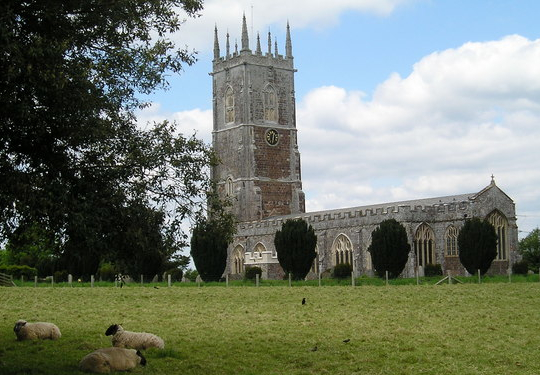

# Introduction


This document addresses key aspects of running a tower.


The lead role in this is often called the tower captain although other titles are sometimes used e.g. ringing master.

It is provided as advice and guidance for the tower captain or potential tower captain, whilst also acting as a guide for ringers generally.

## Scope

The content is not intended to be exhaustive.

## Topics

### Communication; keeping things running smoothly

Communication with people external to the band. Liaison with relevant authorities, Faculties, Contact details, Promotion. Communications within a group of ringers are covered in [Building a Team](../090-BuildingaTeam/).

### Formalities; being compliant, safe and successful
 
Disclosure and Barring Service (DBS), General Data Protection Regulations (GDPR), Safeguarding.

### Finance; income and expenditure including fees
 
### Health and safety; staying safe

Attendance, Insurance, Security, Tower access. What to do in the case of an emergency is covered [Emergency](../060-Emergency/).

### Emergency; what to do if things go wrong

### Tower Environment; keeping your tower running smoothly

Divided between the ringing chamber and the bell chamber. The latter is primarily covered in [Belfry Upkeep](https://belfryupkeep.cccbr.org.uk/docs/010-introduction/).

### Building a Team; creating a supportive environment

Officers, Meetings, Running ringing sessions.

## Image Credits

| Figure | Details | Contributor |
| :---: | --- | --- |
| 1 | Broadclyst, Devon | James Kirkcaldy |

----


**[Previous Chapter](../docs/010-Introduction/)** - **[Next Chapter](../docs/020-Communication/)**


## Disclaimer

*Whilst every effort has been made to ensure the accuracy of this information, neither contributors nor the Central Council of Church Bell Ringers can accept responsibility for any inaccuracies or for any activities undertaken based on the information provided.*

Version 1.0.0, November 2022

© 2022 Central Council of Church Bell Ringers
