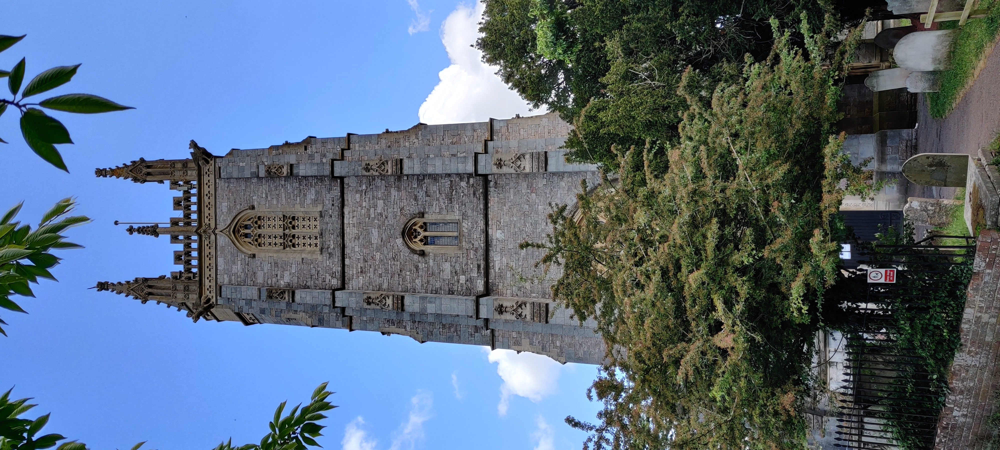

# Communication

Communication 

## Liaison with relevant authority 

The term “Authority” is used to mean the owner(s) and / or persons responsible for the bells and tower in which they are installed. About 90% of rings of bells hung, for full circle change ringing, are in buildings forming part of the Church of England. The legal ownership of the bells in those cases is vested in the Churchwardens. The Parochial Church Council (PCC) has a duty for the use, maintenance and insurance of the bells. It is a good idea to have a ringing representative on the PCC. 

Elsewhere, for example in Church of England cathedrals, churches of other denominations and other religious buildings worldwide, there are likely to be different arrangements and terminology. Authority also means those owning and / or responsible for rings of bells in secular buildings – for example, the Local Authority for a municipal ring of bells, or a private owner.  

## Faculties 

These are applicable to the Church of England. Guidance notes on these should be consulted for any proposed changes within the tower. The following link gives more detail - Guidance notes - changes to the faculty process since April 2020. There were also updates in June 2022. 

Insert link to the relevant section in ‘Belfry Upkeep’  

## Contact Details 

Link to CCCBR display poster (CCCBR) 

It is useful to display contact details outside of the building, so as to be visible when the building is not open. If regular ringing takes place, include the relevant times.  

Whenever contact details are publicised consider: 

- Personal details should be anonymised and GDPR compliant. Use only the details that the contact is prepared to publicise. The contact must give permission. It is better to give the name of their office and not a personal name. 

- Use a generic e-mail address e.g., “Tower Name-Bells @ domain name" instead of a personal e-mail address. This also allows the address to be passed on, should the contact change. 

- Provide a mobile telephone number rather than a landline telephone number. The individual may be travelling to the church when contact is attempted, especially when close to a ringing session. 

- Keep up to date – review at least annually e.g. at AGM. 

## Societies 

The tower may be affiliated to a local ringing society. That body may have the title of Association, Guild, Society, etc. It may cover the local area, county, diocese or country. A tower does not have to be a member of the local society. There are advantages to being a member, these may include: 

- Access to training and development. 

- Access to expertise in tower and belfry inspection. 

- Insurance. 

- Ringing and social meetings. Opportunities to meet other ringers with similar experience and age group, especially important for younger ringers.  

- Ringing at other towers and experiencing different number and weights of bells. 

- Opportunities to ring quarter peals and peals. 

- Finding a “mentor” to support the development of individuals and of the band. 

- Taking committee positions – young people could gain experience for future careers. 

Most societies are affiliated to the CCCBR. 

## Promotion 

Link to CCCBR promotional leaflet (CCCBR) 

Consider the use of: 

- Posters outside, or inside, the building. Ensure that these are up to date, especially contact details. There are Publicity materials insert link to existing CCCBR documentation, including downloadable templates. 

- Flags, banners and publicity stands may be available from a local society.  

- Publicity away from the building especially where the building is not on a main thoroughfare. 

- Regular updates in the parish magazine, local press, radio, television and social media.  

Further guidance on the use of social media is available at https://cccbr.org.uk/wp-content/uploads/2020/10/200902-Social_Media_Guidance.pdf 

Publicise events when these are not a regular occurrence e.g., striking competitions, ringing for special events. Consider placing these in the parish magazine, on the building website and the building social media account. If extended ringing is to take place, consider posting flyers in the vicinity and through letter boxes of properties within earshot. 

For major projects such as the restoration of an installation, including augmentation, separate publicity will be required. Insert link to CCCBR documentation. 

## Image Credits

| Figure | Details | 
| :---: | --- | 
| 1 | St. Michael & All Angels, Heavitree, Devon (Photo: James Kirkcaldy)|
| 2 | Cathedral Church of St. Peter, Exeter, Devon (Photo: James Kirkcaldy)|
| 3 | Various Society badges  (Photo: James Kirkcaldy)|
----

## Information supplied by 

| Section | Contributors |
| :---: | --- |
| Communication | James Morgan |
| Promotion | Vicki Chapman |
----


**[Next Chapter](../030-formalities/)** - **[Previous Chapter](../010-introduction)**

----

## Disclaimer
 
*Whilst every effort has been made to ensure the accuracy of this information, neither contributors nor the Central Council of Church Bell Ringers can accept responsibility for any inaccuracies or for any activities undertaken based on the information provided.*

Version 1.0.1, September 2022

© 2022 Central Council of Church Bell Ringers
