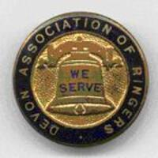

# Chapter 1  They’re different down there

As you have probably gathered, call change ringing is a feature of ringing in the South West of England – Devon and Cornwall specifically. These counties are not in a different country – you can visit them without a passport. If you do visit them, you may come across call change ringing in the style I am trying to explain in this book, so it is worth giving you a few notes and tips to prepare you for your experience. 

When visiting a call change tower in the South West, if they ask which bell you usually ring, don’t be a smart Alec and say “any of them”. That will not endear you to the locals. Just pick a middle bell to be safe. Treble and Tenor are specialist subjects so definitely don’t say the Treble unless you really are an expert, and only say tenor if you don’t really have another option.

There is some slightly different language used to describe method ringing. Method is often used in the singular when method ringers might use plural. “He does method as well” or “That tower does method”. You get used to it.



<--->
Method towers and call change towers seem to respect each other, and ringers who want to follow either code find the right home for them. Some ringers do both, and some don’t. The Devonshire Association is the call change association while the Guild of Devonshire Ringers caters for those wanting to ring methods. When visiting you may not know whether it will be a call change tower or a method tower.
<--->



From the start I am going to annoy some ringers in Cornwall and other parts of the South West by referring to this genre as ‘Devon Call Changes’. The style is practiced elsewhere in the south west, in particular further west than Devon into Cornwall. However Devon Call Changes is an established term and I don’t think it’s my job to come up with a new word for it.
