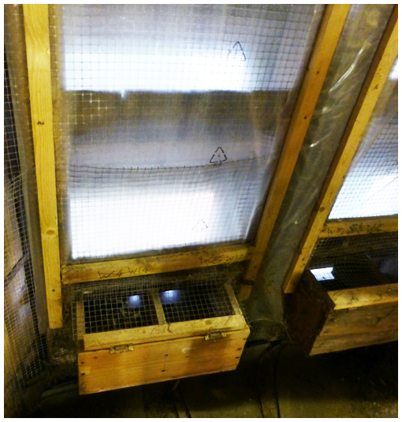

# Formal Requirements

With very few exceptions, the bell ringers do not own the bells. There will usually be what we will term an **Authorising Body** that will have a legal responsibility for the tower and its contents. 

The Steeple Keeper should be formally appointed by the Authorising Body in a clear, democratic, and traceable way, probably for a defined period of time. Once appointed, the Steeple Keeper should maintain contact with the Authorising Body at frequent intervals. While this applies to all ringers, it is particularly important for the Steeple Keeper because the operation and needs of a bell installation may not be familiar to the average member of an Authorising Body.

## Requirements within the Church of England

Of the over 7000 rings of bells in the world, around 90% are with the jurisdiction of the Church of England (CoE). This document is aimed world-wide, however, and we also provide further information in [Other Jurisdictions](#other-jurisdictions).

The ChurchCare [website](http://www.churchcare.co.uk) provides useful general information.

### Authorising Body

Within the Church of England this role is usually filled by the Churchwardens and the Parochial Church Council (PCC). The legal ownership of the bells is vested in the Churchwardens. The PCC has a duty for the use, maintenance and insurance of the bells.

Ringers must remember that Churchwardens and PCC members are volunteers, with many responsibilities other than the bells. The Steeple Keeper (and other members of the band) should build up good relations with them. This should involve, at least:

- Informing them of all activities associated with the bell installation.
- Warning them of any problems with the installation.
- Involving them in important decisions.
- Being in a position to discuss any church restoration or alteration projects which may have implications for the bell installation. Useful guidance is [here](https://cccbr.org.uk/wp-content/uploads/2020/04/SM_ChurchProjects_2020_Ver_1.pdf).

### Faculty Jurisdiction Rules

The Faculty Jurisdiction Rules, discussed in more detail [here](../030-faculty-rules), cover the permissions required to carry out changes to a church. They are legal requirements, and the Church Wardens and PCC members are liable for action if they are not followed. Any changes to the bell installation must be discussed with the Church Wardens and PCC to establish what action may be needed under the Faculty Jurisdiction Rules.

### Ecclesiastical Exemption

A Steeple Keeper is unlikely to be involved in the workings of the Ecclesiastical Exemption, but it is worth  understanding the principle, as this drives the need for the Faculty Jurisdiction Rules.

The Ecclesiastical Exemption provides a mechanism for certain denominations to be exempted from the listed building consent systems administered by local planning authorities. In July 2010, the Department for Culture, Media and Sport issued revised [Guidance](https://assets.publishing.service.gov.uk/government/uploads/system/uploads/attachment_data/file/77372/OPSEEguidance.pdf) on the Order covering the operation of the Ecclesiastical Exemption for places of worship in England. This is relevant to bell installations within the Church of England and the Roman Catholic Church in England.

Quoting the Guidance: “*The 2010 Order limits the Ecclesiastical Exemption to certain buildings within the care of specified denominations which have demonstrated that they operate acceptable internal procedures for dealing with proposed works to listed ecclesiastical buildings* …”. The Faculty Jurisdiction Rules are the “acceptable internal procedures” for the Church of England. Arrangements for the other jurisdictions are covered in [Other Jurisdictions](#other-jurisdictions).

### Archaeologically significant sites

When repairs or alterations to or in historic churches and/or churchyards are under consideration the potential for archaeological implications should always be borne in mind. A guide to church building works with archaeological implications is available [here](https://www.churchofengland.org/sites/default/files/2021-02/CCB_Archaeology_Guidance_Feb_2021.pdf ). For a bell installation, the most likely case would be the removal or modification of a historic bell frame. For this, the Church would need to produce a [Statement of Significance]( https://www.churchofengland.org/resources/churchcare/advice-and-guidance-church-buildings/statements-significance-and-needs ) and the Steeple Keeper would need to contribute their knowledge and experience to this.

### Protected wildlife

For a church tower, bats are the most likely case of protected wildlife – and this is a case where the Steeple Keeper may be the first to detect a possible problem. The Bat Conservation Trust provides useful information [here](https://www.bats.org.uk/advice/information-for-places-of-worship). 

*Figure 1: Nesting boxes for swifts installed in tower louvres*

There may also be restrictions concerning certain species of birds in the nesting season. Churches can make a positive contribution by providing nest sites. Figure 1 shows nesting boxes installed for swifts – a species that is declining due to lack of suitable nest sites. The birds are flourishing and not bothered by the noise of the bells. Further information is given [here](https://www.caringforgodsacre.org.uk/guidelines-for-installing-swift-nest-boxes-in-church-belfries/ ).

## Other Jurisdictions

Differences between national laws (even within the devolved parts of the United Kingdom) and between various religious denominations complicate any simple guidance. The following sections provide an initial and incomplete summary which we hope to extend and refine. 

### Churches Conservation Trust (CCT)

The online Edition of [*Dove’s Guide*](https://dove.cccbr.org.uk/) (as of 29 May 2022) records an overall total of 119 full circle rings of 3 or more bells in the care of the CCT, of which 69 are considered to be in a ringable condition. The Trust is striving to put their churches back at the hearts of the communities in which they stand. To this end, they are very encouraging for any groups to use them, and that includes bell ringing.

CCT churches do not require a faculty in the same way as the Church of England; permission is obtained from the CCT area management. The CCT does not benefit from the Ecclesiastical Exemption, so major work will require listed building consent as appropriate. There may be differences in the approach of various CCT Regions but the general advice is to remain on good terms with the local and Area CCT staff.

### English Cathedrals

Within the CoE jurisdiction, the legal process for cathedrals run parallel with parish church legislation passed by Synod via the Church Commissioners and Parliament. The Ecclesiastical Exemption covers all CoE buildings, fixtures and fittings. The amenity groups have a statutory right to be consulted.

For Cathedrals the [Cathedrals Fabric Commission for England](https://www.churchofengland.org/resources/churchcare/cathedrals-fabric-commission#na) (CFCE) is the equivalent of the Church Buildings Council (CBC). There is more Government and amenity group involvement in the CFCE committees. Each of the cathedrals has its own [Fabric Advisory Committee]( https://www.churchofengland.org/resources/churchcare/cathedral-fabric-commission/cathedral-fabric-advisory-committees) (FAC).  This equates to each cathedral having its own [***Diocesan Advisory Committee***](../170-glossary/#diocesan-advisory-committee-dac). All the cathedrals and churches committees sit within the CBC.

### Ireland

In the Church of Ireland (which includes churches in Northern Ireland), applications up to a specified amount are made through the incumbent and the Select Vestry (the equivalent of the PCC in England) to the appropriate Diocesan Council.  Financial limits vary (in the Diocese of Limerick for example the limit is €10,000). For major works, applicants visit the Church of Ireland [website](https://www.ireland.anglican.org) and download the P5 form, which is self-explanatory. 

The three RC churches in Ireland that have bells (Mount St Alphonsus, SS Augustine & John and Rowe Street) all come under different jurisdictions. Mount St Alphonsus "*belongs to the Redemptorists and decisions regarding infrastructure would be made by our provincial council in consultation with the Rector of Mount St Alphonsus and with the advice of our buildings officer*". John's Lane is an Augustinian church so it would be appropriate to apply through their priest to their Order. Rowe Street Wexford would follow the same procedure as the RC churches in England.

There is no Ecclesiastical Exemption in the Republic of Ireland. Bodies responsible for a place of worship included on the list of protected structures are required to gain agreement from the local authority for any works of alteration – both inside and out. 

For Northern Island, a consultation on Ecclesiastical Exemption held in 2016 included views that the Exemption should be abandoned, as for the Republic. However, the Minister for Communities [concluded](https://www.communities-ni.gov.uk/sites/default/files/publications/communities/ministerial-statement-on-ecclesiasticalption.pdf) that the Ecclesiastical Exemption should continue.

### Isle of Man

Although the Isle of Man is part of the Church of England (indeed the oldest established diocese in the CoE), and comes under the Archdiocese of York, it is not subject to UK domestic law. Hence, the UK Faculty Jurisdiction Rules and all other UK church law do not apply to the Isle of Man.  However, the Faculty Jurisdiction Rules are copied into Manx Law with some minor differences.

A fundamental difference is that the Ecclesiastical Exemption does not apply in the Isle of Man.  For faculty applications that need civil planning approval, this must be obtained before any formal faculty application is made.

### Scotland

[Guidance (pdf download)](https://pub-prod-sdk.azurewebsites.net/api/file/7b83a87d-21ab-4749-b014-ab0c0114bca6) is available on the operation of the Ecclesiastical Exemption in Scotland.

### Wales

The Faculty Procedure in the Church of Wales (CoW) is similar but not identical to that in the Church of England (CoE). For example, the CoE allow more works under their Lists A and B items than the CoW. The CoE also allow Archdeacons to approve List B items, while approval of the Diocesan Registrar is required in the CoW.

A Faculty is required for works outside lists A and B. This needs to be approved by a Diocesan Chancellor (normally a secular judge) before the works can proceed. 

Unlike the Church of England, the Church in Wales owns its churches which are essentially held in trust (formally called the Representative Body of the Church in Wales).

Following a [consultation](https://gov.wales/ecclesiastical-exemption-and-guidance-scheduled-monuments) in 2018, Ecclesiastical Exemption broadly similar to that in the Church of England has been implemented in Wales.

### Outside the British Isles

We do not yet have detailed information from Australia/New Zealand, North America, or other towers outside the British Isles. 
Australia/New Zealand and North America have an increasing number of ringing towers, with a variety of religious denominations. Currently, we suggest you contact their ringing societies (both affiliated to the Central Council of Church Bell Ringers) for more information:

-  [Australian and New Zealand Association of Bellringers]( https://www.anzab.org.au)
-  [North American Guild of Change Ringers (USA and Canada)]( https://www.nagcr.org)

## Image Credits

| Figure | Details | 
| :---: | --- | 
| 1 | Swift nesting boxes installed at Wingrave, Buckinghamshire. (Photo: Alison Hodge, used with permission from Alan Frost) |

----


**[Next Chapter](../030-faculty-rules/)** - **[Previous Chapter](../010-introduction)**


----

## Disclaimer
 
*Whilst every effort has been made to ensure the accuracy of this information, neither contributors nor the Central Council of Church Bell Ringers can accept responsibility for any inaccuracies or for any activities undertaken based on the information provided.*

Version 1.0.1, September 2022

© 2022 Central Council of Church Bell Ringers

