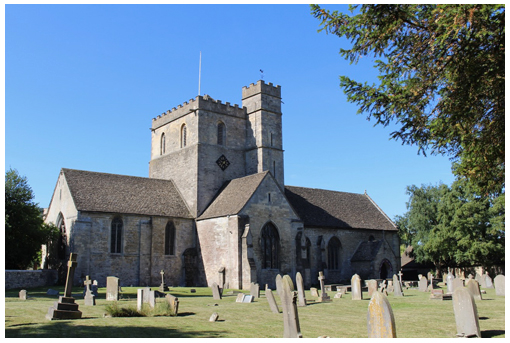

# Faculty Jurisdiction Rules


This chapter refers to activities carried out in churches within the jurisdiction of the Church of England. Ringers must remember that the Rules are set out in law, with possible penalties if they are not followed. Meeting the Rules is the responsibility of the Churchwardens and the Parochial Church Council, and ringers must use their specialist knowledge to assist the Church authorities in any application. Guidance should be sought from the Diocesan Secretary, The Diocesan Bell Advisor, and the local Guild or Association. 


Ringers are probably aware that a Faculty may be required prior to work being done in a Church of England Church. The faculty process exempts churches from listed building consent and conservation area consent that could apply elsewhere. When alterations are proposed, the parish must present the proposals to the archdeacon. For minor alterations, the archdeacon may authorise the work but more major projects will be judged by the Chancellor of the diocese, taking advice from specialists in the [***Diocesan Advisory Committee***](../170-glossary/#diocesan-advisory-committee-dac). The faculty is the legal authorisation of the work by the Chancellor.  

The faculty system is a judicial system, so these notes reflect this style. Parishes and ringers intending do any work in their tower or on their bells must consider the full implications of the Rules.

## Background 

The Faculty Jurisdiction Rules 2015 were introduced with the intention of simplifying the faculty process and reducing the burden of administration, in particular for churchwardens and others in parishes with responsibility for church buildings. The major innovation of the 2015 Rules was the introduction of Lists A and B for items that could be undertaken without a faculty, subject to some general conditions stipulated in the Schedule. 
-	Items in List A may be undertaken by a parish without a faculty and without the need for any form of consultation. 
-	Items in List B may be undertaken without a faculty provided the archdeacon is consulted and has given written authorisation.

The Rules were amended in 2019 and again in 2022. The full version of the latest guidance is [here](https://www.churchofengland.org/resources/churchcare/church-buildings-council/how-we-manage-our-buildings).

## Items Most Likely to be of Relevance for Ringers

The extracts given below are relevant to bells and associated fittings, and also to clocks. Church clocks are included here because they are typically housed in the church tower and in many cases use the ringing bells as clock bells.

### List A:
 As stated above, items in List A may simply be undertaken (within the specified conditions) by a parish without a faculty and without the need for any form of consultation. The Steeple Keeper will work closely with the parish in discussions on these.

### A3. Bells etc.

| Matter | Specified Conditions | 
| ----- | ----- |
|(1) The inspection and routine maintenance of bells, bell fittings and bell frames | No tonal alterations are made to any bell |
| | No bell is lifted from its bearings |	
| (2) The repair and maintenance of clappers, crown staples (including re-bushing) and bell wheels | Works do not include the re-soling or re-rimming of a bell wheel |
| | No bell is lifted from its bearings |	
| (3) The repair or replacement of bell stays, pulleys, bell ropes (including in Ellacombe apparatus), rope bosses, sliders or slider gear | No bell is lifted from its bearings |	
| (4) The repainting of metal bell frames and metal bell fittings | No bell is lifted from its bearings|
| (5) The like for like replacement of a wrought iron clapper shaft |    |
	
### A4. Clocks	

| Matter | Specified Conditions | 
| ----- | ----- |
|(1) The inspection and routine maintenance of clocks and clock dials | Works do not include re-painting or re-gilding of clock dials or repainting clock movements |	
| (2) Maintenance and like-for-like repairs, without removing the clock from the church, of: | |
| (a) ratchets, clicks and click springs on flies | |
| (b) locking levers| |
| (c) pulleys| |
| (d) broken hands | |
| (e) clock hammers and their springs	| |	
| (3) Replacement of: | |
| (a) weight lines | |
| (b) suspension springs| |
| (c) fixings of clock dials| |		
| (4) The reinstallation of disconnected hands and numerals | Works do not include re-painting or re-gilding of clock dials or repainting clock movements |	
| (5) Repairs to bell cranks and clock bell hammers | |		
| (6) The upgrading of electrical control devices and programmers | Any work to an electrical installation is carried out by a person whose work is subject to an accredited certification scheme (as defined in rule 3.1(6)) |

## List B

This table prescribes items which may, subject to any specified conditions, be undertaken without a faculty if the archdeacon has been consulted on the proposal to undertake the matter and has given notice in writing that the matter may be undertaken without a faculty. The archdeacon may impose additional conditions in the written notice. The Steeple Keeper will provide technical assistance in preparation of the proposal to the archdeacon.

### B2. Bells etc.	

| Matter | Specified Conditions | 
| ----- | ----- |
| (1) The lifting of a bell to allow the cleaning of bearings and housings | Regard is had to any guidance issued by the Church Buildings Council |
| | No modification is made to the manner in which any bell may be sounded |
| | No historic material is modified or removed |	
| (2) The like for like replacement of: | Regard is had to any guidance issued by the Church Buildings Council |
| (a)	bearings and their housings | The works do not involve the drilling or turning of the bell |
| (b)	gudgeons | No modification is made to the manner in which any bell may be sounded |
| (c)	crown staple assembly | No historic material is modified or removed |
| (d)	steel or cast iron headstocks | |
| (e)	wheels | |
| (3) The replacement of: | Regard is had to any guidance issued by the Church Buildings Council |
| (a)	bell bolts | No modification is made to the manner in which any bell may be sounded |
| (b)	a wrought iron clapper shaft with a wooden-shafted clapper | No historic material is modified or removed |
| (4) The treatment of timber bell frames with preservative or insecticide materials | |
| (5) The re-pinning or re-facing of hammers in Ellacombe apparatus | Regard is had to any guidance issued by the Church Buildings Council |
| | No modification is made to the manner in which any bell may be sounded |
| | No historic material is modified or removed |	
| (6) The installation of an electric silent ringing device for the training of ringers | Any work to an electrical installation or electrical equipment is carried out by a person whose work is subject to an accredited certification scheme (as defined in rule 3.1(6)) |
| | The device is installed in a location not normally visible to the public |
| | No alteration is made to the fittings of the bells other than the installation of electric contacts and wires |
| | The device does not adversely affect the church’s protection against lightning |	
| (7) A sound control measure in a belfry | Any fixings are made into mortar |	
| (8) The introduction of peal boards in a location not normally visible to the public | |	
	
### B3. Clocks	

| Matter | Specified Conditions | 
| ----- | ----- |
| (1) Alterations to striking trains to prevent striking at night| No part of the clock movement is affected |	
| (2) The repair or replacement of electrical or electronic clocks manufactured after 1950 | |	

## Image Credits

| Figure | Details | 
| :---: | --- | 
| Title Picture | St Swithun, Leonard Stanley, Gloucestershire. A Church of England building on a beautiful day - just to brighten up what might be a rather dry chapter. (Photo: Robin Shipp) |

-----

## Disclaimer
 
*Whilst every effort has been made to ensure the accuracy of this information, neither contributors nor the Central Council of Church Bell Ringers can accept responsibility for any inaccuracies or for any activities undertaken based on the information provided.*

Version 1.0, August 2022

© 2022 Central Council of Church Bell Ringers
