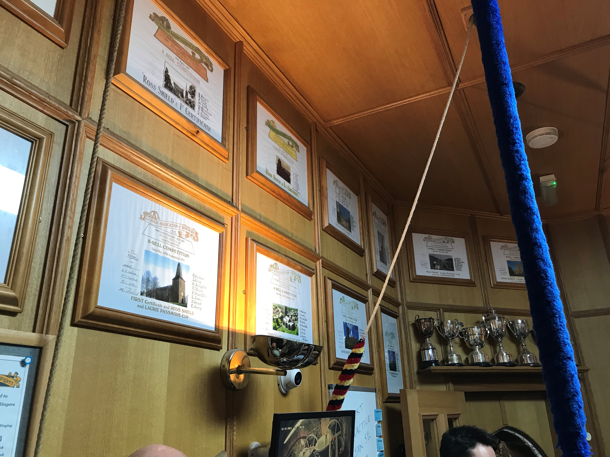

# Chapter 2  First Principles
There are a few things that set Devon calls apart from the sort you are used to.

## Closed handstoke leads!

OK, so some of your ringers probably ring with closed handstroke leads anyway and you have given up telling them about it. A perfect open handstroke lead is actually quite difficult to achieve, and what is perfect anyway? You may be told to leave a whole bell’s gap, but actually about three quarters of a bell’s gap sounds OK. The best 12 bell bands perfect something even narrower and call it ‘style’.

Devon call change ringing is done with closed handstroke leads, which is sometimes referred to elsewhere as ‘cartwheeling’. More about how to do this later.

## Ringing up and down

When the Devon ringers ring in competitions, and most of the rest of the time too, they ring up and down at the beginning and end of each piece of ringing, which they will call a peal. This means they get very good at ringing up and down. Ringing the bells up and down is no longer just a means to an end – it is of equal importance to the rest of the ringing and is where competitions are won and lost.

However, if you are starting your band off ringing in the style you don’t necessarily have to do the ringing up and down bit. Yet.

## Fixed peals

Devon call change peals do not focus on the ‘musical changes’ that you are used to. They don’t go for a set that you might use for a wedding, going for instance from Queens, then Kings, and back, or you might mix Tittums and something else. The Devonians don’t do that, but ring long established and very formulaic sequences that many of the ringers know by heart. To be honest they are not musical in that sense at all, but that’s not the point. 

Ringing one of those sequences, the famous “Sixty on Thirds” will be your first target, but there will be stages to go through before that. 
<--->

*Competition certificates at Kingsteignton*

