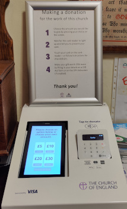

# Finance


**Site currently under construction**

 
## Income  

### Weddings 

In the ***[C of E](../170-glossary/#c-of-e)***, the fees for wedding ringing are set by the ***[PCC](../170-glossary/#pcc)***, hopefully in consultation with the ringers. These should reflect whether ringing is: 

- Before and/or after the wedding. 

- The length of time spent ringing. 

- The number of bells to be rung. Some towers charge proportionately.

- Likely travel times and distances, etc. 

The couple should be advised that if the bride arrives excessively late, ringing may not continue until her arrival and may be curtailed after the service. 
Consider setting an end time when ringing will finish, particularly for ringing after a wedding. This gives certainty of the time when ringers can get away and may help get a band. This is especially useful when ringers are required at a few local churches on the same day. 

## Fees for other ringing 

Consider having fixed fees for: 

- Funerals, possibly commensurate with that for weddings.

- Visiting bands.

- Quarter peals. 

- Peals.

These may be determined in consultation with the ***[tower authority](../170-glossary/#authority)***. If there are no fixed fees it is usual to expect voluntary donations from visiting bands and individuals.

Avoid having a 'box on the wall', especially for downstairs rings, as these invite theft and damage. 

Consider having an electronic payment system for fees and casual donations. This may involve a commission charge which, although low, reduces the donation received. Within a ***[C of E](../170-glossary/#c-of-e)*** church implementing this should involve the ***[PCC](../170-glossary/#pcc)*** and its treasurer. It may allow gift aid to be recovered and ensure that payments for ringing are captured in an appropriate account. N.B. Consider a request for Gift Aid as this enables income tax to be reclaimed. It only applies to charities and HMRC registered charitable groups.

## Payment of Fees 

Arrangements must be made for how the ringers receive any payments. In the ***[C of E](../170-glossary/#c-of-e)***, it is likely that a couple getting married pay the whole cost at one time. The church then arranges the transfer of money to the recipient groups. With the reduction in use of cash, the church may expect to do this via a bank transfer. 

## Subscriptions

The tower and / or the local society may charge a subscription, typically this is an amount payable annually.

## Expenditure 

Agree with the ***[tower authority](../170-glossary/#authority)***, in advance, who will pay for replaceable items e.g. ropes. 

In the Church of England, it may be worth running the tower funds through the ***[PCC](../170-glossary/#pcc)***. The PCC is normally a registered charity and registered with HMRC for Gift Aid. The result might be a reduction of a third. This should be a big encouragement to use PCC funds over any tower fund.

If a major project is envisaged the funding of this must be agreed in consultation with the ***[tower authority](../170-glossary/#authority)***. A separate [document](https://cccbr.org.uk/major-projects/) covers the running of a project.

## Tower Funds 

In the ***[C of E](../170-glossary/#c-of-e)***, funds are best held within the ***[PCC](../170-glossary/#pcc)*** account(s). Ideally these should be ring-fenced preventing their use for non-ringing related expenditure. This can be achieved by having a covering document listing the restrictions of the funds. If ring-fenced there has to be a means of amending the restrictions, a definition of who can do this is essential.

If a tower has funds, separate from the ***[tower authority](../170-glossary/#authority)***, these should never be held by an individual. Traditionally, such funds have been used for minor repairs and social events for ringers. Such funds are not advisable.  If essential, specific treasurer’s accounts are available and may be free from fees. Banks are increasingly reluctant to provide such small accounts.

## VAT and the LPW (Listed Places of Worship) VAT recovery scheme 

This only applies to places of worship within the United Kingdom.

The scheme allows VAT on eligible expenditure to be reclaimed where the church is listed. The definition of eligible expenditure is vague when it comes to bells. It generally covers bells, bell frames, bell fittings (probably stays), ropes, muffles and training bells. It is highly probable that most things ringing related, that keep the hardware going, are likely to be eligible, but it is worth checking as the scheme does change. 

A claim, with multiple invoices below the £1000 threshold, can be made once per year. It is not a difficult process to make these claims.

Further details are available on the [LPW scheme website](http://www.lpwscheme.org.uk/).

## Image Credits

| Figure | Details | Source |
| :---: | --- | --- |
| 1 | Electonic donation box at Wistanstow, Cheshire | Photo: James Kirkcaldy |

----


**[Previous Chapter](../030-formalities/)** - **[Next Chapter](../050-healthsafety/)**


----

## Disclaimer
 
*Whilst every effort has been made to ensure the accuracy of this information, neither contributors nor the Central Council of Church Bell Ringers can accept responsibility for any inaccuracies or for any activities undertaken based on the information provided.*

Version 1.0.0, November 2022

© 2022 Central Council of Church Bell Ringers
