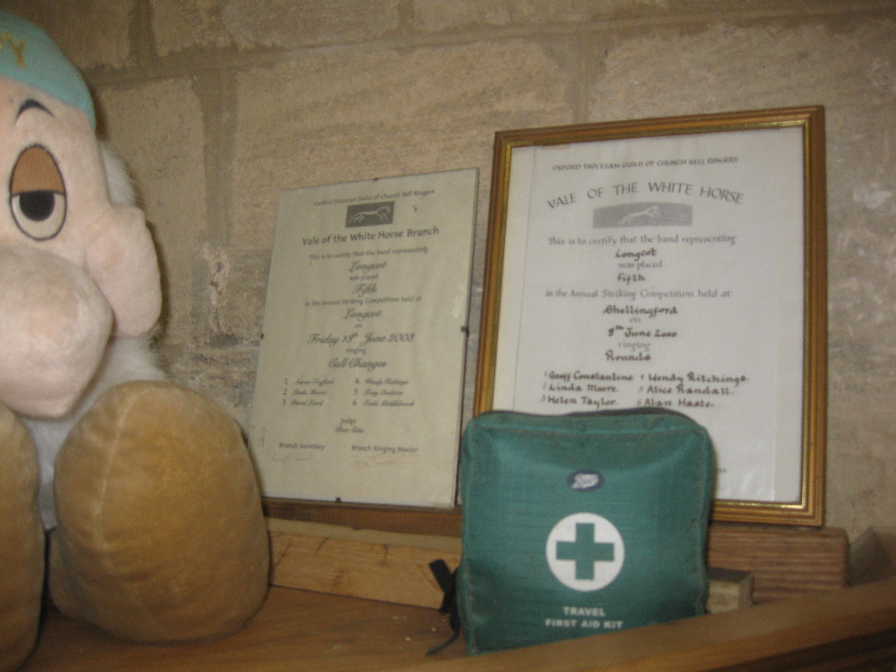
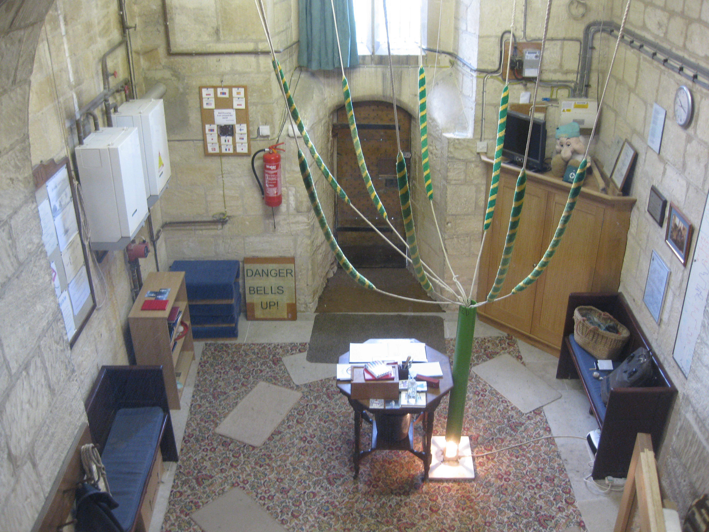

# Health & Safety

Further details can be found at [health and safety policy advice](https://cccbr.org.uk/wp-content/uploads/2021/03/SM_HS_Policies_2021_Ver_1.pdf). 

These must be in-line with the Tower authority’s policies. 

This includes guidance on: 

- Risk Assessments. 

- Fire precautions, further details can be found at [fire prevention](https://cccbr.org.uk/wp-content/uploads/2020/07/SM_FireRiskAssessment_2020_Ver_1.pdf). 

- Fire safety. 

- First aid. 

- Electrical power, lighting and emergency lighting. 

- Accidents and illness. 

- Advice for visitors, both ringers and non-ringers. 

Consideration should be given to special occasions such as tower open days when large numbers of people may be present. 

Ringing is safe until you forget it is dangerous. Your first responsibility, as the person in charge, is the safety of the ringers.  

- If a novice ringer is normally able to handle a bell but still sometimes gets into trouble, nominate an experienced ringer to stand close by to intervene if necessary. 

- Observe how any unknown visitor, who says they can ring, catches hold and if it looks wrong ask them to ring the bell on their own first and stand near in case you need to intervene. 

- Invite any nervous ringers and especially nervous visitors to ring the bell a couple of times on their own first.  

- If you see any signs of physical distress, especially in older ringers, call ‘Stand’ at once. 

- Call ‘Stand’ if there is any significant loss of bell control or other incident.  

- If there are any worrying noises or strange rope movements firsdt determine whether any bells need to be rung down before investigating. If you don’t know the frame layout and relationship to the entry into the bell-chamber ring all the bells down before investigating. If in any doubt ring the bells down and curtail the session. There is always another session; there is not always a way back from a serious accident. N.B Take particular care if a clapper fails, this may break the slider if present in the installation (Hastings stays do not have a slider). Do not try to stand the bell, ring it down with care.  

## Attendance Record(s) 

These should be maintained for the purposes of safeguarding and for emergency precautions. The details to be held should be a minimum of name, entrance and exit date and times. The tower authority may require further details to be logged. 

Towers may wish to have a separate (traditional) visitors' book as an historic record. 

## Additional requirements 

The tower authority may have other requirements and these should be discussed with the authorities. These may arise from insurance or other reasons. 

Special precautions may need to be put in place from time to time e.g., the requirements put in place during the Covid-19 pandemic. The CCCBR website will normally detail the latest guidance in such cases.

## First Aid Kit 

*Figure 1: Readily available first aid kit*

Ideally there should be a first aid kit in the ringing chamber.  

Ensure the location of the first aid kit is indicated, especially when it is elsewhere within the premises. 

Regularly check that all items are within date.

## Insurance 

In the Church of England, ringers are normally included as voluntary workers in the church policy, as long as they have permission to ring. It is probably worth checking what the cover is if there is any doubt. Do not expect a massive pay-out for a cut finger! 

Further details can be found at [insurance](https://cccbr.org.uk/wp-content/uploads/2022/05/SM_Insurance_2022_v4.pdf).

## Security 

Further details can be found at [security for ringers](https://cccbr.org.uk/wp-content/uploads/2020/12/SM_Security_2020_Ver_1.pdf).

A limited number of keys to the building (and internal doors) may be held by the ringers. A single key for each lock is inadvisable, as this will present difficulties at times of sickness or absence. All keys should be registered with the tower authority. This may be a condition of the building insurance. 

There is also information in [Belfry Upkeep](https://belfryupkeep.cccbr.org.uk/docs/040-health-and-safety/).

## Tower Access 

[Guidance notes - Tower Access and Stairways](https://cccbr.org.uk/2017/05/16/tower-access-stairways-guidance/).

Consider the number of keys and/or key holders. There is a balance between security (preventing access) but enabling reasonable access. Emergency exits must never be compromised. 

Spiders and ropes should, ideally, be left inaccessible e.g. locked away. This is essential in accessible ringing chambers.  

Bells should not be left up between ringing sessions, especially where access to the bell and ringing chambers is not secured.  

Turning clappers when bells are up should be avoided in all but exceptional cases, such as heavy bells that are extremely difficult / impossible to rise right-sided. 

Many churches are insured through the [Eccclesiatical Insurance Group](https://www.ecclesiastical.com/).

Information, for those working on bell installations, is available in [Belfry Upkeep]([Chapter 5](https://belfryupkeep.cccbr.org.uk/docs/040-health-and-safety/).

## Other Tower Users 

     

*Figure 2: Multi-use ringing chamber; Figure 3: Ground floor ringing chamber with barrier*<>

There may be other users of the tower and its internal spaces. These, their access and usage requirements will need consideration. Users may include clock winder(s), flag raiser(s), flower arrangers, creches. Clergy and choirs are often users of ground floor areas and may do so at the same time as ringers.  

Consideration also needs to be given to visitors on open days and the general public, especially in ground floor installations. 

There may also be persons requiring access to other installations (such as mobile telephone equipment housed in the tower). 

External references e.g., HSE, Church Care, 

 ## Image Credits

| Figure | Details | Source |
| :---: | --- | --- |
| 1 | Small first aid kit | Photo: Tony Crabtree |
| 2 | Multi-use ground floor chamber | Photo: Tony Crabtree |
| 3 | Ground floor ring with barrier | Photo: Alison Hodge |

----

## Information supplied by 

| Section | Contributors |
| :---: | --- |
| Health & Safety | Tony Crabtree |

----


**[Previous Chapter](../040-Finance)** - **[Next Chapter](../060-Emergency/)**

----

## Disclaimer
 
*Whilst every effort has been made to ensure the accuracy of this information, neither contributors nor the Central Council of Church Bell Ringers can accept responsibility for any inaccuracies or for any activities undertaken based on the information provided.*

Version 1.0.0, November 2022

© 2022 Central Council of Church Bell Ringers
