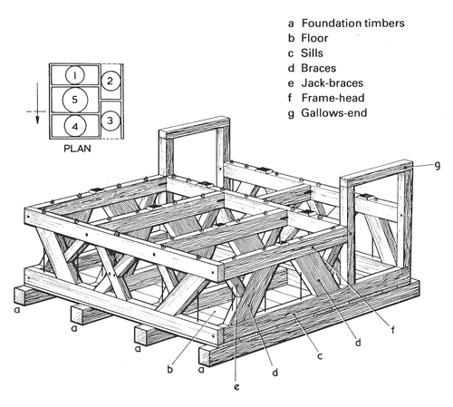
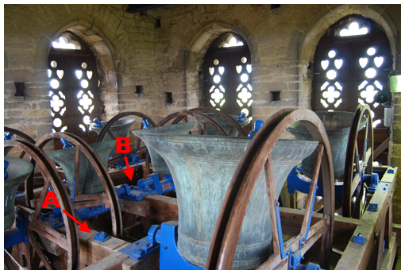
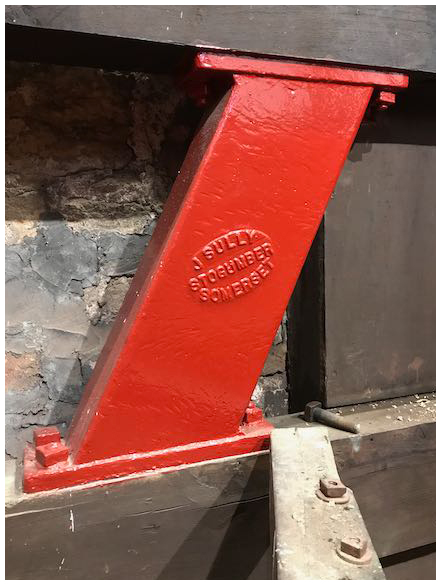
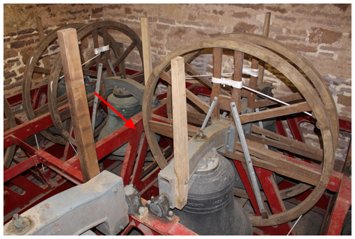
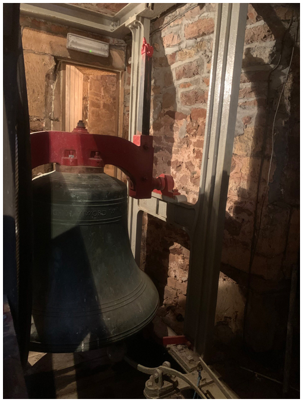
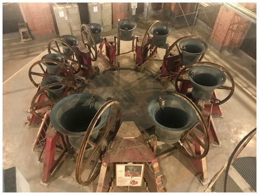

# Bell Frames

The bell frame is the structure which supports the bells. It  fulfils several main roles:

-  It provides rigidity with an economy of materials and compactness
-  It transmits the vertical and horizontal forces arising from the movement of the bells to the tower walls
-  It provides a fair circle of ropes in the ringing room

The design of bell frames has developed over the years as the need changed from simple chiming to full circle ringing, and as newer materials became available. The history is fascinating but outside the remit of this document. Here, we will describe the types of frames most likely to be encountered and the care which a Typical Steeple Keeper can provide in each case.

The Title Picture identifies the parts of a timber frame and provides a good starting point. A more complete account of the development of bell frames is given in Chapter 4 of the Central Council of Church Bell Ringers [Towers and Bells]( https://shop.cccbr.org.uk/product/towers-and-bells-handbook/) publication. 

## Types of Bell Frames

### Timber frames

*Figure 1: Timber frame, showing tie bolts (A) and bearings (B)*

The frame shown in Figure 1 is dated c1899 but has modern fittings. Note the tie bolts (A) and the ball bearings (B) mounted on the frame-heads. Very early timber frames relied on morticed joints on the braces between the sills and frame-heads but, with shrinkage of the wood, these did not provide sufficient rigidity of the frame. Timber frames now rely on tie bolts for rigidity.


The excellent Title Picture shows vertical tie bolts although, unfortunately, they are not labelled.


New timber frames are uncommon now but may still be supplied. In many cases, steel girders replace the timber foundation beams.

### Composite frames

*Figure 2: Cast iron cross brace on a timber frame*

With the availability of cast iron, composite frames were introduced with iron braces bolted to timber sills and frame-heads (Figure 2). Several of these are still in use and, if well maintained, provide rigid frames.

### Iron and steel frames

*Figure 3: Low-sided metal frame*

Iron and steel frames may be ‘low-sided’ as shown in Figure 3, following the pattern of a timber frame but with the sill, frame-head and braces replaced by cast side-frames (arrowed) held together with steel girders. 

*Figure 4: ‘H’ frame*

An alternative is the ‘H’ frame, shown in Figure 4. As you can see, the top of the frame is above the bell, with the bearings at half-height. This arrangement is often used where space is limited and the bells are hung in two or more tiers (in this tower the lighter bells are hung in a higher tier) but ‘H’ frames all on one level are not uncommon.

### Radial frames

*Figure 5: Radial frame at Washington Cathedral*

For completeness, we should mention radial frames (Figure 5). The traditional design, with bells swinging at right angles, can result in torsional stress on the tower and this is minimised in the radial design. This design also provides a simple and precise rope circle. This is taken still further at Liverpool Cathedral, where the radial frame is constructed from reinforced concrete. But such frames take up much more space, usually in towers constructed for the purpose, and are unlikely to be encountered by a Typical Steeple Keeper.

## Care of Bell Frames

Well-built bell frames will last for years and it is all too easy to take them for granted. But all frames can be subject to long-term degradation and the Steeple Keeper – who probably has a closer contact with the frame than most – fulfils a vital role in their care.

### Timber frames

As said above, tie bolts are essential for maintaining the rigidity of a timber frame and a check on their tightness must be built into the [maintenance schedule](../150-maintenance-schedule), preferably during a dry part of the year when shrinkage of the wood will be greatest.


When tightening the nut on a tie bolt, you should attempt to slacken the nut first. This checks that the nut is not simply rusted into place or has bottomed-out on the thread. If the latter, add washers below the nut.


Decay generally results from long-term dampness. In the lower part of the frame, this can be where timber foundation beams enter the tower wall or where there are accumulations of dust or rubbish. The Steeple Keeper must ensure that the areas around all timbers are kept clean with no obstacles to ventilation. Beetle attack is seldom found in dry timbers.

Decay in the top members of the frame is usually due to a leaking roof or rain driving in through the louvres. This is a matter for the church authorities.

Birds, usually pigeons or jackdaws, must be excluded ruthlessly from towers as their nests encourage damp and harbour fungus and insects. Note that Death Watch Beetles may be found in the dead hedgerow sticks favoured by jackdaws for their nests.

Any cases of decay or beetle attack will require specialist treatment. 

### Iron and steel frames

Metal frames require little maintenance, although checks should be made for loose or missing fastenings (usually a rare occurrence). However, these frames need to be cleaned and repainted every 10 or 20 years. This is not a simple job, and the use of a Bell Hanger should be considered. Many girders may be located close to the walls, making their outer surface difficult to access, and vulnerable points where girders meet the tower walls may require the use of ladders or scaffolds.

## Image Credits

| Figure | Details | 
| :---: | --- | 
| Title Picture | The parts of a typical timber bell frame. (Drawing © the late J G M Scott, used with permission from his family) |
| 1 | Timber frame at Thame, Oxfordshire. Entry in the *Bells and Installations* round of the Central Council photographic competition. (Photo: Stephen Hoar) |
| 2 | Cast iron cross brace in the composite frame by John Sully of Stogumber at Almondsbury, South Glos. (Photo: Robin Shipp) |
| 3 | Low-sided metal frame (Whitechapel 1996) at Thornbury, South Glos. (Photo: Robin Shipp) |
| 4 | ‘H’ frame (John Taylor & Co, 1903) at Long Ashton, Somerset. Entry in the *Bells and Installations* round of the Central Council photographic competition. (Photo: Will Rogers) |
| 5 | Radial Frame (Mears & Stainbank, 1962) at Washington Cathedral, USA. Entry in the *Bells and Installations* round of the Central Council photographic competition. (Photo: Lian von Wantoch) |

----


[Next Chapter](../060-headstocks/)


----

## Disclaimer
 
*Whilst every effort has been made to ensure the accuracy of this information, neither contributors nor the Central Council of Church Bell Ringers can accept responsibility for any inaccuracies or for any activities undertaken based on the information provided.*

Version 1.0.1, September 2022

© 2022 Central Council of Church Bell Ringers
