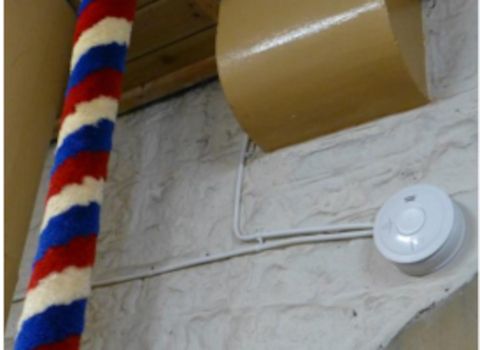


**Site currently under construction**


# Emergency 

Prominently display an ‘In Case of Emergency’ (ICE) notice. Ensure that this is kept up to date. 

A blank form can be seen [here (as a pdf file)](proforma.pdf) or downloaded from [here (as a Word document)](proforma.docx).

The ICE should indicate: 

- Telephone access. Investigate whether there is acceptable mobile telephone coverage. If not investigate where the nearest acceptable coverage is and where the nearest, readily available, telephone landline is. Display this, prominently, alongside the location. 

- The location. Consider which location provides the best access for larger vehicles such as ambulances or fire appliances. Also, consider the easiest means of access for stretchers, etc. Consider using a combination of the following: 

- Post code, this might not uniquely identify a property and will not define the entrance - further details can be found at [Postcode finder](https://www.royalmail.com/find-a-postcode). 

- What3Words, gives an accuracy of approximately 3 metres and may identify the entrance. The system applies to the whole world. It is widely used by emergency services within the UK - further details can be found at [what3words](https://what3words.com/about).  

- Ordnance Survey grid reference, these can be easily transposed when under pressure. Reference can be determined using e.g., google maps. 

- Names of any trained first aiders. Ideally the ***[authority](../170-glossary/#authority)*** should offer training, which should be kept up to date.

- Location of the first aid kit. The first aid kit must be accessible to ringers when the rest of the building is locked e.g., it must not be in a locked vestry. 

- Location of the nearest accessible AED / Defibrillator, if within a reasonable distance. 

- The muster point to be used in the event of an evacuation. 

- If the emergency services are called, send someone to meet and guide them, when possible. 

## Emergency Services

Liaise with the local emergency services to discuss their access and also emergency exits. Towers can be awkward and confined spaces presenting difficulties in access and egress, especially with stretchers and casualties. They may be happy to run a training exercise for both emergency services staff and ringers. 

## Fire extinguisher and alarms.

These must audible and visible when the bells are being rung. These must be inspected, tested regularly and be in date. Smoke detectors are generally rated for 10 years before requiring replacement.

## Emergency lighting and exits

These must be inspected, tested regularly and be in date. They must be to adequate to safely set the bells ahould the power fail during ringing. Emergency lighting should be tested for 3 hours continuous use and a record held by the ***[authority](../170-glossary/#authority)***.

The design of the fire alarm system shall be in accordance with a fire safety plan. 

Ensure that ringers are not “locked in” the tower during ringing. Conversely, unwanted guests must not be able to access the tower while ringing is underway. Consider how unplanned visitors might gain access to the building. Advise such visitors to make contact in advance by publicising this, for instance on the building website. 

 ## Image Credits

| Figure | Details | Source |
| :---: | --- | --- |
| 1 | 'In Case of Emergency' example | Photo: James Kirkcaldy |
| 2 | Typical fire alarm | Photo: Alison Hodge |
| 3 | Emergency exit indicator | Photo: Alison Hodge |

----


**[Previous Chapter](../050-healthsafety/)** - **[Next Chapter](../070-ringingchamber/)**


----

## Disclaimer
 
*Whilst every effort has been made to ensure the accuracy of this information, neither contributors nor the Central Council of Church Bell Ringers can accept responsibility for any inaccuracies or for any activities undertaken based on the information provided.*

Version 1.0.0, November 2022

© 2022 Central Council of Church Bell Ringers
