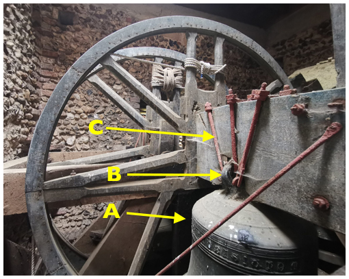
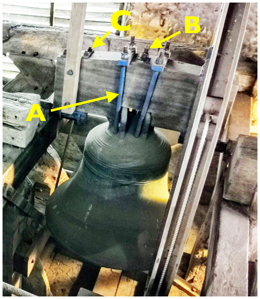
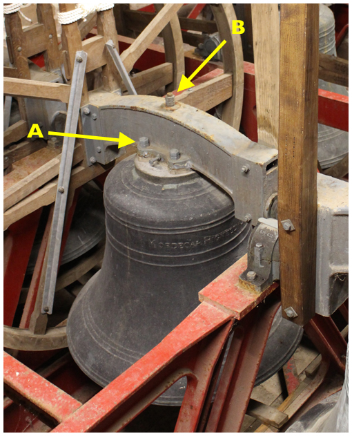
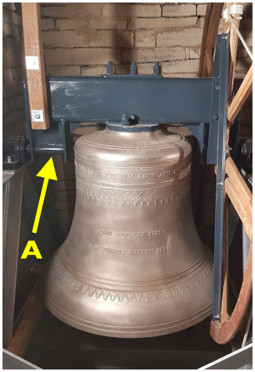
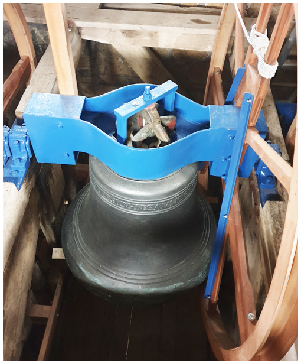
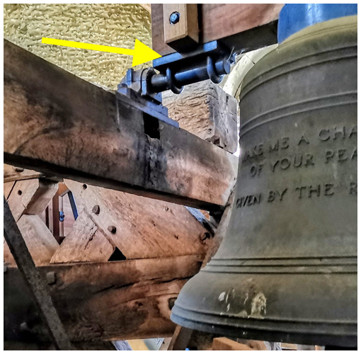

# Headstocks

A headstock is one of the major structural elements of any bell installation, with each bell being hung from a headstock mounted on bearings on the bell frame. Each headstock carries the full weight of the bell during its rotation through just over a full circle, so they must be maintained in good condition.

Several other major parts of the installation are attached to the headstock:

-  Details of how the [wheel](../070-wheels) and [stay](../080-stays-and-sliders) are attached will be found in the relevant chapters.
-  Details of various ways in which the [bell](../130-bells) is attached are given in this chapter.
-  We also include here details of the attachment of the [***gudgeons***](../170-glossary/#gudgeons), which fit into the [bearings](../100-bearings) to form the axle about which the bell rotates.

Headstocks were traditionally made of timber but, since the early 20th century, metal has been the most common choice.  For the former, elm was frequently chosen because of its durability, but other hardwoods have been used.  Metal headstocks can be cast iron or fabricated from steel.

## Timber Headstocks

There are many possible types of timber headstock. Mainly, they depend on whether the bell is hung from [***canons***](../170-glossary/#canons) or whether the canons have been removed (or the bell cast with a flat top). Further details on canons can be found in [Bells](../130-bells).

In early designs, the gudgeons were inserted into bosses on the headstock bound with iron hoops to prevent splitting. This is not a satisfactory arrangement and other methods have been developed. The most common is for the gudgeons to be clamped or fitted to iron or steel plates which are then secured by bolts passing up through the headstock. We will see an example of this in [Care of Headstocks](#care-of-headstocks) below.

### Bell hung from canons

*Figure 1: Bell with canons mounted on timber headstock*

Figure 1 shows a bell (A) supported from its canons (just visible at B) by straps (C) bolted to plates on the headstock. Note that a slot is needed on the headstock to accommodate the canons – this can be a point of weakness.

### Bell hung without canons

A bell without canons – either after their removal or cast as a  flat-top bell – will be attached to a timber headstock using bolts passing through the crown of the bell.

*Figure 2: Bell drilled for support; canons present but not used*

Figure 2 shows an unusual variation on this. The canons are present but are not used for support. This is provided by the long bolts (A) passing through the crown. This is an unusual timber equivalent of a clapper-retaining headstock – of which more later.

This view also shows (at B) the top of the crown staple bolt, supporting the clapper, the nuts (C) supporting the gudgeon plate and a better view of the extent to which the headstock is slotted to accommodate the canons.

## Metal Headstocks

With due respect to history, metal headstocks are preferable to timber where possible. They are more stable and rigid than a timber headstock and provide a more positive attachment of the [***gudgeons***](../170-glossary/#gudgeons), ensuring that they remain accurately in line. The main types of metal headstocks which you may find are:

-  Cast metal – usually cast iron, sometimes cast steel.
-  Fabricated steel.
-  Canon-retaining – designed to allow canons to be retained on bells of historic value.

### Cast metal

*Figure 3: Cast metal headstock*

Figure 3 shows a typical cast iron design, one from the former Whitechapel foundry. Note the bolts (A) supporting the bell (two on each side of the headstock) – these attach to part of the headstock casting, avoiding the need for the long strapping or bolts usually required for a timber headstock. Also note the crown staple nut (B) on top of the headstock. Metal headstocks are shorter in height than a comparable timber one and the crown staple bolt can be shorter and easier to handle when being removed or replaced.

A further point visible on Figure 3 is that metal headstocks can be shaped in order to ‘tuck up’ the bell. That means raising the centre of gravity of the bell compared to the axis of rotation.


The position of the line joining the gudgeons relative to the bell is of great importance as it determines the time of swing of the bell. It is necessary for ease of handling that these times are graded within each ring of bells. It is much easier to design this with the use of metal headstocks to vary the tucking up of each bell.

The dynamics of a ringing bell is a fascinating subject which is unfortunately beyond the scope of this document.


### Fabricated metal

*Figure 4: Fabricated metal headstock*

A fabricated metal headstock provides a cheaper and perfectly acceptable option for lighter bells. The example in Figure 4 is a hollow rectangular steel beam with various attachments welded on. Note particularly the bracket (A) holding the gudgeon, allowing the bell to be tucked up.

### Metal canon-retaining headstocks

*Figure 5: Metal canon-retaining headstock*

At one time, canons were accidentally (or deliberately) broken or cut off the crown and the bell was then secured to the headstock with bolts passing through the crown. The historical value of canons is now recognised and such bells can continue in use with canon-retaining headstocks – an unusual timber example of which was seen in Figure 2.

Nowadays, canon-retaining headstocks are often made of fabricated steel, as shown in Figure 5, although some are castings. This design in Figure 5 is attractive because the canons are reasonably visible. Some designs obscure the view of the canons – which is unfortunate for an item which has been retained because of its historical value.

## Care of Headstocks

Mainly because of its role in supporting the bell, a Typical Steeple Keeper is limited to just basic checks on the headstock. While these are vital, the resolution of any problems identified will almost always need to be left to a bell hanger, defined here as an individual or company having suitable equipment and experience in bell installations, and meeting the regulatory and insurance requirements to carry out such work. 

For those within the jurisdiction of the Church of England, the Faculty Jurisdiction Rules also need to be considered. All the relevant items in [List A](../030-faculty-rules/#list-a) (items that a parish can undertake without external consultation) specify “No bell is lifted from its bearings”. [List B]( ../030-faculty-rules/#list-b) (items that may be undertaken without a faculty provided the archdeacon is consulted and has given written authorisation) allows more freedoms ranging from “lifting of a bell to allow the cleaning of bearings and housings” to “like for like replacement of steel or cast iron headstocks”. Interpretation of these Rules can be difficult and your [***Diocesan Bells Adviser***](../170-glossary/#diocesan-advisory-committee-dac) should be able to help.

### Care of timber headstocks

An inherent challenge with a timber headstock is that wood is not a stable material: it can change size with changes in temperature and humidity, and it can degrade with time. The result is that fastenings may work loose and key items (mainly the gudgeons) may lack dimensional stability. The need for a slot to accommodate canons may also weaken the headstock, leading to cracking.

As a Typical Steeple Keeper, you may not be able to rectify all of these problems but you should be able to recognise when they occur.


As mentioned earlier, the fastenings for the [wheel](../070-wheels) and [stay](../080-stays-and-sliders) are covered in those chapters.


#### Bell nuts

For a bell with canons, these are the nuts at the top of the straps connected to the canons; for a flat topped bell, they are the nuts at the end of the long bolts through the crown of the bell, passing either through the headstock or up to a plate over the top of the headstock.


**Procedure to check tightness of bell nuts**
1.	Work on each nut (usually four) separately.
2.	Working diagonally, check the tightness of the nut by slackening it a small amount then tightening. (This checks that the nut is not rusted solid.)


#### Additional check for bell with canons

If canons are present, the bell may not fit snugly underneath the headstock and may move, either because of rough handling or incorrect tightening of the nuts. This can be checked as follows:


**Procedure to check bell hangs true on headstock**
1.	Tie off rope to remove its weight.
2.	If the bell is fitted with an independent clapper staple, slightly loosen the clapper staple nut on top of the headstock (B on Figure 2).
3.	With a long spirit level, check the lip of the bell is horizontal (with plain bearings, this may require a nudge to settle the bell at bottom centre).
4.	Using the spirit level, and taking care not to move the bell, check that headstock is vertical.
5.	If this is not the case, note the direction the bell is out of true.
6.	Attempt to correct this by **CAREFULLY** slackening the bell nuts on one side and tightening those on the other.
7.	Re-check and repeat step 6 if necessary. 
8.	If this is not working, contact a Bell Hanger.
9.	Finally, re-tighten the clapper staple nut.


#### Gudgeons

If your tower has old timber headstocks with the gudgeons inserted directly into the headstock, you have an interesting – but not very reliable – museum piece. For any problems here, you need to talk to a Bell Hanger.

*Figure 6: Attachment of gudgeon to a timber headstock*

A more common arrangement is shown in Figure 6, where the gudgeon is clamped to a plate beneath the headstock by bolts secured by nuts on top of the headstock – see Figure 2(C).  Figure 6 clearly shows a recent restoration, judging by the finish on the metal parts and the headstock. Many examples of timber headstocks will not look as smart as this.

You will need to check the nuts securing the gudgeon plate for tightness following the procedure for bell bolts – work diagonally, loosen slightly then tighten. An indication of loose bolts might be revealed by checking the gap between the plate and the headstock (arrowed on Figure 6). This might be more noticeable when the bell is ‘up’ and hanging on the gudgeon clamps but that is **NOT** the time to be inspecting details on bell fittings. In any case, the gap may be difficult to determine on an old, rough headstock.

#### Metalwork

The straps, threaded ends and nuts supporting the bell will all corrode with time, with the threads probably being most vulnerable. You should inspect all metalwork and identify any items badly affected. This is not something that a Typical Steeple Keeper can rectify but you will play a valuable role in identify the problem and referring it to an expert for a second opinion and, eventually, to a Bell Hanger for replacement.

#### Rot and beetles

Old timber headstocks may suffer from rot (particularly if the louvres in the Bell Chamber are not weather-proof. Headstocks, especially if damp, may also be attacked by [***Death Watch Beetle***](../170-glossary/#death-watch-beetle) (holes of 2mm diameter or slightly larger) or Furniture beetle (smaller holes). You should check for early signs of any damage and report any beetle infestation to the church authorities. Even if damage is not detected, a preventative measure is to treat headstocks every ten to fifteen years with wood preservative. This is a job for a specialist.


The position on Faculty Jurisdiction Rules within the Church of England is not clear regarding the treatment of headstocks. [List B]( ../030-faculty-rules/#list-b) includes “The treatment of timber bell frames with preservative or insecticide materials” but does not mention headstocks. The lack of reference to headstocks implies, by omission, that a faculty is required to treat these, which seems inconsistent. As always in difficult cases, consult your [***Diocesan Bells Adviser***](../170-glossary/#diocesan-advisory-committee-dac).


### Care of metal headstocks

Metal headstocks present far fewer challenges than timber ones: they are dimensionally stable and the material does not suffer degradation, apart from possible rusting.

#### Bell nuts

These should be checked for tightness in the same was as for timber headstocks – work diagonally, loosen slightly then tighten. 

#### Gudgeons

These must be firmly fixed, either on a bracket attached to a fabricated headstock (A on Figure 4) or passing through a hollow cast metal headstock and secured by a bolt or riveted. It may be possible to detect a problem by swinging the bell through a small angle and looking and listening for anything unusual. But realistically, the bell will need to be removed from the headstock for a thorough inspection and possible repair. This is certainly a job for a Bell Hanger and would fall under [List B]( ../030-faculty-rules/#list-b) of the Church of England Faculty Jurisdiction Rules.

#### Painting

A fabricated headstock which has been galvanised should not normally require painting but, as for [metal frames](../050-bell-frames/#iron-and-steel-frames-1), cast metal headstocks will require cleaning and painting every 10 to 20 years. This should be done by a Bell Hanger, who will understand the need to avoid damage to the bells and other parts of the installation. This could be combined with painting of a metal frame.

## Image Credits

| Figure | Details | 
| :---: | --- | 
| 1 | Ampton, Suffolk. Timber headstock and bell supported from canons with straps. Entry in the *Bells and Installations* round of the Central Council photographic competition.  (Photo: Neil Dodge) |
| 2 | Pakenham, Suffolk. Bell supported by drilling through crown; canons present but not used. Entry in the *Bells and Installations* round of the Central Council photographic competition.  (Photo: Neil Dodge) |
| 3 | Thornbury, Glos. Cast metal headstock. (Photo: Robin Shipp) |
| 4 | Hawkesbury, Glos. Fabricated metal headstock on the Tenor bell. Entry in the *Bells and Installations* round of the Central Council photographic competition.  (Photo: David Bagley) |
| 5 | Elkstone, Glos. Metal canon-retaining headstock. (Photo: Simon Ridley) |
| 6 | Pakenham, Suffolk. Attachment of a gudgeon to a timber headstock. Entry in the *Bells and Installations* round of the Central Council photographic competition.  (Photo: Neil Dodge) |

----


[Next Chapter](../070-wheels/)


----

## Disclaimer
 
*Whilst every effort has been made to ensure the accuracy of this information, neither contributors nor the Central Council of Church Bell Ringers can accept responsibility for any inaccuracies or for any activities undertaken based on the information provided.*

Version 1.0.1, September 2022

© 2022 Central Council of Church Bell Ringers
