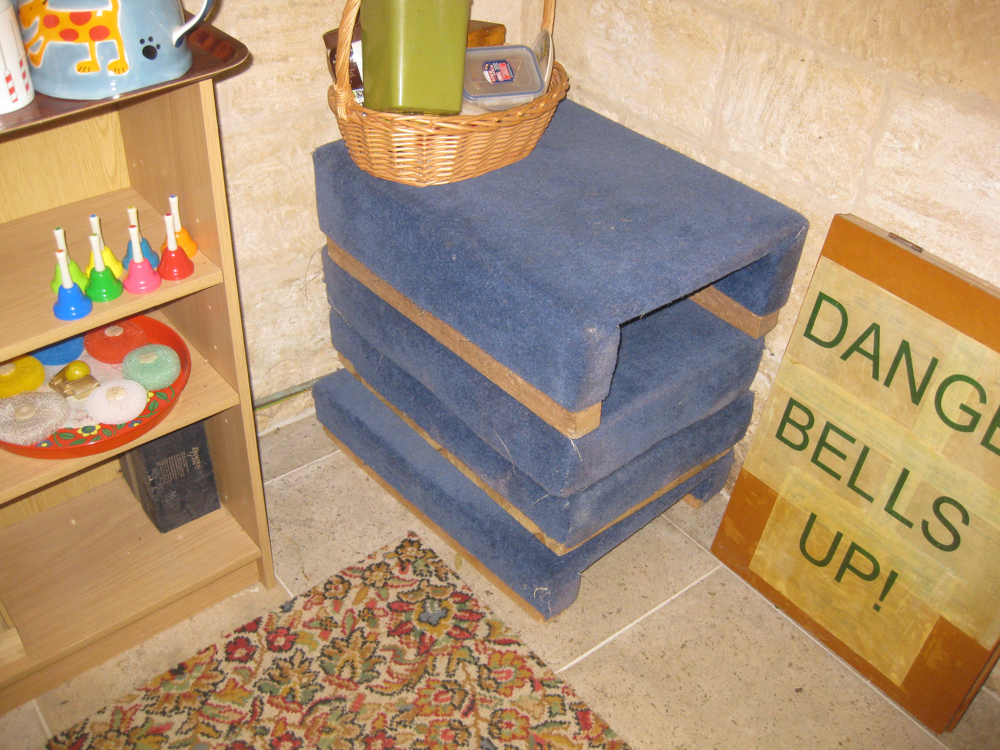
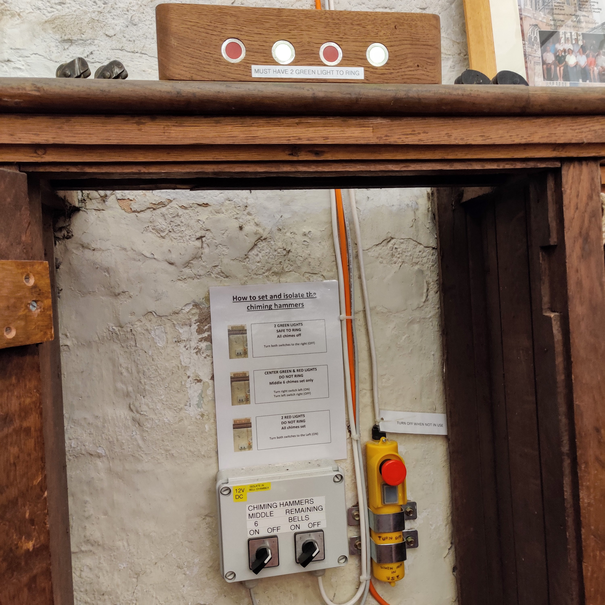
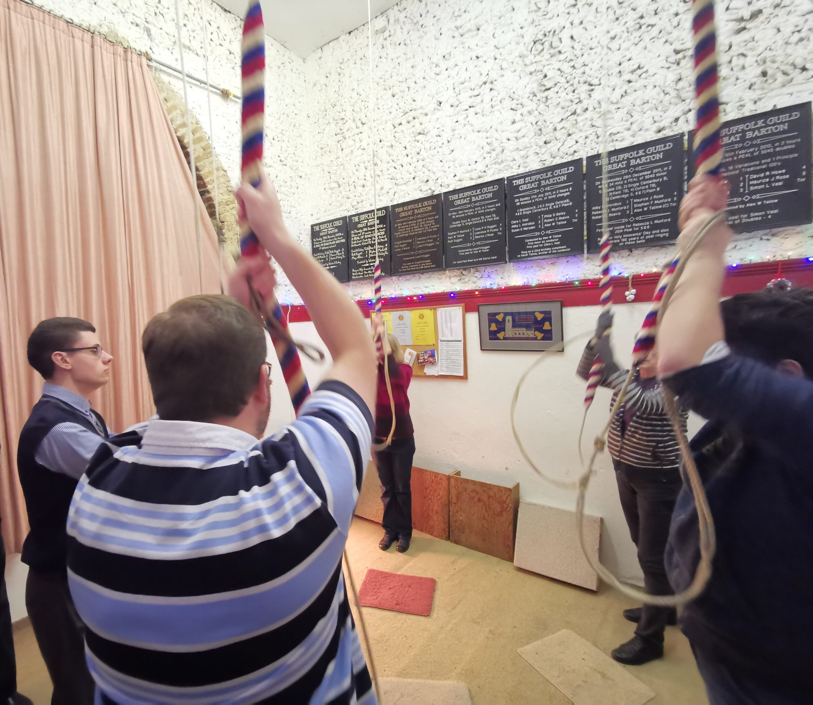
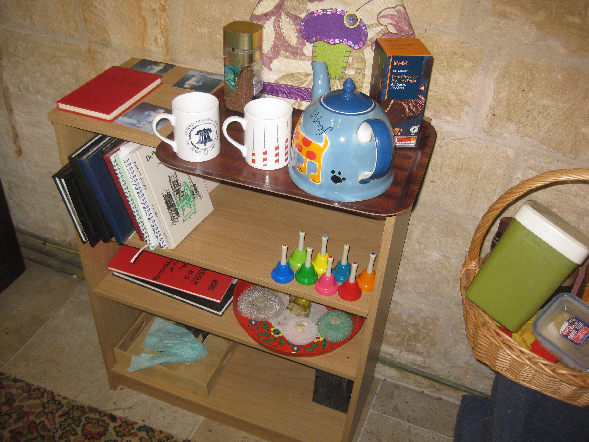
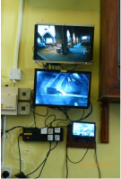
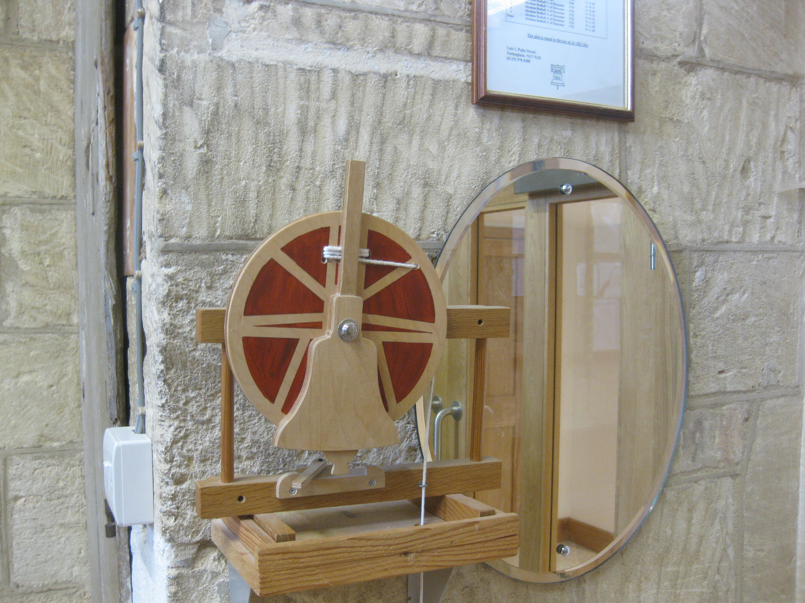
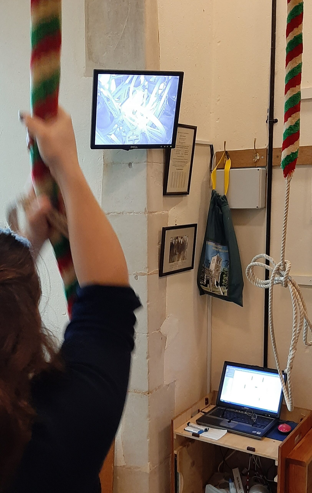
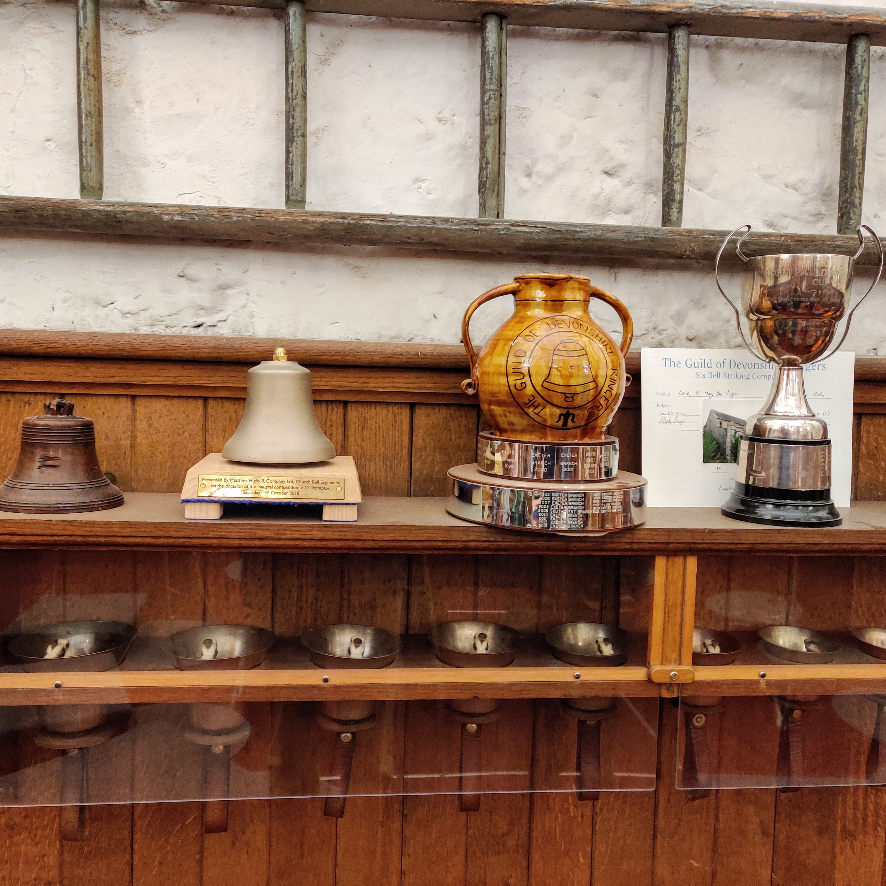

# Ringing Chamber 

Picture of welcoming tower interior 

Try to keep the ringing chamber a tidy and welcoming place. This will give a good impression to any visitors, especially potential recruits. 

## Access

*Figure 1: Non-slip staircase surface*

If the ringing chamber is upstairs, are the steps safe, secure, non-slippery and with good grab handles etc? 

Are the steps well illuminated? 

If the access door from the stairs opens inwards to the ringing chamber, are there measures, such as a window or a notice to ensure it is not opened into a ringer immediately inside? 

If access is by a trap door, is it able to be safely secured when open? 

Is there any other way of accessing the ringing chamber that is less inconvenient? Seek advice maybe from your Association Towers & Belfries Committee  

## Boxes 

*Figure 2: Selection of boxes*

Guidance notes on ringing boxes - https://cccbr.org.uk/wp-content/uploads/2021/06/SM_Ringing_Boxes_2020_Ver_1_1.pdf. 

Are these secure and suitable for use? 

Are they suitably sized so the ringer doesn’t feel any risk of being too near the edge? 

Are they carpeted so they can be stacked safely and without sliding for very young ringers? 

Wedges for uneven floors 

Carpets and Rope Mats

*Figure 3: Carpet, mats and boxes - Exeter Cathedral*

Mats, and carpets, where the ropes come into contact should be pure wool. They should not contain nylon as this can lead to excessive rope wear.  

## Ceiling, Rope Guides,  Spiders 

*Figure 4: Rope guide - Melbourne, Derbyshire*

Are the rope bosses at the optimum height? Too high and the ropes can be flighty. Too low and the sallies can “jump” when coming down at backstroke. 

If unsure, seek expert advice, maybe from your Association towers and belfries committee or a professional bell hanger. 

Is the rope circle poor or very unequally spaced? Again, consider seeking advice as above, especially when there are ropes too close together.  

## Chiming Apparatus 

 

*Figure 5: Ellacombe chiming frame* *Figure 6: Electonic control unit*

Ellacombe apparatus, chiming hammers, electrical (e.g., Apollo) units and similar. Ensure that these are disabled before ringing, especially when the apparatus is not in the ringing chamber.  

## Coat Hooks 

Are these fit for purpose?  

## Curtains / blinds 

Primarily to prevent ringers being blinded by sunlight. Heavy curtains may also be an effective way to shut off an open staircase, door way or open gallery to enable the ringing chamber to be heated without heating the rest of the building, staircase, etc.  

## Electrical Devices 

Power points and powered devices should be checked by a professional approved by the tower authorities. Any portable electrical equipment should be subject to regular checks. Devices must be included in church register of electrical equipment. If there are too few power points, then additional points should be installed rather than using extension leads and adaptors Do not daisy chain from one socket – arrange for additional power points to be installed professionally by church approved contractor.

## Heating   

Consider arrangements to make the environment comfortable. In summer this would include adequate ventilation. In winter this would include heating the area. If the ringing chamber is open to the rest of the building it is worth investigating the use of screens or curtains to enclose the area. If there are any windows through which the sun might shine investigate a blind or curtains to reduce this. 

## Lighting 

*Figure 7: Well lit ringing chamber*

Further details can be found at Guidance notes - [lighting in and around towers](https://cccbr.org.uk/wp-content/uploads/2020/02/SM_Lighting_2019_Ver_3.pdf).  

Is the ringing chamber lighting placed centrally to the rope circle so as to illuminate all ringers above and from the front; avoiding “silhouetting” of ringers? Are there at least two light sources, in case one “blows” or gets smashed by a wild rope? Does one of them have battery power-fail to protect against a blown fuse or power failure? 

If the ringing chamber has large windows is there some means of reducing direct sunlight temporarily blinding the ringers such as curtains or blinds. Seating 

Provide adequate seating to accommodate people not ringing. Seating may consist of chairs, benches, etc. Are these fit for purpose? 

## Notices Boards and Information 

 

*Figure 8: Typical notice board* *Figure 9: Teaching aids*

Notice board(s) with up-to-date notices and Association circulars.  

Teaching aids and a suitable space for teaching. This may include model bell(s), simulator(s), books and pictures of the bells above for those unable to climb to them (see also CCTV).  

# Storage  

Consider whether these need to be lockable, especially when the ringing chamber is readily accessible. 

# The Ringing Experience 

Also, major overlap with V&L group – are they producing anything? Also, ART?  

Insert link to information in 'Belfry Upkeep’ 

# Go of the bells 

Are the bells odd-struck? This may be easily corrected to give a more satisfying experience. Consider seeking advice as above. 

Are any bells set too fine or too deep. Again, this may be relatively easily corrected, consider seeking advice as above.  

# Sound 

Are the sound levels in the ringing chamber good? Is it echoey? if so, consider a carpet or large rug. Curtains and soft furnishings may also help. 

Do the bells “shout” down through a trap door or from the stair's door? 

If so, take steps to remedy this or seek expert advice, maybe from your Association towers and belfries committee or the CCCBR. 

External acoustics for neighbours.  

## Other areas to consider 

*Figure 10: CCTV covering church interior and bell chamber*

CCTV may cover the ringing chamber and the bell chamber. It is useful for visitors, who may not be able to access the tower, and for learners.  

Communication links to the body of the building, especially where the ringing chamber is separate. This may be as simple as a bell pull or as complex as a telephone / visual communication system. This can assist with timings for services (especially weddings) and other activities within the building.  

Kitchen or at least a kettle, mugs and a means of taking the latter away for cleaning. These must be compliant with hygiene requirements  

Parking. 

Toilet(s).  

## Other Tower Resources  

The following is a list of possible assets, though not exhaustive  

### Display bell(s) 

*Figure 11: Model bell for demonstration*

Are these kept securely? Are they adequately insured?  

If possible, these should be portable allowing their use for demonstrations outside of the tower.  

### Handbells

*Figure 12: Set of fourteen handbells in cases*

Are these kept securely? Are they adequately insured?  

Are these usable? If not, consider restoration.  

A cheap option is a set of eight “rainbow” handbells. These are available online, inexpensive, robust and ideal for teaching place-counting, etc. 

### Records

*Figure 13: Peal boards at St. Mark, Exeter*

Tower records of visitors, quarter peals and peals. Within churches in the Church of England, these are formally part of the Parish records and should be deposited in Diocesan records. Further information can be found in the History and Archive Work Group pages on the CCCBR website.  

Peal and other commemorative boards, certificates and photographs. Are these recorded elsewhere? A good idea is to maintain a quality photographic record of these in a separate location.  

Where can peal boards be obtained? Putting a board up requires consultation with the tower authorities and an Archdeacons' consultation in a Church of England church.

*Figure 14: Visitor's book*

### Simulators

*Figure 15: using the simulator at Great Gransden, Cambridgeshire*

Are the components kept securely? Have the electrical components been PAT tested by an approved contractor?  

### Spare ropes  

Insert link to information in 'Belfry Upkeep’.

It is a good idea to have a few usable spares to cover any bell, as needed. 

Do you have at least one person able, and willing, to check the ropes at suitable intervals? Perhaps, a local society 'expert'? Can they identify and correct any wear points, change or repair a rope if needed, and be prepared to order new ones when needed? 

If unsure, consider contacting your local Association Towers & Belfries Committee 

### Tools 

*Figure 16: Selection of tools*

Are these usable and not simply rusted away? 

It may be preferable for the person doing maintenance to provide their own tools, as tower tools have a habit of “walking” or being misused, even by vandals and other ill-intentioned visitors! 

### Trophies 

*Figure 17: Trophies at Exeter Cathedral*

Although these are the usually the property of the awarding body, they are in the care of the tower and should be kept securely. Insurance of these items is normally the responsibility of the awarding body 

## Image Credits

| Figure | Details | Source |
| :---: | --- | --- |
| 1 | Non-slip staircase surface | Photo: Tony Crabtree |
| 2 | Pile of carpeted boxes |  Photo: Tony Crabtree |
| 3 | Carpets, mats and boxes at Exeter Cathedral | Photo: James Kirkcaldy |
| 4 | Rope Guide frame at Melbourne, Derbyshire | Photo: James Kirkcaldy |
| 5 | Ellacombe chiming apparatus | Photo: James Kirkcaldy |
| 6 | Electonic chiming control unit at Exeter Cathedral | Photo: James Kirkcaldy |
| 7 | Well lit ringing chamber at Great Barton, Suffolk | Photo: CCCBR archive |
| 8 | Notice board | Photo: Tony Crabtree |
| 9 | Teaching aids | Photo: Tony Crabtree |
| 10 | CCTV showing church interior and bell chamber | Photo: Alison Hodge |
| 11 | Model demonstration bell | Photo: Tony Crabtree |
| 12 | Set of fourteen handbells in carrying cases | Photo: James Kirkcaldy |
| 13 | Peal boards at St Mark, Exeter | Photo: James Kirkcaldy |
| 14 | Visitor's book | Photo: Tony Crabtree |
| 15 | Using the simulator at Great Gransden, Cambridgeshire | Photo: CCCBR archive |
| 16 | Collection of tools suitable for use on a bell installation | Photo: Tony Crabtree |
| 17 | Competition trophies at Exeter Cathedral | Photo: James Kirkcaldy |

----

## Information supplied by 

| Section | Contributors |
| :---: | --- |
| Ringing Chamber | Tony Crabtree |

----


**[Previous Chapter](../060-Emergency)** - **[Next Chapter](../080-BellChamber/)**

----

## Disclaimer
 
*Whilst every effort has been made to ensure the accuracy of this information, neither contributors nor the Central Council of Church Bell Ringers can accept responsibility for any inaccuracies or for any activities undertaken based on the information provided.*

Version 1.0.1, September 2022

© 2022 Central Council of Church Bell Ringers# Health & Safety 
