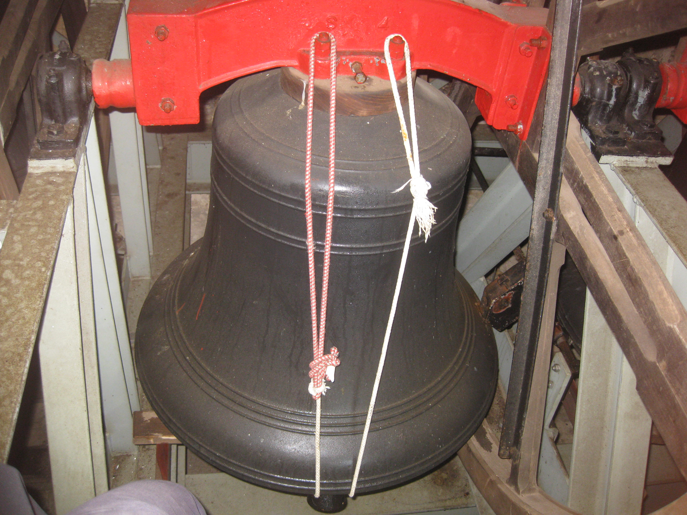

# Bell Chamber

This covers not only the bell installation but all areas that may be accessed and used by ringers outside of the ringing chamber. The bell installation is covered specifically by ['Belfy Upkeep’](https://belfryupkeep.cccbr.org.uk/docs/010-introduction/). 

*Figure 1: Modern low-side frame*

Need to be clear about who is responsible whilst pointing out that ringers are often the only ones with regular access to parts of the church building and have a 'duty of care'. 

Checks should cover the state of the louvres and the general state of the tower with especial concern for the ingress of water and wildlife. 

Make a thorough check after any period of inactivity. Insert link to information recently issued for returning from Covid. 

## Acoustics 

Including examples of sound control in towers. Further details can be found at [Guidance note - sound control in towers](https://cccbr.org.uk/wp-content/uploads/2021/01/Mike-Banks-noise.pdf).

## Lighting

Further details can be found at [Guidance note - lighting in towers](https://cccbr.org.uk/wp-content/uploads/2020/02/SM_Lighting_2019_Ver_3.pdf). 

## Lightning protection and Bell Frames

Further details can be found at [Guidance note - lightning conductors](https://cccbr.org.uk/wp-content/uploads/2020/03/SM_LightningConductors_2020_Ver_1.pdf). 

## The Bell Installation

The following checklists, available within [the SMWG pages on the CCCBR website](https://cccbr.org.uk/about/workgroups/stewardship-and-management/):  

- [Tower and bells periodic checks](https://cccbr.org.uk/wp-content/uploads/2021/01/Record-sheet-quarterly-and-annual-checks-Jan-2021-V1.pdf).

- [Tower and bells detailed survey](https://cccbr.org.uk/wp-content/uploads/2021/01/Tower-survey-v1-26-Jan-2021.pdf).

There are also the following short videos prepared by Tom Ridgman, Ely Diocesan Bells Adviser. We are grateful to them for their permission to reuse this material. The links to which are as follow:

- [Getting ready to inspect and maintain bells](https://www.youtube.com/watch?v=JK100rBzVE0)

- [Maintaining bells and their fittings](https://www.youtube.com/watch?v=99jHnLDcic8)

Ensure regular checks of the bells, frame, fittings and whether all electrical items are working. N.B., some rectifications of faults may require professional intervention. This where the local society may be able to assist. 

## Stays 

 

*Figure 2: Conventional stay (and slider)* *Figure 3: Hastings Stay*

There are several different types of stays in use. Typically one of the above will be found. It is useful to have spare stays or materials to fashion them. It is useful to have the dimensions of each stay – don't measure the last one, as that progressively introduces errors! The measurement of Hastings stays needs to be particularly precise. 

## Muffles  

 

*Figure 4: Older, leather fastening, muffle* *Figure 5: Modern, velcro fastening, muffle*

There are two basic types of muffle. The older type is attached by means of leather straps and / or leather thongs. The newer type makes use of Velcro fastening. As muffles are used infrequently, regularly check them for deterioration, do not leave it until they are required. Ensure that it is known how to fit these correctly. Muffles should be fitted with the bells down and, as in all cases when work is undertaken in the bell chamber, with a second person present. When not in use muffles should be stored in a fabric bag, ideally hung in the ringing chamber. They should not be thrown into a cupboard which may be damp and therefore cause deterioration. 

Muffles are, traditionally, used on a limited number of occasions such as funerals, remembrance Sunday, ringing out the old year. On most occasions bells are half-muffled, that is a single muffle is fitted. Traditionally the backstroke is muffled, in which case the muffle sits on the clapper on the side away from where the rope drops. Bells are only rung fully muffled (or deeply muffled i.e.. with the backstroke of the tenor unmuffled) for the death of a reigning monarch, the incumbent (Parish Priest), or the Bishop of the Diocese. 

## Silencers
  

*Figure 5: Wooden clapper tie* *Figures 7: and 8: Rope clapper tie*

There are various types and means of fitting. ART recommend one based on an old cycle inner tube which is very good. 

It may be preferred to tie the clapper on the hand stroke side so as not to be fine-set for teaching basic bell handling. 

It may be preferred to tie the clapper centrally if the main objective is simulator work. 

## Wildlife 

Are there any protected species e.g., bats? If there are, especial care must be taken so as not disturb them

## Image Credits

| Figure | Details | Source |
| :---: | --- | --- |
| 1 | Modern cast-iron low-side frame at Broadclyst | Photo: James Kirkcaldy |
| 2 | Conventional stay and slider at All Saints, Loughborough | Photo: CCCBR archive |
| 3 | Hastings stay and slider at All Saints, Loughborough | Photo: CCCBR archive |
| 4 | Older muffle with leather thongs and buckle fastenings | Photo: James Kirkcaldy |
| 5 | Modern muffle with velcro fastening at Ripon Cathedral | Photo: CCCBR archive |
| 6 | Solid wooden clapper tie at Washington Cathedral, Washington DC | Photo: CCCBR Archive |
| 7 | Rope clapper tie shown outside bell | Photo: Tony Crabtree |
| 8 | Rope clapper tie shown inside bell  | Photo: Tony Crabtree |

----

## Information supplied by 

| Section | Contributors |
| :---: | --- |
| | |

----


**[Previous Chapter](../070-RingingChamber)** - **[Next Chapter](../090-BuildingTeam/)**

----

## Disclaimer
 
*Whilst every effort has been made to ensure the accuracy of this information, neither contributors nor the Central Council of Church Bell Ringers can accept responsibility for any inaccuracies or for any activities undertaken based on the information provided.*

Version 1.0.1, September 2022

© 2022 Central Council of Church Bell Ringers# Health & Safety 
