# Stays & Sliders

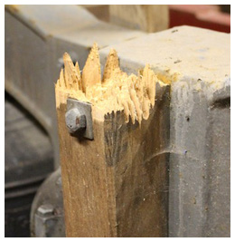

A **Stay** is a mechanism which allows a bell to be ‘parked’ (the ringing term is ‘**Set**’) with its mouth upwards. This is achieved by the stay engaging with a **Slider**, which allows the bell to go just past the point of balance in either direction.

The stay also acts as a ‘safety valve’. It is designed to break if the bell is set too violently, avoiding damage to other, more expensive, parts of the installation.


If the stay breaks the bell will continue to rotate, taking the rope upwards. Learners **MUST** be taught that this could happen and that, if it does, they must let go of the rope immediately.


In this Chapter we will:
-  describe various designs of stays and sliders, including some which may not often be encountered,
-  explain how the stay interacts with the various types of sliders, 
-  set out the routine checks and maintenance needed to keep the installation operating smoothly, and
-  identify cases where a Typical Steeple Keeper should seek expert advice.


We have tried to separate the discussion on stays and sliders but this is not always possible because of the interaction between them. Please bear with us on this.


## Stays

The stay is fitted to the [headstock](../060-headstocks) on the end opposite to the [wheel](../070-wheels). There are various ways to attach a stay, depending on the type of headstock. The three main configurations are shown in Figure 1, and further details are given in the following sections.

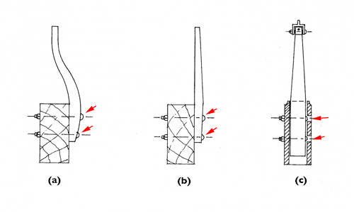

*Figure 1: Typical types of stay and their fitting*

In many (but not all) installations the stay is secured to the headstock using [***coach bolts***](../170-glossary/#coach-bolts). The heads of the bolts (arrowed on Figure 1) are next to the stay and the square section under the head of the bolt bites into the wood of the stay to secure the bolt.
-  Figure 1a shows a curved stay bolted to a wooden headstock. This is likely to be found only on old installations. The curve is designed to put the end of the stay on the centreline of the headstock.
-  Figure 1b shows a straight stay bolted to the side of a wooden headstock, although the same arrangement could be used for a hollow metal headstock.
-  Figure 1c shows a straight stay in a metal ‘socket headstock’. This shows a ‘Hastings stay’ but the same arrangement is often used for a straight stay like the one in Figure 1b.

A stay is made of straight-grained Ash timber, thickest at the top fixing or where it exits a socket (Figure 1c) and tapering towards the end which contacts the slider. This provides maximum strength at the point of maximum stress. You may, however, find plenty of stays without tapers.

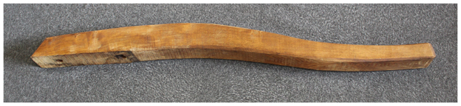

*Figure 2: Profile of a curved stay*

Traditionally, it is likely that curved stays will have been steam-bent. Nowadays, they will be cut from a piece of Ash wide enough to provide the correct profile. An example is shown in Figure 2. If possible, the direction of the grain should follow the longest finished length.

### Fixing to wooden headstocks

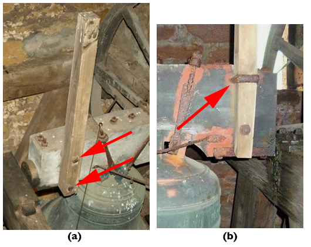

*Figure 3: Stays attached to wooden headstocks*

The stay will always be attached on the side of a wooden headstock, usually by bolts, arrowed on Figure 3a. In older installations, the top bolt may be replaced by a U-shaped fastening (arrowed on Figure 3b) secured with nuts and washers on the far side of the headstock. 

### Fixing to metal headstocks

#### Socket type

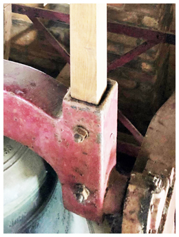

*Figure 4: Socket fitting on a metal headstock*

A metal headstock may incorporate a socket to accommodate the stay (Figure 4). This keeps the stay on the centre line of the headstock but it requires careful fitting. 

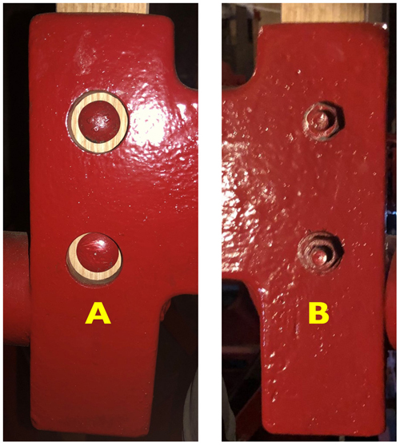

*Figure 5: Position of bolting on a socket stay*

Figure 5 is a composite showing both sides of a socket headstock. Here, the bolt heads are on side A, with holes large enough to allow the bolt head to be in contact with the stay. Being [***coach bolts***](../170-glossary/#coach-bolts), the square section under the head will dig into the wood to stop the bolt turning as it is tightened. The holes on side B are smaller – just big enough to take the shaft of the bolt. Washers and nuts are then screwed on to side B and tightened to draw the stay against side B. The stay must be sized to provide clearance on the other three sides of the socket. 

#### Fixing on the side of a headstock

Nowadays the need for a stay to be on the centre line of a metal headstock is not considered essential (except where Hastings stays are fitted – see later). This is because metal headstocks tend to be narrower than wooden ones, and the position of the slider can be adjusted more easily in a modern installation. Many stays will now be found bolted on the side of the headstock. Figure 6 shows the stay (A), a hollow cast headstock (B) and the stay bolts (C) – note the heads of the coach bolts.

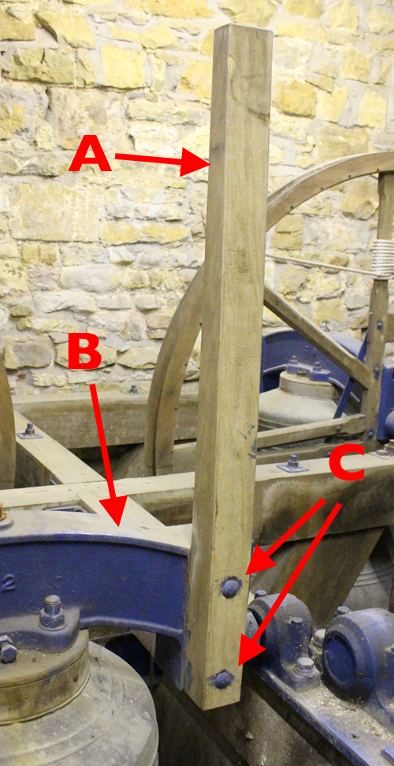

*Figure 6: Stay mounted on side of a metal headstock*

## Sliders

When the bell is mouth-up, the stay engages with the slider, which allows the bell to move just past the vertical position in either direction. Many installations use a traditional design, although the ‘Hastings’ design – and some others –  may be encountered.

### Traditional design

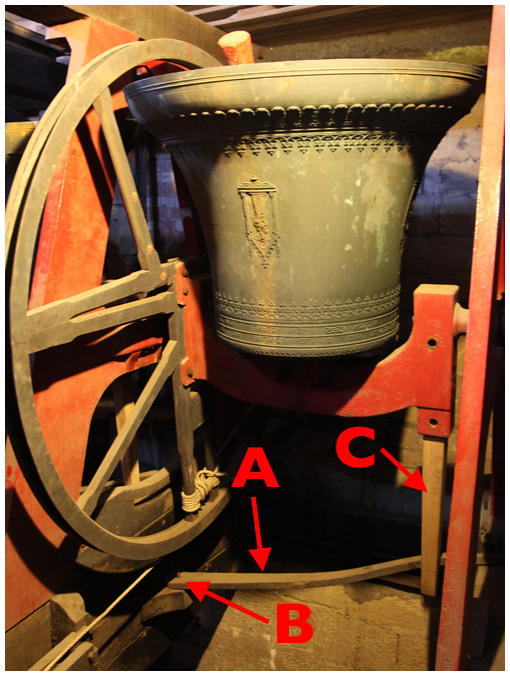

*Figure 7: Raised bell with a traditional stay and slider*

The main parts are shown in Figure 7. The **slider** (A) is located under the bell. There is a **pivot** (B) on the wheel side and the other end sits on a **runner board** (not visible). As the bell nears top centre the stay (C) pushes the slider between two **end stops** on the runner board – this is shown in Figure 8.



*Figure 8: Operation of a traditional stay and slider*

The slider is usually curved. This is because the pivot must be below the rim of the wheel, while it is usually convenient to locate the runner board higher on the frame. In some cases, the runner board may be located at the same height as the pivot, in which case a straight slider will be used. This will require a longer stay.

The pivot may be anything between an L-shaped iron rod hammered into a wooden frame, to a pin on an angled plate bolted to the frame. The slider has a hole which locates on the pivot. There will usually be some arrangement to stop the slider jumping off the pivot, for example a bolt or a split pin through a hole in the pivot. Whatever the arrangement, the slider must be able to move smoothly on the pivot.

In some cases, there is no means of retaining the slider on the pivot. This may be satisfactory if the installation is well-maintained and the slider moves smoothly – and it does allow the slider to be removed easily when working under the bell – but it does introduce a risk.


Both the tip of a curved stay on a wooden headstock and the stay on a metal socket headstock lie on the centre line of the headstock. In this case the centre of the runner board will be below the centre of the headstock. For a side-mounted stay, the runner board will usually be offset by about half the width of the headstock. A curved stay can be replaced with a straight one if the runner board can be moved but, depending on the design of the frame, this may be difficult or impossible. This is a job for a Bell Hanger.


### Hastings stay

This mechanism, invented by Rev Edward Hastings Horne, has been fitted to some installations by John Taylor and Co between 1890 and 1960. They will still fit Hastings stays if required or where space considerations mandate them. More information on Hastings stays is given in [Further Reading](#further-reading).

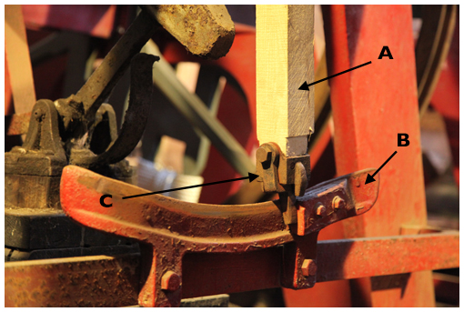

*Figure 9: Hastings stay showing dingler and quadrant*

In this system, shown in Figure 9, the slider under the bell is replaced by a metal quadrant (B) whose curvature matches the arc described by the tip of the stay. The ends of the quadrant bend out in opposite directions to form an elongated S-shape. The stay (A) has a pivoted metal peg, usually called a **dingler** (C), at its tip and the bends at either end of the quadrant direct the dingler to stop blocks on either side of the quadrant. The video in Figure 10 shows a Hastings stay in operation.



*Figure 10: Hastings stay in operation*

### Gillett & Johnston system

Gillett & Johnston sometimes used a system, shown in Figure 11, similar in some ways to the Hastings stay.

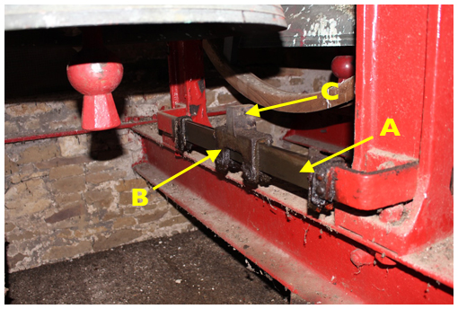

*Figure 11: Gillett & Johnston system with straight track*

In this system, a **Traveller** (B) moves along a track (A). In this example, the track is straight, although it may be curved to match the arc of the moving stay. The stay pushes a tab (C) on top of the traveller along the track until it hits the stop block at either end. This avoids the need for a dingler on the end of the stay, but the length of the stay is critical – it must be long enough to engage the tab on the slider but without fouling the track.

### Steel stays & pendulum sliders

A very few light rings are fitted with steel stays, presumably on the argument that the bells are so light that there is no problem in not relying on the “weakest link” safeguard of a breakable stay. This is the case at Frenchay, Gloucestershire, which has six bells with a tenor of 217kg (just over 4cwt). The frame comprises a grillage of steel girders with the bearings on top of the frame and ‘pendulum’ sliders hung below.

*Figure 12: Steel stay in socket headstock (a) and pendulum sliders below (b)*

Figure 12a shows the steel stay in the socket headstock with supporting wooden blocks either side. 12b shows a pair of sliders with one bell set (on the right). The sliders are equipped with small springs to soften the impact as the bell is set – or over-pulled.

Some light rings with traditional wooden stays may also be fitted with pendulum sliders.

### Mini rings

Mini-rings are becoming common, both as fixed and portable installations – see [here](http://campaniles.co.uk/directory.html). Many of them have a tenor around 4.5kg (10lb) and these dispense with stays and sliders altogether. To set at hand stroke, the bell is allowed, under control, to continue past the balance, taking the rope up to the height of a normal back stroke set. These bells are light enough to be pulled back to the hand stroke set position before ringing. 

## Routine Checking

Except where noted, any actions arising from these checks can be rectified by a Typical Steeple Keeper.

### General procedure for all types


1.	The checking interval must be judged on the usage of the bells – both the number of learners being taught and the possibility of visitors finding difficulty with unfamiliar bells.
2.	Good ringers can recognise the early stages of cracking by noticing that a bell seems ‘soft’ when setting.
3.	With the bell ‘Down’, firmly push the end of the stay in both directions. Any movement will indicate loose stay bolts. Any springiness might indicate cracking.
4.	Tighten the stay bolts if necessary and check again.
5.	If cracking is noticed, the stay needs to be replaced – see [Broken Stay](#broken-stay).
6.	If the nut on the clapper crown staple bolt becomes loose, the clapper may drop slightly and hit the slider. This condition would normally have been detected in the routine checks of the clappers, but it may occur rapidly, particularly if the nut is not securely locked. This will usually result in a knocking noise which may be heard even from the ringing room. It can be confirmed by tell-tale marks on the top of the slider. The urgent remedial action to deal with loose crown staple bolts is covered in [Clappers](../090-clappers).

Even if there is no suggestion of cracking or loose bolts, the stay bolts should be loosened and re-tightened periodically to check that the nuts have not rusted solid. This is particularly important for a socket headstock, where trapped dampness may cause the bottom of the stay to soften or rot. Trying to remove a rusted nut in this case may cause the head of the coach bolt to turn in the wood, making the bolt very difficult to remove.


### Additional for traditional design


1.	Clean the surfaces of the runner board and underside of the slider of any dirt or debris. Accumulations of oil or grease may suggest a problem with the bell bearings – see [Bearings](../100-bearings) for rectification measures.
2.	Check for wear at the pivot pin (this would be unusual) and check that retaining locknuts (if fitted) on the pin are tight.
3.	Check the end stops on the runner board for damage, usually caused by prolonged poor handling. It may be possible to repair these using a competent local carpenter but, in extreme cases, this is a job for a Bell Hanger. (The longer-term solution is to improve the training of all ringers.)
4.	The surface of the running board should not require lubrication but, if necessary, use graphite powder. Do not use beeswax or furniture polish as this can attract dirt particles.
5.	Finally, check that the slider is moving smoothly and easily on the runner board, without sticking or scraping noises.


### Additional for Hastings stays


1.	Check the dingler for free movement and tightness of the fixing screws. With extended use, the holes in a dingler may wear, leading to looseness of the peg. If needed, John Taylor and Co can provide replacement dingler assemblies.
2.	Check the edge of the dingler and the track for any signs of rubbing. This could result from incorrect setting up of the stay or looseness of the stay bolts. If necessary, reset the stay as described in [Broken Stay](#broken-stay).
3.	Apart from these points, a Hastings installation requires **NO** maintenance. The quadrant should not be lubricated, as this encourages a build-up of dirt.


### Additional for Gillett sliders


1.	Check that the track is clean and the traveller moves smoothly.
2.	Lubricate the track sparingly with light oil. This is necessary because the frictional drag on the traveller is greater compared to that of the dingler on a Hastings stay.


### Additional for steel stays and pendulum sliders


1.	Check tightness of all fastenings.
2.	Check free and smooth motion of the pendulums, lubricating sparingly as required.


## Broken Stay


A stay functions in a similar way to a safety valve or electrical fuse: it protects the installation from unusual occurrences. If a tower suffers from repeated broken stays, and if the stays have been properly maintained, then the fault lies most likely in the way that learners have been taught.


For ringers, a broken stay will be an unexpected and possibly alarming event. As Steeple Keeper, you will be under pressure to get it fixed and you may be inundated with advice from ‘instant experts’. Your responsibility now is to keep calm and to plan your course of action, taking account of your own experience (and possible limitations) and the availability of materials, services, and advice from reliable experts. The main steps are:

-  Your immediate actions
-  Procuring a replacement stay
-  Fitting the replacement
-  Checking the work

### Immediate actions


1.	Do not enter the bell chamber alone.
2.	Check the slider and surrounding equipment for any damage caused by the impact and the flying remains of the stay.
3.	Remove the part of the stay still attached to the headstock, keeping all bolts, nuts, and washers.
4.	For a side-mounted stay, mark the side of the headstock where the stay was mounted. (This may be obvious from markings on the headstock but better safe than sorry.)
5.	Do not dispose of the broken parts of the stay. A stay made of good quality straight-grained ash will usually break cleanly across the stay. With care, the two parts can be pushed together and will provide a template for making the replacement. This is critical for a curved stay as there is no ‘standard’ profile.
6.	The rope will have wound itself around the wheel: it may even have come off the wheel and be wound around the headstock or gudgeon. Pull the rope up into the bell chamber and check it for any damage, cleaning off any dirt or grease as necessary. Treat this like [fitting a new rope](../120-ropes/#fitting-a-new-rope) – this will make it easier to reinstate the rope if the rope route is complex, possibly including a rope guide.


### Procuring a replacement stay

Several options are available here and the choice requires careful consideration.

#### Obtaining a replacement from the original bell hanger

The simplest and lowest risk option is to obtain a replacement stay from the original bell hanger. This is not the cheapest option but bear the following points in mind:
-  The wood will be Ash, of guaranteed quality.
-  The stay will have been made using the correct tools, by qualified wood workers covered by insurance against any accidents.
-  It will be made to records held by the original bell hanger.
-  The stay should be delivered with fitting instructions, identifying at least the straight edge to be fitted against the headstock.
-  You have a claim if the stay is not to standard.

#### Obtaining a replacement from another bell hanger

The original bell hanger may no longer exist. If they have gone out of business recently, it may be worth checking if another bell hanger has taken over the business – and any records.

If records are not available, and if you have the parts of the original stay, then a bell hanger should be able to produce a replacement using the old stay as a template. The standard of work should still meet the standard expected of an original bell hanger.


A word of caution here. How certain are you that the broken stay was of the correct size? And if this has happened in the past, is it possible that the size has gradually crept up because of over-caution about removing too much material? A badly over-sized stay is not doing its duty as a ‘safety valve’.


If you do not have an adequate template, or if there is any doubt about the size, then you should arrange for a bell hanger to visit to assess the situation and take any required measurements.

#### Making a replacement stay yourself

Within the Church of England, ‘replacement of bell stays’ appears in List A of the [Faculty Jurisdiction Rules](../030-faculty-rules/#a3-bells-etc). This means that it can be undertaken without external consultation but the responsibility still lies with the church authorities. Any decision they make will rely on your advice and their trust in you. (The situation will be similar in other jurisdictions). That is a heavy burden. If you really believe you can undertake this, ideally with the support of an Experienced Steeple Keeper, then go ahead. But you must consider:

-  Do you have access to Ash of the required quality?
-  Do you have access to the required wood working tools and are you experienced in their use?
-  Do you understand all the Health & Safety implications of such work?
-  Do you understand that if ‘your’ stay breaks and causes injury to a ringer, you might be held responsible for some or all of that injury if the workmanship was seen to be faulty?

We will not provide further information on how to make a replacement stay on the assumption that anyone undertaking this work will be fully aware of what is required.

#### Repairing the broken stay

Don’t even think about it.

### Fitting the replacement


In what follows, we assume that replacement stay is an exact copy of the original, including the bolt holes. If the bolt holes have not been drilled, they will need to be marked up from the headstock and then drilled, preferably using a pillar drill to ensure they are at right angles to the flat side of the stay. If you do not feel capable of doing this, you should either call in the bell hanger or seek advice from an Expert Steeple Keeper.


Assuming the replacement stay has been made to the required standard, a Typical Steeple Keeper should be capable of fitting it. As always when working in a bell chamber, an assistant is essential – and very useful. The Steeple Keeper is making a useful contribution here: the Bell Hanger is saved a journey to carry out a short job.

#### Side-mounted stays


**Procedure for a side-mounted stay**
1.	Mount the stay on the correct side of the headstock. This is why you marked the correct side when you removed the broken part. You did do that, didn’t you?
2.	Mount the straight (un-tapered) side against the headstock. Whoever made the stay should have marked that side.
3.	If you are using coach bolts, it helps to tap the head gently with a hammer to start the square section under the head biting into the wood. 
4.	If you are using a bolt with a hexagonal head, you will need a second spanner to hold the head while you tighten the nut. This is where the assistant is useful.
5.	Before fully tightening the nuts, use a spirit level to ensure that the stay is vertical. The holes in the stay and headstock should have enough play to allow you to move the stay slightly to correct this. 
6.	If this doesn’t work, the holes in the stay are not perfectly aligned. You may be able to correct this using a circular wood file on the hole. Otherwise, you will need to go back to whoever made the stay with a legitimate complaint.
7.	Finally, tighten the nuts.


#### Socket headstocks


**Procedure for a socket headstock**
1.	Mount the stay with the straight side against the side of the socket with the larger holes (Side A on Figure 5).
2.	Coach bolts are essential here, as it will be impossible to reach a hexagonal bolt head with a spanner –  probably even with a socket spanner.
3.	If coach bolts are replaced on an older socket headstock a problem may be encountered as some metric coach bolts have a larger diameter head than the imperial ones they replace. This means that the larger head may not fit through the hole in the headstock. The diameter of the bolt head can be reduced if you have access to a lathe or a grinder, but do not remove more material than necessary.
4.	The new stay should slide easily into the socket. If there is any indication of binding, remove the stay. Any areas that were binding should be obvious and can be carefully trimmed using a plane or wood file.
5.	Before fully tightening the nuts, use a spirit level to ensure that the stay is vertical. The holes in the stay and headstock should have enough play to allow you to move the stay slightly to correct this. 
6.	If this doesn't work, the holes in the stay are not perfectly aligned. You may be able to correct this using a circular wood file. Otherwise, you will need to go back to whoever made the stay with a legitimate complaint.
7.	Finally tighten the nuts.



**DO NOT** under any circumstances attempt to force an over-sized stay into the socket. This can over-stress the socket and may break it, especially if it is made of cast iron. This does happen – see Figure 13.


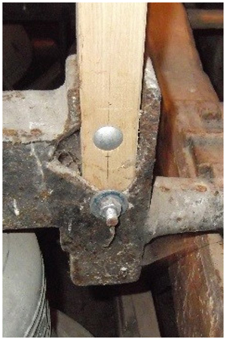

*Figure 13: Cast iron headstock broken by over-sized stay*

#### Hastings stays

The procedure for fitting a Hastings stay is similar to that for a plain socket stay except for the need to replace the dingler assembly. If unfamiliar with this, you should seek advice from a Bell Hanger or Expert Steeple Keeper.

### Checking the work


This will involve witnessing the operation of the stay and slider when the bell is rung up. This is potentially dangerous and you **MUST** take the following precautions:

1.	Place yourself in a position where you can see the stay and slider but are not in the direct line in the unlikely event of the clapper breaking.
2.	A further person is in the Ringing Room ready to raise the bell.
3.	Ideally, a third person is with you in the Bell Chamber.
4.	Either tie the clapper, or all persons in the Bell Chamber wear hearing protection.
5.	A system of signals is agreed between the Ringing Room and the Bell Chamber. This could be jerking the rope on an adjacent bell.
6.	Signal to raise the bell and witness the interaction between stay and slider.
7.	If there is any problem, give the signal to immediately lower the bell.


You would have had to do something very wrong for there to be a problem with a traditional stay and slider. The most likely problem with a Hastings stay would be the dingler binding on one side of the quadrant. Note which side is binding and, after lowering the bell, slacken the stay bolts and attempt to move the stay slightly before repeating the check.

For any other problem, you must swallow your pride and seek expert help.

Some bolts, particularly coach bolts, may take time to settle in. It would be prudent to check the bolt tightness after a week or so.

## Further Reading

“Hastings Stays”, *The Ringing World* 2003 (4834/35): 1230-31, with follow-up letter 2004 (4837): 29.

## Image Credits

| Figure | Details | 
| :---: | --- | 
| Title Picture | What you hope not to see: the remains of a broken stay. (Photo: Robin Shipp) |
| 1 | Typical types of stay and their fitting. From *A Schedule of Regular Maintenance*, Central Council Publication, 1991. (Drawing © Alan Frost) |
| 2 | Curved stay removed from Thornbury, Glos, during 1996 rehang. (Photo: Robin Shipp) |
| 3 | Stays attached to wooden headstocks with (a) two bolts, (b) top clamp. (Photos: Chris Povey) |
| 4 | Socket fitting on a metal headstock at Temple Guiting, Glos. (Photo: Chris Povey) |
| 5 | Bolting on a socket stay. (Composite of photos by Chris Povey) |
| 6 | Stay mounted on the side of a metal headstock at Chipping Sodbury, Glos. (Photo: Robin Shipp) |
| 7 | Raised bell at All Saints, Loughborough, showing traditional stay and slider. Entry in the *Bells and Installations* round of the Central Council photographic competition. (Photo: Roger Lawson) |
| 8 | Operation of a traditional stay and slider at Thornbury, Glos. (Video: James Joynson) |
| 9 | Hastings stay at All Saints, Loughborough, showing dingler and quadrant. Entry in the *Bells and Installations* round of the Central Council photographic competition. (Photo: Roger Lawson) |
| 10 | Hastings stay in operation. (Video: Andrew Ward) |
| 11 | Gillett & Johnston system at Wickwar, Glos. (Photo: Robin Shipp) |
| 12 | Steel stay and pendulum sliders at Frenchay, Glos. (Photo: Robin Shipp) |
| 13 | Cast iron headstock broken by forcing in an over-sized stay. (Photo: Chris Povey) |

-----

## Disclaimer
 
*Whilst every effort has been made to ensure the accuracy of this information, neither contributors nor the Central Council of Church Bell Ringers can accept responsibility for any inaccuracies or for any activities undertaken based on the information provided.*

Version 1.0, August 2022

© 2022 Central Council of Church Bell Ringers
