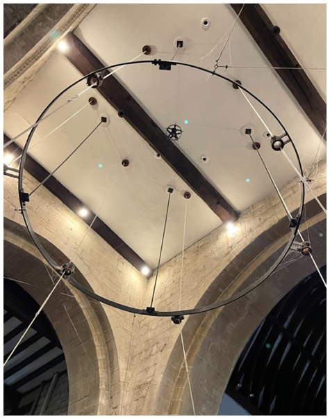
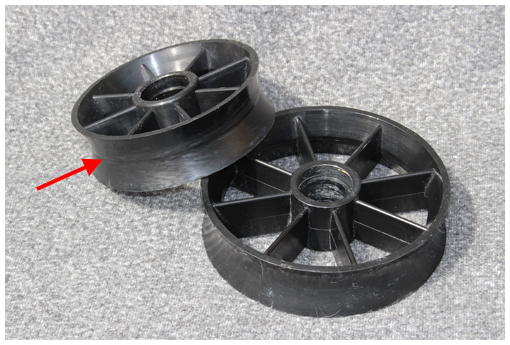
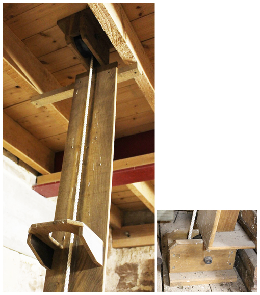
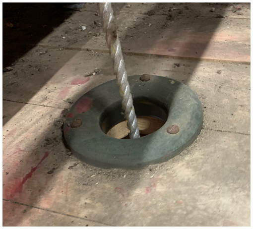
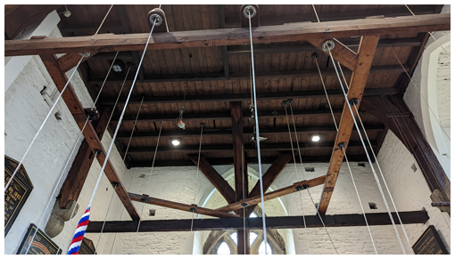
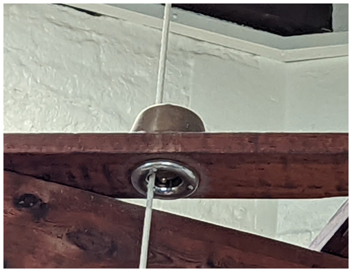

# Rope Routes

The rope may encounter many obstacles between the bell and the ringer. The main reasons are:

-  It is difficult to design a traditional rectangular [bell frame](../050-bell-frames) with all ropes falling in a perfect circle, especially with constraints on space and the possible need for a two-tier frame.
-  There may be obstacles such as support girders, ladders and clock cases which limit the placement of ropes.

Any obstacle to free movement of the rope will have an effect on the handling of the bell. In this chapter we describe situations which a Steeple Keeper may encounter and the implications for checking and fixing problems.

## Obstacles to a Straight Drop

### Pulleys


The term Pulley can be used to refer either to a wheel which rotates as a rope passes over it or to the whole assembly of the wheel within its mounting, called a Pulley Block. Here, we will use more traditional terms: referring to the wheel  as a **Roller** and using **Pulley** for the whole assembly of the **Roller** and the **Roller Box** which supports it. Some ringers may use different names but please bear with us.


The first major ‘obstacle’ in any installation is the **Ground Pulley**. This usually sits below the bell and accommodates the change of direction of the rope as the bell rotates. With the bell set at back stroke (or down), the rope rises straight up to the wheel with the pulley playing little part. When set at hand stroke, however, the rope is pulled under the wheel, running over the **Ground Pulley Roller**. A single pulley like this may be referred to as a **Hand Stroke Roller**.


A rope moved from where it would naturally fall is said to be ‘drawn’. Thus, where a double ground pulley is used the rope is ‘drawn’ further under the bell.




*Figure 1: Movement of the rope over a double ground pulley*

The video in Figure 1 shows the operation of a double ground pulley. Note that the hand stroke pulley has to cope with a change of direction as well as the forces involved as the bell changes direction. The wear on this pulley likely to be larger than on any other along the rope route.


In a tower with a very short draught the sally may pass up through the ground pulley. In this case a wider roller box should have been fitted to accommodate the sally without resistance. If this is not the case, a suitable roller box should be obtained from a Bell Hanger.


We have been referring to the most common location for the ground pulley – sitting below the wheel. A possible alternative is to ‘top-rope’ the wheel, with the ground pulley placed level with the top of the wheel, as shown in Figure 2. 



*Figure 2: Movement of the rope on a top-roped bell*

This may be a way of re-routing a rope to provide a more direct fall where there is an obstacle below the bell. The arrangement is used on the [Charmborough portable ring]( http://charmborough.org), mainly to save space, although it also avoids the need for the sally to pass through the ground pulley. Note that this is only possible where the bell frame extends above the bell – see the description of an H-frame in [Bell Frames](../050-bell-frames).

Traditionally, rollers were turned up in wood and fitted to an axle with plain bearings, which were often of very crude design.

*Figure 3: Modern plastic rollers with the start of grooving (arrowed)*

Today, various types of plastic rollers (Figure 3) are used as well as wood. They are usually fitted with sealed ball bearings which give long trouble-free service and are virtually silent in operation. Note the dished face on which the rope runs. Note also that the smaller roller is just beginning to show signs of grooving from rope wear (arrowed).

### Intermediate chambers

We can see that a limited amount of rope draw is possible by varying the position of the ground pulley. Ideally, any draw below the ground pulley should be minimised but, in order to achieve a good rope circle, that may not be possible. An [***intermediate (or clock) chamber***](../170-glossary/#intermediate-chamber), if present, offers the possibility of drawing ropes.

Small amounts of draw can be accommodated by the rope running over **Bosses** (see below) in the ceiling and floor. “Small amounts” is difficult to define but a rule of thumb is up to 5cm horizontally per metre of height.

*Figure 4: Rope drawn in an intermediate chamber*

For larger amounts of draw, single pulley blocks are required on the floor and ceiling of the chamber and possibly also boards with support rings. For a large draw, these boards avoid the rope dropping into a loop when slack and then snapping tight when force is applied. Figure 4 shows a top pulley, board, and support ring (left), with detail of the bottom pulley (right). The use of a board is preferred to an enclosed box section (usually called a ‘rope chute’) because this may channel excessive sound down into the ringing room and may hide rope wear. However, a rope passing through a clock case should be fully enclosed, to reduce the risk of rope fibres getting into the clock mechanism. This will also avoid a broken rope becoming entangled in the mechanism.

### Rope bosses

A **Rope Boss** is a flange which protects the rope from wear as it passes through a floor or rope guide. The example is shown in Figure 5 is on the floor of a bell chamber, immediately below the ground pulley.

*Figure 5: Boss on a bell chamber floor*

Bosses can be made of timber or metal:

-  Hardwood is popular because it maintains a smooth surface – softwood is also used but wears much faster than hardwood.
-  Metal bosses can be made of cast iron, steel or aluminium. All of these corrode, even to a small extent, and this can lead to increased rope wear.
-  Stainless steel does not corrode in a normal tower environment and a stainless-steel boss will retain a smooth polished surface. This is, however, an expensive option.

### Rope Guides

Some ringing rooms can have very high ceilings. In this case, one or more rope guides may be fitted to control the fall of the ropes. Rope guides may also be used to draw the ropes into a better circle but the amount of draw should be kept to a minimum.

*Figure 6: Rope guide at St Mary Redcliffe*

Figure 6 shows the rope guide at St Mary Redcliffe, Bristol. This carries bosses for all 14 bells. Note the solid construction, which minimises movement and rope noise.

In contrast, the Title Picture shows the rope guide at Leonard Stanley, Glos – a ground floor ring, rung from the centre of the church. The rolled steel frame is suspended on rods, braced laterally with series of wires. It is reported to perform very well.

The height of the rope guide should be such that, when the Tenor bell is set at back stroke, the lower half of the sally is in the guide. But note that one of the reasons for fitting a guide is to assist the handling of smaller bells, which may be ‘flighty’. So, rope guides may be fitted on the front bells only.

## Checking and Fixing

Any problems with the rope route can lead to difficulties in handling a bell and wear on the rope. This chapter covers the checking and fixing of features in the rope route which may cause problems. Checking of the ropes themselves is covered in [Ropes](../120-ropes) and, if possible, checks on the ropes and the rope routes should be combined.

### Rollers and roller boxers


**Procedure for checking rollers and roller boxes**
1.	Check that the roller box is securely mounted.
2.	Check for signs of rope wear on the sides of the roller box.
3.	Hold the rope away from the roller and spin it by hand.
4.	Check that the roller spins freely and quietly.
5.	Check that the roller is round and that any groove worn by the rope is less than a few mm deep.


Problems identified in the procedure above should be dealt with as follows:

#### Roller Box not securely mounted (1)

Check all fastenings securing the roller box and tighten as necessary.

#### Rope wear on the roller box  (2)

Ideally, the rope should only contact the roller, not the side of the box. Signs of significant rope wear on the box will indicate a problem:
-  For a ground pulley, the most likely cause is that the bell wheel is not running true. Checks and remedies are given in [Wheels](../070-wheels/#wheel-not-running-true).
-  If the wheel is running true, it is possible that the ground pulley is not correctly aligned with the wheel. This may require assistance from a Bell Hanger, although an experienced Steeple Keeper may be able to correct this using packing pieces or modifications to the fixing points.
-  For other pulleys used to draw a rope in the intermediate chamber, wear on the roller box is almost certainly due to misalignment. See [Intermediate chambers](#intermediate-chambers-1), below.

#### Roller not spinning freely and quietly (4)

This is unusual in a modern installation with sealed bearings on the roller. To check, remove the bolt from the axle and withdraw it. The roller should then drop out of the roller box and can be inspected in detail. The problem may be a seized or dirty bearing. A replacement should be obtained from a specialist bearing supplier or a Bell Hanger.

For older types of rollers with plain bearings, lubrication may solve the problem: 
-  If the roller is fixed to its axle, the bearing is usually a metal plate fitted on each side of the box – a few drops of oil should be sufficient to stop any noise and permit free rotation. 
-  If the roller spins on an axle fixed to the box, run a few drops of oil down the inside face of the box, holding the roller to one side to facilitate this. This type of roller box often has a groove down each inside face to make this operation easier. 
-  The roller box may be fitted with ‘[***Stauffer***](../170-glossary/#stauffer-lubricator)’ type screw lubricators. An occasional turn of the cap will force sufficient grease into the bearing to last for some months. If the cap will screw down no further, remove it, fill with grease, and replace.

#### Roller not round or grooved (5)

The face of a roller may develop a groove caused by wear from contact with the rope (see Figure 3). A small groove is acceptable but the roller should be replaced if the depth of the groove exceeds a few millimetres. With extensive use, rollers may become elliptical, with a deeper groove on one side. This is more likely for wooden rollers, particularly on the hand-stroke roller, with its heavier duty. In this case, the roller will need replacement.

### Intermediate chambers

Ropes dropping straight through an intermediate chamber should not present problems, although you should check that the assorted items that always seem to accumulate in these chambers are well away from the ropes.

If ropes are drawn, carry out the roller box and roller checks described above on the pulleys at both the floor and ceiling. Note that the ceiling check may require the use of a ladder – this is made much easier with modern telescopic ladders.

If you have recently taken over as steeple keeper, you should check that the pulleys on any drawn ropes are correctly aligned – with the axis of the pulley at right angles to the direction of drawing. Correcting this will require re-aligning the pulley. This may be possible using local labour; otherwise, contact a bell hanger.

### Bosses and rope guides

Check all ceiling and rope guide bosses for signs of wear or looseness, particularly if they are used to draw ropes. Check metal bosses not made of stainless steel for corrosion, and polish if necessary. The height of a rope guide will make checking of these bosses difficult: binoculars may help, although a scaffold tower may be needed for a more thorough check.

*Figure 7: Detail of a boss on the rope guide at Redcliffe*

A problem which may be experienced with rope guides is that the sally develops an ‘hour-glass’ shape as it passes through the guide. This has been cured at Redcliffe by installing a longer boss (Figure 7). This comprises a stainless-steel boss below the rope guide and a 13cm wooden boss above, giving a 17cm tube in contact with the rope.

Rope bosses, whether on a floor or in a rope guide, can be noisy. This may be due to the floor or the rope guide structure being inadequately rigid. A Steeple Keeper can do little about this, although it might be worth considering if any alterations are planned for the floor or the guide.

Ceiling bosses may work loose with time, leading to rattling as the bell is rung. You may be able to deal with this by tightening screws or adding strengthening blocks on the floor above the boss.

## Image Credits

| Figure | Details | 
| :---: | --- | 
| Title | Rope guide at Leonard Stanley, Glos. (Photo: Roger Bagley) |
| 1 | Rope moving over a double ground pulley, Thornbury, Glos. (Video: James Joynson) |
| 2 | Movement of the rope on a top-roped bell, St Mary Redcliffe, Bristol. (Video: Philip Pratt) |
| 3 | Modern plastic rollers. (Photo: Robin Shipp) |
| 4 | Rope pulled in an intermediate chamber, Thornbury, Glos. (Photo: Robin Shipp) |
| 5 | Rope boss in a bell chamber floor, Thornbury, Glos. (Photo: Robin Shipp) |
| 6 | Rope guide at St Mary Redcliffe, Bristol. (Photo: Philip Pratt) |
| 7 | Detail of a boss on the rope guide at Redcliffe. (Photo: Philip Pratt) |

-----

## Disclaimer

*Whilst every effort has been made to ensure the accuracy of this information, neither contributors nor the Central Council of Church Bell Ringers can accept responsibility for any inaccuracies or for any activities undertaken based on the information provided.*

Version 0.1 (pre-publication), June 2022

© 2022 Central Council of Church Bell Ringers

