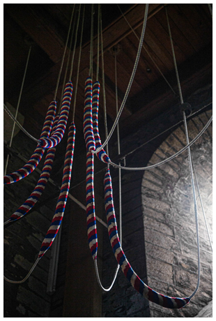
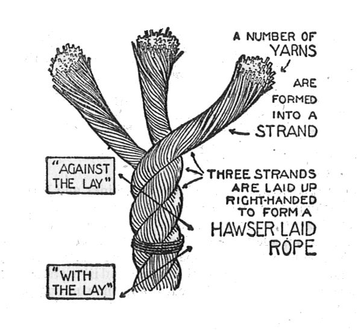
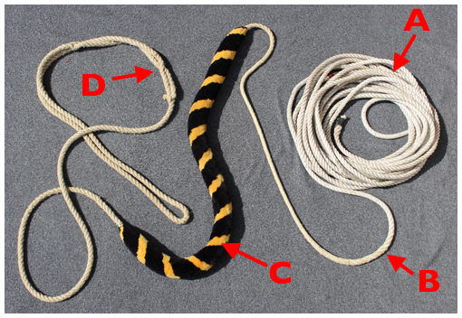
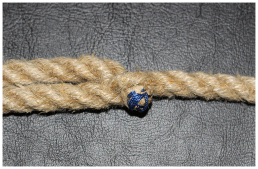
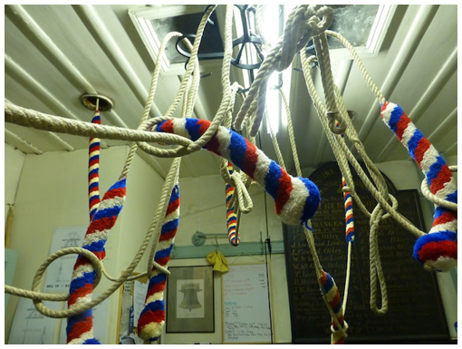
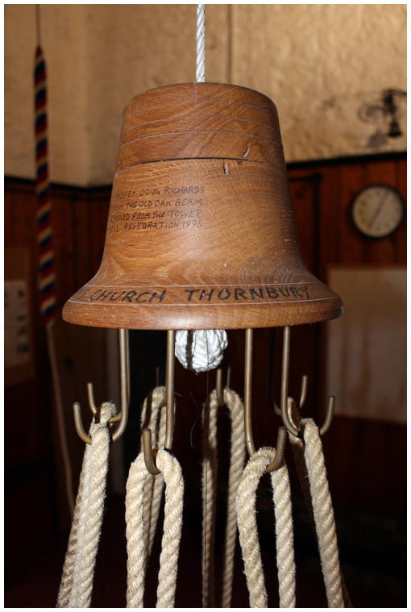
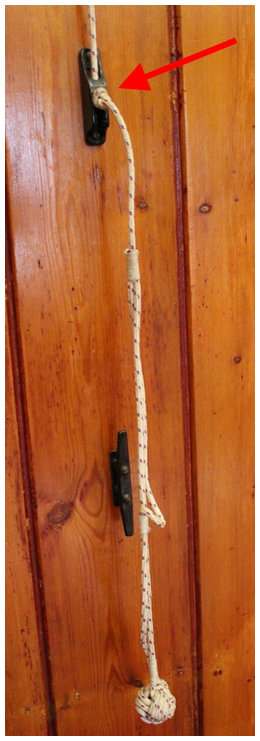
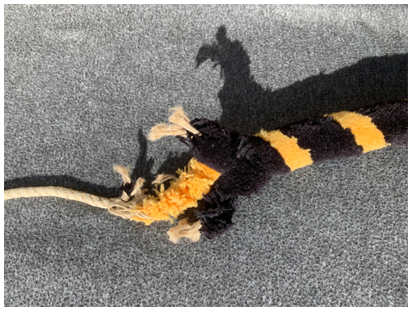

# Ropes

The rope forms the essential connection between the bell and the ringer. It is a two-way communication – the ringer uses the rope to control the movement of the bell, while the rope provides information on the position of the bell and how fast it is moving.

The rope may have to negotiate obstacles between the bell and the ringer, such as pulleys, rope guides, rope chutes and rope bosses. These are covered in [Rope Routes](../110-rope-route).

## Rope Construction

Ropes are built up in three stages: First, fibres are gathered and spun into yarns. For ropes made of natural fibres (such as hemp or flax), Rope Makers may buy yarns ready spun: they resemble string. A group of yarns is then twisted to form a strand and three (or possibly four) strands are twisted together to form a rope. At each stage, the direction of twist is reversed - this gives stability and strength to the final rope. 

It is important to note that the fibres in a natural rope are not continuous: the yarn can easily be picked apart. The successive reverse twists provide friction to hold the fibres together. This is illustrated in Figure 1, taken from *A Seaman’s Pocket Book, 1943*. (‘Hawser-laid’ is a traditional term for a three-strand rope.)

*Figure 1: The components of a natural fibre rope*

Since the 1970s, polyester ropes have been used for top ends of bell ropes. Some people still refer to this as ‘Terylene’, a brand name of that era which is no longer used. Other man-made materials have been used, so we will just refer to ‘artificial fibre’ to avoid confusion. While these ropes are still made up from strands, the fibres making up the strands are continuous.

Artificial ropes with a braided outer cover have been developed for nautical and climbing applications. An early example was Dyneema® and this name is commonly used, although other versions are available. These products have been used for the top ends of bell ropes because of their very low stretch and hard-wearing properties. 

### Parts of a bell rope

*Figure 2: Parts of a bell rope*

The demands are different on different parts of a bell rope, shown in Figure 2: 

- The top end (A) needs to resist the atmosphere in the bell chamber and the wear and flexing experienced on the route to the ringing room. 
- Where a top end is made of artificial fibre, a splice (B) is used to join the artificial top end to the bottom end. There are two possibilities:
  - When a new rope is made with an artificial top end, the natural fibre of the bottom end is combined with the artificial fibre during manufacture to produce a ‘machine splice’ with very little change in the diameter of the rope, as can be seen at (B). This can only be done by a Rope Maker.
  - If the sally and tail end of an existing natural fibre rope are in good condition, an artificial fibre top end can be spliced on, usually with a [short splice](#splicing). This can be done, if needed, by a Steeple Keeper experienced in splicing. A suitable artificial fibre top end can be sourced from a Rope Maker.
- Top end rope, be it natural or artificial, is not kind on ringers’ hands and natural fibre, wound to give a softer rope, is used for the bottom end of the rope – that part handled by the ringer. The two areas where the rope is handled are:
  - The Sally (C), handled at the handstroke, is made of wool fibres incorporated into the rope as it is made.
  - The Tail End (D), handled at the backstroke, is doubled back and tucked in. This allows adjustment of the tail end length and makes it more comfortable to handle. The very end of the rope will be finished (the term is ‘whipped’) to prevent fraying and to assist in tucking in the rope, as shown in Figure 3.

*Figure 3: Example of whipping at end of a tail end rope*

### Natural or artificial?

Most steeple keepers would nowadays accept the benefits of using artificial fibre for the top ends of bell ropes:

- It resists damage from the damp atmosphere in a bell chamber.
- It resists stretching.
- It resists wear.
- It resists damage caused by the bending of the rope as it exits the [***garter hole***](../170-glossary/#garter-hole).

### Yorkshire tail ends

*Figure 4: Yorkshire tail ends*

It would be remiss not to mention Yorkshire tail ends. These have a small sally (Figure 4) at the tail end, rather than a doubled-back rope. Most Rope Makers can provide them if required. The Whiting Society have an article on Yorkshire tail ends [here](https://www.whitingsociety.org.uk/articles/yorks-stuff/yorkshire-tails.html).

### Ordering new ropes

As the details of towers may vary, we advise discussing your needs with a Rope Maker. Also consider consulting a Rope Maker if you have inherited a rope that needs replacing: if you don’t know the history, the old rope may not have optimum dimensions.

## Spiders

*Figure 5: A typical spider*

A spider is a device usually used to hoist bell ropes up to the ceiling when not in use, as shown in the Title Picture and Figure 5. The spider is a wood or metal object (often decorative) with hooks for the ropes. It is suspended on a cord which passes over one or more pulleys before coming down to a fixing point in the ringing room. 

The spider is not there just to make the ringing room look tidy – it may be necessary to use it to secure the ropes from unwanted tampering. This will be discussed further in in the online document *Running a Tower* (currently in preparation). That document will also cover decisions about where to place the spider and its cord within the ringing room.

The spider should stop above normal head height, to avoid possible injury if the cord is accidentally let go. This can usually be achieved by running the cord through an eyebolt or similar above the fixing point, with a knot (ideally a ***[‘Figure-eight’ knot](../170-glossary/#figure-eight-knot)***) to catch the cord at a safe height, as shown (arrowed) in Figure 6. 

*Figure 6: A knot (arrowed) prevents the spider dropping below head height*


Someone who knows about such things has pointed out that the device arrowed in Figure 6 is actually a type of cleat which would stop the rope if it was let slip. Well maybe, but better safe than sorry.


## Checking

The condition of the ropes should be checked regularly at the following areas as set out in the [Maintenance Schedule](../150-maintenance-schedule).

### Garter hole

This is the point where the rope emerges from the wheel. Here it will experience tight turns in both directions as the bell swings from handstroke to backstroke. This is an area of greatest wear and must be checked regularly. The garter hole and the bobbins, see [Wheels](../070-wheels), should also be checked for smoothness and possible loose screws.

Natural fibre ropes are prone to this form of wear, and it is good practice to adjust the rope up and down a little to spread the wear. Artificial fibre ropes are usually more resistant to this type of wear but should still be checked at this point.

### Pulleys, Bosses, Rope Chutes & Rope Guides

These areas are described in [Rope Routes](../110-rope-route). A particular area of wear, possibly worse than that at the garter hole, is about 45cm (18 in) from the garter hole, where the rope passes over the ***[ground pulley](../170-glossary/#ground-pulley)***. The wear arises from the rope having to accelerate and decelerate the pulley at every stroke.

Unless you are lucky enough to have straight drops from the ground pulley to the ringers there will be general wear resulting from other components which may rub against the rope or change its direction. But this will be distributed along a length of the rope and is not a major problem unless there is a ‘rogue component’ causing more local wear. This should be detected by the checks described in [Rope Routes](../110-rope-route). Once again, the problem is minimised using artificial fibre top ends.

### Sally

A sally might experience wear at its top if it passes through a rope guide or a boss in a low ceiling. There may also be wear within the length of a sally if it falls within a boss or rope guide at backstroke. Factors like this should be made known to a Rope Maker when ordering ropes as it may be possible to adjust the sally to compensate.

If woollen strands are sticking out from a sally you can carefully trim them off. Do not attempt to pull them out. However, if the sally is dropping wool or starting to come apart you should contact a Rope Maker as a repair may be possible.

### Tail end

Tail ends are often the first part of a rope to need repair. There are two main causes:

- On larger bells, with their bigger wheels, the rope may repeatedly hit the floor when the bell is rung. Ropes perform best in tension and the bottom of a loop hitting the floor horizontally may open the strands. This parts the fibres and loosens the rope structure, leading to wear at this point. There is a view that rope mats will help to avoid wear, so long as they are made of wool, rather than artificial fibre. Apart from that possibility, you can either live with this or install permanent boxes on affected bells.
- Ringers adjusting the tail end length. This may take two forms:
  - Untucking and tucking the tail end, common before the start of a peal or quarter peal. This is acceptable, provided it is done carefully, using a wooden spike, known as a ***[fid](../170-glossary/#fid)***, to separate the strands. Metal spikes should not be used: the risk of damaging the strands is too great. 
  - Tying a knot – usually a ***[‘Figure-eight’ knot](../170-glossary/#figure-eight-knot)*** – to shorten a long rope. This is a short-term measure – perhaps just for one touch at a practice. This is acceptable so long as the knot is removed after use – if a knot is left in for too long it tightens, with possible damage to the rope when it is eventually untied. Also, knots should be removed before bells are lowered.

### Spider cord & pulleys

The spider cord will be of smaller diameter than a bell rope and the pulleys will probably be less sophisticated than bell pulleys. It is important to check for wear on the cord and free running of the pulleys.

## Repairs


If ropes are kept in a good condition, with regular checks for wear and other damage, a rope should not break during ringing. But a Steeple Keeper will need to be able to deal with wear or other damage before a breakage, or to replace a rope. Also, there may be an urgent need to deal with a broken rope when visiting a tower not fortunate enough to have a capable Steeple Keeper.


### Splicing

Most repairs to bell ropes involve splicing. With practice, this can be carried out by the Steeple Keeper. We do not discuss the details further here as excellent guidance from the late Frank Beech is available in ‘Splicing Bell Ropes – Illustrated’, available [here](https://shop.cccbr.org.uk/product/splicing-bell-ropes-illustrated/). This includes details of how to splice an artifical fibre top end onto an exisisting sally.

With natural fibre top ends, splicing was often needed because of wear at the garter hole and over the ground pulley. There was a common recommendation to order ropes longer than required to provide extra rope for repairs, with the excess being tied off at the wheel. With the much better wear properties of artificial fibre top ends this is not necessary.

The need for repair of a tail end is more likely and this can be carried out by a Steeple Keeper competent in making a short splice. Note that this must be done using ‘tail end’ rope to provide suitably soft handling. Bell Hangers and Rope Makers can provide lengths of such rope, with one end finished with a whipping to prevent fraying (see Figure 3). Even if a tail end seems to be beyond repair, it is worth discussing this with a Rope Maker. There may be other options available which are cheaper than a new rope.

### Spare ropes

If a repair cannot be carried out quickly, it may be useful to have a spare rope available. There is no need to hold a complete set of spare ropes: that is a waste of space and money. Depending on the range of sizes between your Treble and Tenor, up to three spares should be adequate to provide a temporary replacement for any bell.


Spare ropes should not be kept in a poorly ventilated cupboard. Ideally, they should be hung in a tidy coil in the ringing room, possibly in sacking bags. This will also avoid the risk of attack by mice (Figure 7).


*Figure 7: Rope attacked by mice while stored in a cupboard*

### Fitting a new rope

This is a job for at least two people: one in the bell chamber and the other in the ringing room. The Health & Safety aspects described in [Health & Safety](../040-health-and-safety) must be considered. Ideally, two people in the bell chamber would be preferable – at the least, an assistant can hold the rope in position while it is tied off on the wheel.

Unless you have a very straight drop from the bell to the ringing room, it is much easier if two ropes are involved. For simplicity, we will call these the ‘new’ and ‘old’ ropes. You have a choice:

- In the ringing room, tie the top of the new rope to the old rope’s tail end and pull the new one up using the old rope, or
- Take the new rope up to the bell chamber, tie the bottom of the new rope to the top of the old rope and lower both ropes down.


Either option finishes with a whole bell rope in the bell chamber, with the risk of it getting tangled or dirty. (This is where an assistant in the bell chamber is valuable.) If this is an issue, you could consider obtaining a thinner plain feeding rope and using that to lower the old rope and then pull up the new one.


The top end of the new rope is then fed through the garter hole on the wheel and gently pulled up until the assistant in the ringing room stops the rope at the correct sally height.


There are various ways of establishing the correct sally height. One option is to keep a record of the correct distance between the bottom of each sally and the floor; another option is to have a wooden stick marked with the correct height for each sally. Pragmatically, if the assistant in the ringing room is an experienced ringer you could just rely on their judgement.


The rope is then tied off on the top spokes of the wheel, see Figure 8. Details are given in [Splicing Bell Ropes – Illustrated](https://shop.cccbr.org.uk/product/splicing-bell-ropes-illustrated/).

*Figure 8: Rope tied off on the main spokes of the wheel*

## Image Credits

| Figure | Details | 
| :---: | --- | 
| Title Picture | Ropes on a spider at St Germanus, St Germans, Cornwall. Front cover of *The Ringing World* , 12 November 2021. Used with permission. (Photo: James Wray) |
| 1 | Parts of a ‘Hawser Laid’ (three strand) rope, from *A Seaman’s Pocket Book, 1943*. Public domain document, see [here](https://en.wikipedia.org/wiki/File:Hawser-laid_rope_(Seaman%27s_Pocket-Book,_1943).jpg#file).  |
| 2 | Parts of a bell rope. (Photo: Robin Shipp) |
| 3 | Example of whipping at end of a tail end rope. (Photo: Robin Shipp) |
| 4 | Yorkshire tail ends. (Photo: Alison Hodge) |
| 5 | A typical spider, at Thornbury, South Glos. (Photo: Robin Shipp) |
| 6 | Knot to prevent a spider dropping below head height. (Photo: Robin Shipp) |
| 7 | Rope attacked by mice while stored in a cupboard. (Photo: Robin Shipp) |
| 8 | Rope tied off on the main spokes of a wheel, at Wickwar, South Glos. (Photo: Robin Shipp) |

----


[Next Chapter](../130-bells/)


----

## Disclaimer
 
*Whilst every effort has been made to ensure the accuracy of this information, neither contributors nor the Central Council of Church Bell Ringers can accept responsibility for any inaccuracies or for any activities undertaken based on the information provided.*

Version 1.0.1, September 2022

© 2022 Central Council of Church Bell Ringers
