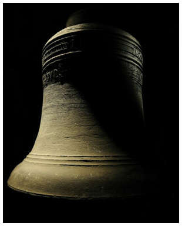
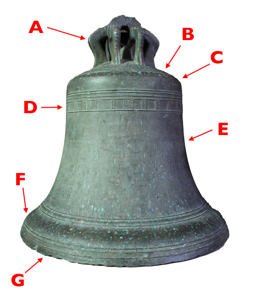
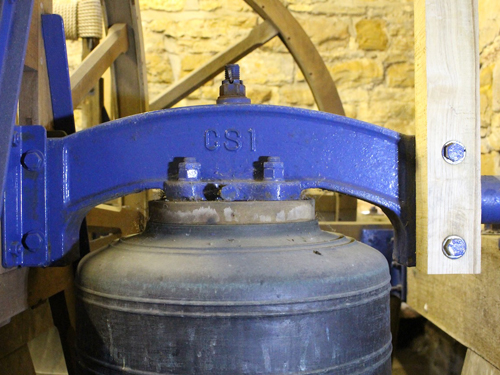
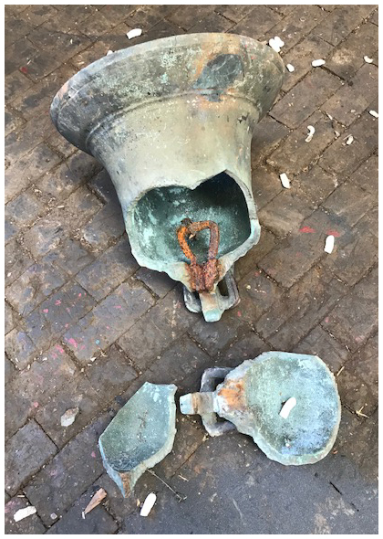

# Bells

Bells are important as the public voice of the church – familiar to those living near or passing by. Made of cast bronze (an alloy of about 77% copper and 23% tin), they have been associated with English churches since at least the seventh century. The oldest surviving bells date from about the twelfth century, although these are rarely part of a ring of bells. However, it is not unusual to find a pre-reformation (pre-1534) bell still in use. 

Around the middle of the nineteenth century, some church bells were cast in steel, as a cheaper alternative to bronze. Manufacture was discontinued after about twenty years but some rings of steel bells are still in use.

## Delvelopment of Bells

*Figure 1: Parts of a bell*

Figure 1 shows a pre-reformation bell, cast around 1450, and illustrating the main parts of a bell:

(A) Almost every bell cast before the end of the 19th century had loops cast into the crown of the bell called ‘canons’ (sometimes ‘cannons’), together with a taller central loop called the ‘argent’ (partly missing on this bell). These were used to suspend the bell from a [headstock](../060-headstocks).

(B) The top of the bell is termed the ‘crown’.

(C) is the ‘shoulder’, for obvious reasons.

(D) is the ‘inscription band’ – incorporated onto the bell during founding. On pre-reformation bells this is usually liturgical – ”SANCTE MICHAEL ORA PRO NOBIS” on this bell. On a modern bell this will usually give the founder’s name and a date.

(E) is the ‘waist’ of the bell. Modern bells may have an inscription giving more information here.

(F) is the ‘soundbow’ – the point where the clapper strikes the inside of the bell.

(G) is the ‘lip’ of the bell.

At one time, canons were accidentally (or deliberately) broken or cut off the crown and the bell was then secured to the headstock with bolts passing through the crown. The historical value of canons is now recognised and such bells can continue in use with canon-retaining headstocks – see [Headstocks](../060-headstocks) for more details.

*Figure 2: Modern flat-topped bell*

For over a hundred years, new bells have been cast with flat tops and bolted directly to the headstock with a wood or epoxy spacer, as shown in Figure 2. This bell was cast in 2000 by the Whitechapel Bell Foundry and installed by Whites of Appleton as the new treble during the augmentation to eight of the ring at Chipping Sodbury.

## Checking for Problems

There is little a Steeple Keeper can do in terms of maintenance of the bells, but regular checking will identify any problems, which may then require action. 

### Surface finish

The shiny finish on a new bell will not remain for long: the patina which appears with age on a bronze bell is quite natural and there should be no attempts to remove it. The most that should be done is to remove any deposits or stains which may appear. The bells must also be protected when the frame, headstocks, or other parts of the installation are painted.

Stains on a bell may reveal problems elsewhere. For example:

-  Oil or grease stains may result from a leaking oil seal on a ball bearing or spillage from lubrication of a plain bearing. Evidence of either of these requires action, as described in [Bearings](../100-bearings).


In earlier times, white spirit was widely used to remove oil or grease, but it is now recognised that this is harmful to health and difficult to dispose of safely. Low volatile organic compound (VOC) degreasers are now widely available and must be used for cleaning. See [Health & Safety](../040-health-and-safety/#hazardous-materials).


-  Bird droppings will reveal the need to check the tower’s bird protection – possibly damaged netting on the louvres. Small amounts of bird droppings can be removed with a damp cloth, but extensive bird ingress requires specialist cleaning because of the risk of infection.

-  Water stains may reveal problems with weather protection, or damage to the roof. This will require action by the church authorities.

### Wear on the soundbow

Wear will result from the impact of the clapper on the inside of the soundbow. This normally results in a small area of bright metal. 


The impact area may become elongated as a result of a worn clapper bush or a loose crown staple. But this should be detected by the checks described in [Clappers](../090-clappers/#checking).


In time, the impact area will become deeper. If it becomes deeper than about 10% of the thickness, there is risk of the bell cracking. The extent of wear can be checked by a Steeple Keeper with the use of a pair of [***outside calipers***](../170-glossary/#outside-caliper).


**Procedure for measuring depth of impact area**
1.	Measure the thickness of the soundbow at its thinnest point using the calipers.
2.	Measure the thickness of the soundbow either side of the thinned area at the same distance from the lip of the bell as the centre of the thinned area and calculate the average unworn thickness. 
3.	If the difference between the worn and unworn thickness is greater than about 10%, then the bell must be checked by a bell hanger. 


The usual remedy for excessive wear is  to rehang the bell turned through 90&deg; (termed ‘quarter turning’). This is definitely a job for a bell hanger and will require approval from the [relevant authorities](../020-permissions).

### Cracking

*Figure 3: Bell cracked and broken from a cast-in crown staple*

A cracked bell is a serious problem. Even a small crack may grow and result in a complete failure of the bell (Figure 3). Cracks may be found in the following places:

-  The most likely location is in the crown of a bell with a cast-in iron crown staple, or the remains of one. Iron corrodes with time and the corroded staple expands in the crown of the bell, generating stresses which will ultimately lead to cracking of the bell, as you can see in Figure 3. Given the difficulty of access and the likely surface condition it will be difficult to detect a crack in the crown visually. The only reliable safeguard is to remove all traces of a cast-in staple – see [Clappers](../090-clappers/#removal).
-  Where a bell is hung by its canons, cracks may be found around the canons. This area should be inspected visually at regular intervals, although this inspection may not be reliable because of the surface condition and because cracks may be hidden by the headstock. The only reliable remedy is to avoid stress on the canons by rehanging the bell with a modern [canon-retaining headstock](../060-headstocks/#metal-canon-retaining-headstocks).

Cracked bells require the services of a bell hanger. A Steeple Keeper may, however, perform a valuable function by recognising the possibility of a problem, or even identifying a possible crack.


Some cracked bells may be repaired by welding. If feasible, this allows a historic bell to be retained in use safely. But this is NOT routine welding and, currently, there is only one company known to provide the service.


### Damage from chiming hammers

Bells should be checked for damage if they are used as clock bells, for manual chiming, as part of a carillon or [Ellacombe apparatus](../170-glossary/#ellacombe-apparatus), or other systems in which hammers strike the bells.

The following precautions must be observed to avoid damage to the bells – and to the chiming mechanism:

- Any hammers must be capable of being pulled clear of the bells before full circle ringing.
- The mechanism for chiming the bells, be it a clock, manual chime or an Ellacombe apparatus, must be correctly installed and maintained in good condition.
- The mechanism for pulling the hammers clear must be checked regularly.
- The means for pulling hammers off must be clearly visible in the Ringing Room, and its status must be obvious.
- If the Ellacombe apparatus is not located in the Ringing Room, arrangement must be made to ensure that it is locked off when ringing is taking place. 
- Ringers must exercise a culture of always ensuring all hammers are off before ringing starts – and restoring them when ringing finishes.
- The use of reversible notices saying “chimes on/off” is discouraged since their accuracy cannot be guaranteed and may discourage actual checks.
- Persons operating an Ellacombe apparatus (who may not be regular ringers) must be instructed in the use of the apparatus: over-enthusiastic use may damage the bells.

## Image Credits

| Figure | Details | 
| :---: | --- | 
| Title Picture | The Treble bell at Derby Cathedral. (Photo: Roger Lawson) |
| 1 | Bell cast c1450, showing the main parts. (Photo: Robin Shipp) |
| 2 | Modern flat-topped bell. (Photo: Robin Shipp) |
| 3 | Bell cracked and broken from a cast-in crown staple. (Photo: John Taylor & Co) |

----


**[Next Chapter](../150-maintenance-schedule/)** - **[Previous Chapter](../120-ropes/)**


----

## Disclaimer
 
*Whilst every effort has been made to ensure the accuracy of this information, neither contributors nor the Central Council of Church Bell Ringers can accept responsibility for any inaccuracies or for any activities undertaken based on the information provided.*

Version 1.0.1, September 2022

© 2022 Central Council of Church Bell Ringers

