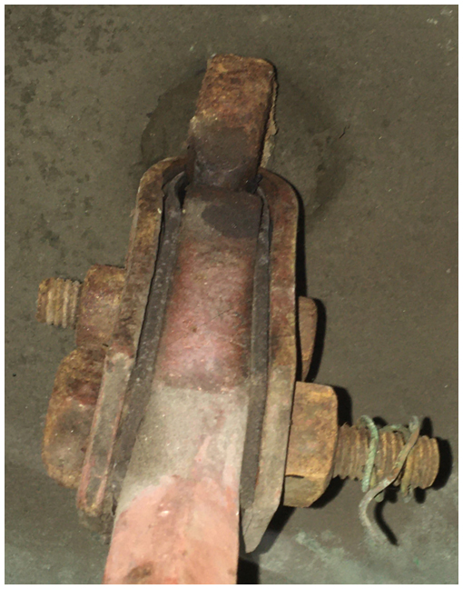
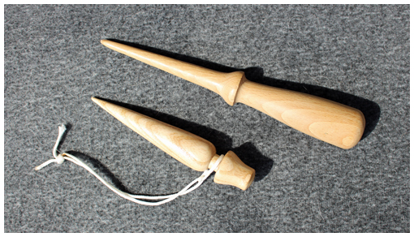
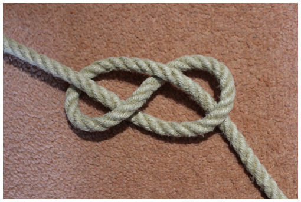
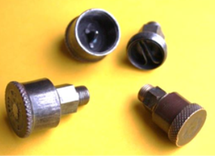

# Glossary

As with any technical subject, bell ringing and bell hanging has, over the years, developed specialist terms some of which are unique to ringing and others which have particular meaning when applied to ringing. Some other technical terms may not be familiar to ringers. We hope to have included all of these here. They are linked from the text in the various chapters. Items appearing elsewhere in the glossary are shown in **Bold**.

## Argent

The central boss on the crown of older bells, around which the **Canons** are grouped. These are used to attach the bell to the **Headstock**.

## Baldric (or Baldrick)

A U-shaped metal strap with leather lining, traditionally used to suspend clappers. The name originates from a belt worn over one shoulder to support a sword or bugle.

## Bobbins

Shaped blocks on the rim of a wheel designed to reduce the radious of curvature as the rope emerges from the **Garter Hole**. See [Wheels](../070-wheels).

## Canons

(Sometimes 'Cannons'). The loops cast onto the crown of older bells, by which the bell is suspended from the **Headstock**.

## Clapper

The component suspended inside a bell which, when the bell is swung, strikes the bell to produce the note. See [Clappers](../090-clappers).

## Coach Bolts

Coach bolts (sometimes referred to as 'Carriage Bolts') are used in a bell installation for bolting a wooden component to either a metal or wooden component - most often to bolt a **Stay** onto a **Headstock**. The square section under the domed head bites into the wood, securing the head while the nut is tightened.

## Diocesan Advisory Committee (DAC)

Within the Church of England, the DAC is the lead body in the diocese for advice on the care and development of church buildings; providing advice to parishes, Archdeacons, and the Diocesan Chancellor. It has a key role to promote good practice in the maintenance and development of church buildings. Before considering a faculty application, the Chancellor is obliged to take advice from the DAC. The DAC will appoint one or more DAC Bells Advisers. Towers will benefit by maintaing contact with their local Adviser. 

## Ellacombe Apparatus

A system intended for tune ringing, consisting of a set of hammers arranged to strike the inside of the bells, operated from the ringing room or lower in the tower by pulling sleeved ropes mounted in a frame, operated by one person. Arrangements **MUST** be in place to ensure that, when ringing is taking place, the hammers are pulled clear and the apparatus cannot be accidentally operated.

## Fid

A pointed instrument made of wood, used to open up the strands of a bell rope for tucking in a **Tail End**, or to open a knot that has worked tight. A marlin spike is similar but is made of metal and should not be used on bell ropes to avoid damage to the rope. The smaller fid shown above was left at a tower as a 'thank you present' by a visiting band, one of whose members is a skilled wood turner.

## Figure-eight Knot

A knot useful for temporary shortening of a **Tail End** or as a 'stopper knot', for example to prevent a **Spider** dropping too far if the cord is let slip. (The figure above shows the knot before it is pulled tight.)

## Fretting

Fretting refers to wear damage of loaded surfaces in contact with little or no lubrication, encountering movement tangential to the surface. Fretting is caused by adhesion of surface asperities, which are then broken by the small movement.

## Garter Hole

A Hole in the rim of a wheel through which the rope passes in order to be secured to the spokes. See [Wheels](../070-wheels).

## Grease Nipple

Designs vary, but this is a device for lubricating a component with moving parts. A grease gun locks on to the nipple and grease can be pumped in. The picture above is of a grease nipple (arrowed) at the top end of a clapper, which allows lubrication of the clapper bush -- see [Clappers](../090-clappers). Grease nipples may be found on some ball bearing housings: these are used to charge the bearing with grease on manufacture and should not be pumped with grease during use. This is a sure way of damaging the seals on the bearing -- see [Bearings](../100-bearings).

## Ground Pulley

A pulley in the bottom of the bell pit - the first pulley the rope passes through after leaving the **Wheel**. The rope passes round this pulley as the bell goes up to handstroke. If the rope does not drop vertically at backstroke there will be a second ground pulley in a double pulley block (sometimes called a 'roller box').

## Gudgeons

The steel shafts fixed to the headstock that form the axle about which the bell rotates.

## Headstock

A wood or metal beam supporting the bell. The **Wheel**, **Stay** and **Gudgeons** are attached to the headstock.

## Intermediate Chamber

The space in most towers between the **Ringing Rooom** and the **Bell Chamber**. It often contains the church clock, when it may be called the "Clock Chamber". The ropes pass through this chamber and may be drawn here to achieve a good rope circle. In many towers, this chamber is used a a general dumping ground for rubbish and this must be kept under control.

## Outside Caliper

A tool used to measure thickness. Used to check the depth of a clapper impact dent - see [Bells](../130-bells).

## Psittacosis

Psittacosis is an infection of birds caused by the bacterium *Chlamydia psittaci*. Birds can transmit *C. psittaci* to humans; the resulting infection is also known as psittacosis or ornithosis.

## Ringing Room

The space in a tower from where the bells are rung.

## Sally

The tufted handgrip on a rope, used to pull at handstroke.

## Spider

A device with hooks on which bell ropes can be hung in order to be raised above head level when not in use.

## Stauffer Lubricator

A screw cap lubricator used on older clapper bushes or roller box bearings. The cap is filled with grease and given a turn occasionally to force grease into the bearing. When fully turned, the cap is removed and re-filled with grease.

## Stay

Wooden bar attached to a **Headstock** that under normal usage prevents a bell moving beyond the point of balance when set.

## Tail End

The end of the rope, usually doubled back on itself (Except for Yorkshire tail ends), used to pull at backstroke.

## Twiddle Pin

A threaded pin either side of a metal headstock, screwed in to contact the clapper staple. Slackening one and tightening the other allows the clapper to be moved to provide an even strike. Officially called 'clapper adjustment screws' or 'clapper centring pins'. See [Clappers](../090-clappers/#clapper-centring-pins).

## Wheel

A circular wooden component attached to the **Headstock** by which the rope is attached to the bell, permitting it to be rung full circle. See [Wheels](../070-wheels).

## Image Credits

| Glossary Item | Details | 
| :--- | --- | 
| Baldric | Baldric clapper suspension at Stone, Glos. Photo: Andrew Ward |
| Coach Bolts| Photo: Robin Shipp |
| Fid | Photo: Robin Shipp |
| Figure-eight Knot | Photo: Robin Shipp |
| Grease Nipple | Enlarged from a photo by Allen Nunley |
| Outside Caliper | Photo: Robin Shipp |
| Stauffer Lubricator | From *Manual of Belfry Maintenance*, photographer unknown |

-----

## Disclaimer
 
*Whilst every effort has been made to ensure the accuracy of this information, neither contributors nor the Central Council of Church Bell Ringers can accept responsibility for any inaccuracies or for any activities undertaken based on the information provided.*

Version 0.1 (pre-publication), August 2022

© 2022 Central Council of Church Bell Ringers
