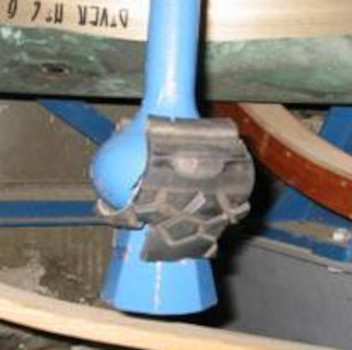

# Bell Chamber

The bell installation is covered specifically by [Belfy Upkeep](https://belfryupkeep.cccbr.org.uk/docs/010-introduction/). The information here deals with the need for specific items.  

*Figure 1: Modern bell installation*


**Ringers are often the only ones with regular access to parts of the church building and have a 'duty of care'. However they are not the people with overall responsibility. Bell chambers should never be visited alone. It is strongly advised that a second person, who is also suitably experienced, is present.**

 
## Muffles  

 

*Figure 2 (left): Leather fastening muffle. Figure 3 (right): Velcro fastening muffle*

There are two basic types of muffle. The older type (above left) is attached by means of leather straps and/or leather thongs. The newer type (above right) makes use of Velcro fastening. As muffles are used infrequently, regularly check them for deterioration, do not leave it until they are required. Cable ties may be used to ensure that muffles are firmly fixed, however when removing these be careful to not cut the muffles.

Ensure that it is known how to fit muffles correctly. Muffles should be fitted with the bells down and, as in all cases when work is undertaken in the bell chamber, with a second person present. When not in use muffles should be stored in a fabric bag, ideally hung in the ringing room. They should not be thrown into a cupboard which may be damp and therefore cause deterioration. 

Muffles are, traditionally, used on a limited number of occasions such as funerals, remembrance Sunday, ringing out the old year. On most occasions bells are half-muffled, that is a single muffle is fitted. Traditionally the backstroke is muffled, in which case the muffle sits on the clapper on the side away from where the rope drops from the wheel when the bell is down. Bells are traditionally only rung fully muffled (or deeply muffled i.e. with the backstroke of the tenor unmuffled) for the death of a reigning monarch, the incumbent (Parish Priest), or the Bishop of the Diocese.

## Silencers

There are various types and means of fitting. 

*Figure 4: Wooden clapper tie*

A wooden tie that holds the clapper in the middle of the bell.

 

*Figure 5 (left): Rope tie showing fastening to headstock. Figure 6 (right): Rope tie showing attachment to clapper*

A rope may be used to tie the clapper. It may be preferred to tie the clapper on the hand stroke side for teaching basic bell handling so as not to be fine-set, as in the above picture. It may be preferred to tie the clapper centrally when the main objective is simulator work. 

*Figure 7: ART style tie*

***[ART](../glossary/#art)*** recommend a tie based around an old cycle inner tube. 

 

*Figure 8 (left): Tyre silencer set for quiet ringing. Figure 9 (right): Tyre silencer set for open ringing.*

A silencer may also be made from a piece of tyre. They can be easily twisted through 90° to un-silence the bell and may prove useful where there are learners.

## Sound Control

Sound control may be present. This may consist of shutters, trapdoors, etc. Installations are bespoke to individual towers. It is essential that the method of operation is well documented alongside when it should be used. Further details can be found at [sound control in towers (CCCBR)](https://cccbr.org.uk/wp-content/uploads/2021/01/Mike-Banks-noise.pdf).

## Image Credits

| Figure | Details | Source |
| :---: | --- | --- |
| 1 | Modern cast-iron low-side frame at Broadclyst, Devon | Photo: James Kirkcaldy |
| 2 | Older muffle with leather thongs and buckle fastenings | Photo: James Kirkcaldy |
| 3 | Modern muffle with velcro fastening at Ripon Cathedral, North Yorkshire | Photo: CCCBR archive |
| 4 | Solid wooden clapper tie at Washington Cathedral, Washington DC | Photo: CCCBR Archive |
| 5 | Rope clapper tie shown outside bell | Photo: Tony Crabtree |
| 6 | Rope clapper tie shown inside bell  | Photo: Tony Crabtree |
| 7 | ART style clapper tie | Photo: ART |
| 8 | Tyre silencer set for quiet ringing | Photo: Peter Dale |
| 9 | Tyre silencer set for open ringing | Photo: Peter Dale |

----


**[Previous Chapter](../ringingroom/)** - **[Next Chapter](../buildingateam/)**


----

## Disclaimer
 
*Whilst every effort has been made to ensure the accuracy of this information, neither contributors nor the Central Council of Church Bell Ringers can accept responsibility for any inaccuracies or for any activities undertaken based on the information provided.*

Version 1.1, December 2022

© 2022 Central Council of Church Bell Ringers
