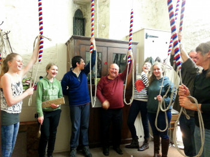

# Bells in Your Care

Some notes for incumbents and churchwardens who find themselves responsible for a ring of church bells.

The following was previously published as a .pdf file on the [CCCBR](docs/glossary/#cccbr) website.

## Bell Ringing

**The sound of church bells ringing out can provide very loud evidence of the existence of an active church with an active congregation and you are fortunate to have bells in your care. Ringers and the [CCCBR](docs/glossary/#cccbr) can help with anything you need to know.** This is a brief summary.

*Figure 1: Ropes hanging on spider.*	

The very English art of full circle ringing has been practised in this country for over 400 years, and more recently in other countries around the world. The skill, which takes several months to acquire, lies in controlling the bell as it swings full circle so that it can be made to sound at a precise point - like, indeed, any other musical instrument. Younger people generally learn more quickly, but most people between the ages of 11 and 70, or more, can learn to ring.

Because ringing is by definition a group activity (one ringer for each bell being rung), each tower with a ring of bells usually has a local band, led by its chosen tower captain, and usually belonging to the local ringing society. These in turn are affiliated to the [CCCBR](docs/glossary/#cccbr), which through its committees seeks to provide help and information about all bell matters, including maintenance of towers and belfries, fundraising, redundant bells, publications, public relations and much more.

This 'Running a Tower' document has advice about tower management, health and safety and fire risk assessment for bell towers, amongst much more information. Alternatively, contact your local ringing society, or DAC bells adviser.

## The Mechanics

*Figure 2: Modern bell installation.*

Nearly all [Church of England](docs/glossary/#church-of-england) churches have at least one bell, and a substantial minority (6000 in England, 500 in other English-speaking countries) have rings of five or more bells hung in the English style, so that the bells can be swung through a full circle by means of a rope and wheel, with one ringer for each bell.

Sets of bells which can be sounded in other ways, by means of hammers of some kind, or by swinging each bell through just a small arc by means of a lever or an incomplete wheel, are called 'chimes' rather than 'rings'. If your bells are hung together in a frame, each with a full wheel, they will probably have been intended for full-circle ringing (although if they are not being used regularly by competent ringers, and have perhaps been neglected for some time, they may not
be immediately suitable for ringing without initial inspection and maintenance or repair).

Please take an early opportunity to visit your tower in the company of the tower captain (the ringers' leader), or of some other competent ringer. For your own safety, NEVER, ever, go up the tower alone: church towers are fascinating but lonely places, and a fall might mean lying undiscovered for hours. Moreover, especially if the bells have been left ready to ring in the mouth-upward position (referred to as 'UP'), going close to them, or touching them or the ropes, could be very dangerous, and as well as possibly causing injury, could also cause expensive damage to the bells and related fittings, as the tower captain will explain.

If, at present, you do not have any ringers at your tower, for help and support, contact your local ringing society. Alternatively, your local DAC will have a bells adviser who can either advise you directly, or put you in touch with the local society.

## Benefits of Bells and Ringers

*Figure 3: Ringing meeting.*

Robert van de Weyer, in his book on the Country Church, said: 

“The Christians within a village are like the bells which ring out over its rooftops on Sunday morning. There are not many of them, yet everyone in the village is aware of them. They are gentle and reassuring, yet at times they disturb people. They have been there a very long time, yet they never go out of date. People are slow to respond to their call, but they are regarded with great love and goodwill. To everyone they are a sign of hope and a source of comfort.” 

Others have said: 

“I would give you two examples of how ringing in our tower has had an effect on the parish, apart from letting the locals know we are there every time we ring. The first is that of nine ringers attached to our tower five were not church goers before they took up ringing. Two of them now come occasionally, but almost every week ring for service and join in with church socials on a regular basis. The second is the opportunity to show a welcome to non church people. It doesn't happen often, but on a few occasions over the last couple of years, on our practice nights people have spotted us going in and asked if they might come in to the church.”

“Our band is, roughly, 2/3 non-churchgoers. All of us, however, ring for Sunday service, share in the rota for providing tea/coffee after the Sunday morning service, provide staffing for one or more stalls at the winter/summer fairs, spread awareness of the church's friendliness through talking about ringing there with other friends, run a FB page about our activities that nonringers subscribe to, and act as general awareness-raisers about the possibility of hiring the church hall, etc. Some of the band who do attend services regularly also serve on parish committees, take part in the transport rota for infirm members of the congregation, etc. If an organisation had to pay for all that input I think it would be quite costly.”

“We run three tower open days each year. The Dean recognises this contribution as part of the Cathedral outreach. The open days are very popular with tourists and local people alike. Each time there are a significant number of local people who have never entered the Cathedral before, despite living in the city all their lives.”

“I think you can be either taken for granted by some clergy or really valued... wish more clergy took an interest.”

## Frequently Asked Questions

### Who can I ask about the state of the bells and fittings in our tower?

If your church has an active band of ringers, their leader the tower captain can advise on sources of information; or you can contact the local bell-ringing association or DAC bells adviser: **[contact information](https://cccbr.org.uk/about/affiliated-societies/)**.

*Figure 4: Practice session.*

### Why is necessary to practice every week?

As with any musical activity, development and maintenance of the required skills requires regular practice.

### How long does it take to train a ringer? 

Learning to control a bell accurately requires skill: developing the necessary skill can take many months. Different people learn at different rates, but 10-15 hours of individual tuition, followed by many more hours learning to ring with other ringers, is not uncommon.

### Why don't ringers always stay to the service?

For any number of reasons! They may have other services to attend or to ring for, in other churches; they will already have spent half an hour or more in the church, and may have other interests and commitments; and they may not even be  christians - in which case it may be helpful to know that ringing has been a gentle door into church life for many. You may find it of benefit to arrange sometimes to visit the ringers in the ringing chamber to pray with them, during ringing before services, or during their practices. This should help to foster links between the ringers and the rest of the church community.

### Should I let visiting ringers ring our bells?

If you possibly can, yes. The tower captain or tower secretary should be able to recognise bona fide requests, and will normally make the necessary arrangements when requests for additional ringing sessions have been received, after checking that the timing will not conflict with other church activities. Visiting bands will normally leave a donation towards the costs of maintenance of bells and ropes. Visiting other towers and ringing on different bells is an excellent way for individual ringers or bands of ringers to gain experience and make progress with their ringing. There is a strong tradition of welcome and cooperation among ringers; and your ringers too should find visits to other towers enjoyable and helpful. Also - the more your bells are rung, the more it will remind those outside of your church’s presence.

### Should ringers charge for ringing for weddings?

It is normal practice for a fee to be charged for wedding ringing. Nowadays, the ringers need to be compensated for the time and cost of travelling to and from the tower, at least as much as for the effort they put into the actual ringing. A policy about payment, including the amount to be charged, should be discussed and agreed with the bell-ringers in advance. The fee is usually paid by the wedding couple, often directly to the ringers. Ringers are volunteers and are generally not legally employees of the church. For advice, have a look at Steve Coleman’s articles 'Ringing and Money' on the **[Ringing World website](https://www.ringingworld.co.uk)**, this may require subscriber access.

### Who should appoint the tower captain?

Ringers soon learn who among their number is competent to lead them. An accepted leader, democratically elected by the band, with the election ratified by the incumbent, is the ideal. This is further explained within this 'Running a Tower' document.

### How do I deal with complaints about noise?

Reasonably and openly in the first instance. Refer to the **[CCCBR leaflet](https://cccbr.org.uk/wp-content/uploads/2017/05/TSC_GN7v9.pdf)** on Noise, the Law and the Environmental Health Office. The CCCBR also offer a **[Complaints Helpline](https://cccbr.org.uk/resources/stewardship-and-management/dealing-with-complaints/)**, through which additional advice can be obtained quickly.

*Figure 5: Getting ready to ring.*

### What about Safety?

The heaviest bell in your tower may weigh a ton or more, and heavy masses of moving metal must not be treated 'unadvisedly, lightly, or wantonly'. In a nutshell, it's important that access to the bells should be restricted only to those who know what they're doing: The tower should never be left unlocked; and if the ringers ring from ground floor level, that area too should either be kept locked when not in use, or at least bell ropes, and controls for clock chimes or other chiming hammers, should somehow be secured so as to minimise risks of interference and damage. Such controls may need to be disconnected before each ringing session, and reconnected afterwards.

Bells and bell-ropes should only be touched by experienced ringers or by learners under the supervision of an experienced instructor; builders or workmen may know little about bells, and should always be accompanied, even if visiting towers for purposes unrelated to the bells; and no-one should be in the tower alone.

there is further useful advice about tower management, health and safety, and fire risk assessment for bell towers within this 'Running a Tower' document.

### What about Safeguarding?

Here are some helpful guidelines on **[safeguarding (CCCBR)](https://cccbr.org.uk/2022/12/08/launch-of-from-practice-to-perfect/)**, but as a general rule each diocese issues its own guidance which will cover most bell-ringing situations. These issues cannot, of course, be dealt with fully in a brief text such as this. Your local ringing society will be able to give you more comprehensive advice, and can help, too, with any particular incidents or situations.

## Sources of Help

### **[The Central Council of Church Bell Ringers](https://cccbr.org.uk)** (Registered Charity number 270036)

Many pages of the website give information about all aspects of ringing (some of it's a bit technical, but do persist). Alternatively you could contact the Council's Honorary Secretary at secretary@cccbr.org.uk.

### Your local ringing society

**[Contact information](https://cccbr.org.uk/about/affiliated-societies/)** for ringing societies. Your diocesan website will normally have links to the local ringing societies. Local associations usually have:
- a Bell Adviser.
- an Education Officer.
- a Public Relations Officer.
who will be able to offer advice or help.

## Image Credits

| Figure | Details | Source |
| :---: | --- | --- |
| 1 | Ropes on a spider | Photo: CCCBR |
| 2 | Modern bell installation | Photo: CCCBR |
| 3 | Ringing meeting | Photo: CCCBR |
| 4 | Practice session | Photo: CCCBR |
| 5 | Getting ready to ring | Photo: CCCBR |


**[Return](docs/communication/)**


----

## Disclaimer
 
*Whilst every effort has been made to ensure the accuracy of this information, neither contributors nor the Central Council of Church Bell Ringers can accept responsibility for any inaccuracies or for any activities undertaken based on the information provided.*

Version 1.1, March 2023

© 2023 Central Council of Church Bell Ringers
