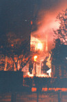
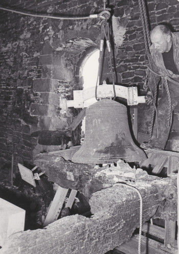
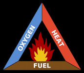
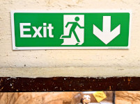

# Fire Protection and Risk Assessment

The following was previously published as a .pdf file on the [CCCBR](docs/glossary/#cccbr) website.

## Introduction

These notes offer advice about specific issues that may affect bell ringers and the bell tower when considering fire safety and fire protection. The notes may assist the [tower authority](docs/glossary/#tower-authority) and bell ringers; they do not intend to provide comprehensive information about fire protection and fire risk assessments more generally. Few  towers were designed or built to comply with current legislation and many are extremely historic and vulnerable structures. Ringers are often in towers at times when the building is otherwise unoccupied, and also in parts of the building that are separate and less accessible from the rest of the building.

Most towers with rings of bells are within the jurisdiction of the [Church of England](docs/glossary/#church-of-england). The notes therefore focus on these but the issues are likely to apply to rings of bells in towers owned by other organisations, in churches of other denominations, and also churches elsewhere in the world. Local legislation and circumstances should always be taken into account.

   

*Figure 1 (left): Fire at Leighton Buzzard. Figure 2 (right): the aftermath.*

Fires may start anywhere in the building and for a variety of reasons: electrical faults, in kitchen areas, lightning strikes, accidents especially during building work, or arson. A church can act as a chimney and help draw a fire up. Regrettably fires can and do occur in towers, examples within the recent past include:

- Coventry Cathedral (1940), church destroyed by bombing but tower and bells remain.
- Yateley (1979), tower restored with recast bells.
- York Minster (1984), bells not affected.
- Leighton Buzzard (1985) church and tower gutted, new ring installed.
- Buckfastleigh (1992), church destroyed but tower and bells remain unaffected.
- Royston (2018), church destroyed, Tower restored with recast bells.

## Responsibilities

There are legal requirements
In England and Wales the Regulatory Reform (Fire Safety) Order 2005 came into effect in 2006 and applies to all buildings other than domestic dwellings. 
Scotland and Northern Ireland have separate legislation that is very similar. 
The Ministry of Housing, Communities and Local Government provides full details and guidance on this on their website (applicable in England and Wales). Ringers should comply with the relevant legislation that is applicable in their local area.

The Fire Safety Order puts duties on persons who are in control of premises (defined as 'responsible persons'). Whilst in most churches the [PCC](docs/glossary/#pcc), as a body corporate, will be the overall responsible person, ringers (whether locals or visitors) often have sole responsibility for what takes place in the belfry and ringing room. They should therefore co-operate with the [tower authority](docs/glossary/#tower-authority) to ensure safety.

The [PCC](docs/glossary/#pcc) has ultimate responsibility for the care and maintenance of all church buildings and their contents, including fire protection and safety. These responsibilities are usually executed by the churchwardens.

The [tower authority](docs/glossary/#tower-authority) should prepare an Emergency Plan as part of the Risk Assessments and Emergency Plans. This is prepared by the tower authority, in conjunction with ringers and provides information about what should be done in the event of emergencies and other incidents, including fire.

The value of emergency planning was demonstrated during an incident (not fire related) as recounted by Phillip Orme in The Ringing World in January 2020 (issue no. 5673)

The [tower authority](docs/glossary/#tower-authority) will appoint a person to be the lead for building safety. They, working with others as necessary, will conduct a Fire Risk Assessment. The assessment will identify any physical and operational changes needed to make the building comply with legislative requirements.

The Tower Captain or another competent person (I.e. with good knowledge of the tower, bells and bell ringing) should assist with the Fire Risk Assessment. They should ensure that all aspects of access to the tower and the bells by ringers are considered and that any changes proposed are appropriate for ringing and ringers, and subsequently implemented.

The [tower authority](docs/glossary/#tower-authority) should ensure that the ringing master and deputy are fully familiar with fire safety procedures for ringers and the bells.

The 'responsible person' has a duty to ensure that ringers and visitors know what they should do to prevent fires and what to do if one should break out while they are in the building. They should ensure that 'reasonable and practicable' fire safety precautions are implemented and reviewed periodically to ensure that they are still applicable, particularly after any alterations to the building and/or ways of operating.

## The Assessment

The risk assessment for the tower and ringers should be an integral part of the church Risk Assessment. It is a written document retained in the building, with a copy available for tower users. It should refer to all parts of the tower, i.e. the access and staircases, in the ringing room, intermediate spaces and bell chamber.

To reduce the risk of fire, you need to eliminate one or more of the following ingredients depicted in the 'Fire Triangle':
- Heat or cause of ignition.
- Fuel as combustible material.
- Oxygen, normally from air.

*Figure 3: The fire triangle*

The Tower Captain and/or Steeple Keeper should accompany the Responsible Person while they prepare the Risk Assessment in the tower systematically. Here we highlight specific factors that are likely to be important for ringers and in the tower in the course of undertaking the risk assessment:

### Identify Fire Hazards

E.g. old/poor electrical installations and equipment.

Increasingly, ringers bring more electrical devices into ringing rooms including heaters, phone chargers, rechargeable lights, computers, rope warmers, cameras, kettles, etc. Heaters should ideally be installed as permanent fixtures, rather than portable equipment. All additional electrical items should be 'PAT' tested (Portable Appliance Testing) as items on the inventory of building electrical equipment. The use of additional items of electrical equipment also leads to the proliferation of multi socket extension leads, which themselves can pose additional risks of electrical overload and overheating. If they are essential, follow the instructions for their use keeping within the limits specified and not 'daisy chained'. Only electrical equipment serving a specific need should be left running while the tower is unoccupied, all
other equipment should be turned off fully (on/off switch located on the equipment turned to off, wall switches off and plugs out).

Remove as much combustible material such as paper, boxes, ropes, overalls for maintenance work, etc.. Items for use should be kept compact and tidy.

Flammable materials such as paint, oils, lubricants, etc., should not be stored in the tower whether for use by ringers or other building users.

### Identify People at Risk

The local band of ringers and other regular tower users (e.g. clock winder) all need to be considered but also consider visitors, and members of the public, who may visit the tower on open days, or for clock and other maintenance work.

### Evaluate, Remove, Reduce, Protect from Risk

A periodic clean up and tidy up is essential, but ensure that what may appear to be 'junk and rubbish' papers are not historic records and valuable tower or even local society assets! 
Store valuable artefacts securely, perhaps in a secure archive facility – if there were to be a fire how would they be replaced?

### Record, Plan, Inform, Instruct and Train People

Remove or reduce the risks identified to a 'reasonable and practicable' level. 

### Review Regularly

The risk assessment should be reviewed regularly to ensure that it is kept up to date, with changes made as appropriate.

## Examples of actions that may be taken

### Fire Detection and Warning Systems

These should be installed, maintained and tested periodically as part of the building systems and cover the tower to the highest levels.
- Smoke/fire detectors at each level of the tower and in the staircase.
- Fire bells and flashing lights are used in new installations – check that they are audible and visible even when the bells are being rung. Some buildings still rely on voice alerts – although this is acceptable and may be adequate for a ground floor ring, would a voice be audible above the noise of the bells being rung, several floors up a tall tower?

### Equipment

Extinguishers suitable for the hazards in the area should be provided at all levels in the tower. Sprinkler systems may be installed in some larger buildings. These will be provided as part of the building equipment, maintained and tested periodically. It is common for extinguisher systems in the tower to be overlooked or inaccessible during inspection visits!

Fire doors are not often installed in older buildings but even a poorly fitting door kept closed may reduce smoke ingress and slow the progress of a fire through a tower.

### Evacuation Procedures

Fire evacuation routes should be as short as possible, with ideally more than one route available. This however, is rarely feasible in towers so additional fire detection and resisting systems should be installed through towers. In the extreme, consideration may be given to how ringers could be rescuedfrom the tower roof or through a tower window, even through the trap door in the floor. Such extreme arrangements should be planned and in all likelihood rehearsed with the local fire and rescue services, before being accepted as a realistic option.

Staircases and doorways should be kept clear of obstructions and materials that could cause or assist the spread of fire.

Battery powered lighting should be available, ideally as part of the building installation. There is now a range of rechargeable torches that can be kept charged and made available when required. Make sure that there is sufficient to meet the needs of the number of ringers likely to be in the tower. Torches are also useful outside the building and for use in the muster/assembly point. 

Emergency evacuation routes should be marked clearly using (preferably) illuminated signs in the standard pattern.

*Figure 4: Standard exit sign*

Remember that all building doors may be locked securely when ringers are in the tower, but make sure that there is a means of opening emergency exits quickly. Several mechanisms may be considered depending on local constraints, particularly maintaining security e.g. a key in a box behind a glass panel, or a 'push bar to open'.

Towers often have various doors, cupboards, passages etc. that do NOT lead to a way out of the building. It should be made clear, especially to those who are unfamiliar with the building, which will and which will not offer a way out in an emergency. Additional arrangements should be considered for towerusers who are less mobile; advise them specifically when arriving at the building.

The muster/assembly point for the building will be slightly away from the building. Its location should be indicated at all exits. At some buildings, the ringers’ exit from the tower may not be the same as doors used by the majority of the building users.

Ringers should also be reminded that they should not park vehicles where several large emergency vehicles may require access, even when there are no other users in the building at the time.

### Training and Advising Ringers and Tower Users

Ringers using the tower whether on a regular basis or as visitors should be made aware of the building Emergency Plans and know the procedures to be followed in the event of a fire or other emergency incident. Ringers should be included in routine emergency evacuation practices. Normally, the Tower Captain should trained to act as a marshal to guide people out of the building in the event of an emergency. Their responsibilities in the event of emergencies should be included in their letter of appointment from the [tower authority](docs/glossary/#tower-authority).

However, it is quite usual for ringers to be let into a tower then left to ring with few or none of the local ringers present, whether for a short visit or a quarter peal lasting about an hour, or even a peal lasting 3 hours or more. The visitors should be briefed fully, ideally with information in writing, about emergency arrangements, especially if the building is otherwise unoccupied.

A record of who is in the tower, with names and time of entry and time of leaving is an essential aid for emergency service workers. They should then know the number of people at risk and reduce risks to themselves and the building by wasting time searching unoccupied space needlessly.

## Final comments and further information

Risk assessments and fire protection in towers should be considered by the ringers in conjunction with the Responsible Person for the building concerned. Those responsible should have the necessary knowledge and information about what is required legally and to comply with local arrangements. It should not therefore be necessary for ringers to find information for themselves.

The legal requirements, advice, guidance on risk assessments, etc. are available on various websites including the Church of England, insurers such as Ecclesiastical, and the UK Government Health & Safety Executive. Professional advice should only be obtained from a competent fire risk assessor, who should be a member of a Professional Body Person Registration Scheme (e.g. Institute of Fire Prevention Officers (IFPO), Institute of Fire Safety Managers (IFSM) or Institution of Fire Engineers (IFE)). 

Specific UK Government web sites offer information about risk assessments in buildings:
- **[Small and Medium places of assembly](https://www.gov.uk/government/publications/fire-safety-risk-assessment-small-and-medium-places-of-assembly)**
- **[Large places of assembly](https://www.gov.uk/government/publications/fire-safety-risk-assessment-large-places-of-assembly)**

The Institution of Fire Engineers have a specialist interest group for heritage buildings and have produced guidance on **['Fire Safety for Traditional Church Buildings'](https://historicengland.org.uk/images-books/publications/fire-safety-for-traditional-church-buildings/fire-safety-traditional-church-buildings/)**

## Image Credits

| Figure | Details | Source |
| :---: | --- | --- |
| 1 | Leighton Buzzard fire | Photo: Mark Regan |
| 2 | Leighton Buzzard bell chamber after the fire | Photo: Mark Regan |
| 3 | The fire triangle |
| 4 | Standard exit sign |


**[Return](docs/healthsafety/)**


----

## Disclaimer
 
*Whilst every effort has been made to ensure the accuracy of this information, neither contributors nor the Central Council of Church Bell Ringers can accept responsibility for any inaccuracies or for any activities undertaken based on the information provided.*

Version 1.1, March 2023

© 2023 Central Council of Church Bell Ringers
