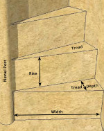
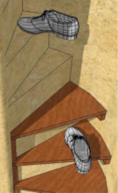
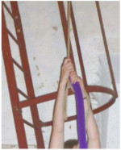
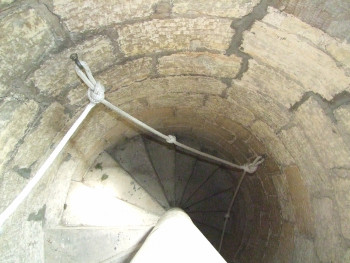
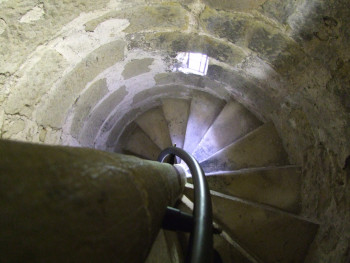
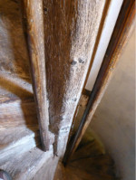

# Tower Access

The following was previously published as a .pdf file on the [CCCBR](docs/glossary/#cccbr) website.

## Introduction

No matter how comfortable and well equipped your ringing room or how excellent the go of the bells, if you can't reach them safely they're not much use to you. For that reason it is well worth considering the state of the access route to the tower.

All towers are different and each will present a corresponding set of unique circumstances which will affect the decisions made with regard to the access route. The access to the tower is not, of course, the sole province of the ringers but of church-wardens, electricians, bell hangers, masons and sometimes visiting members of the public. As such it is necessary to bear in mind the needs of all users of the tower and to remember that access to the upper reaches of the tower should be as well maintained and as carefully designed as the access to the ringing room.

## Terminology

*Figure 1: Terminology used.*

- Newel / Newel Post: the central column of a spiral stairway.
- Rise: the height of a stair from the tread below.
- Tread: the horizontal surface of a stair upon which users step.
- Tread Depth: the horizontal distance from the front edge of a tread to the back edge. For spiral stairs an indicative value is measured 300mm (12”) from the outer wall of the stairway.
- Width: the distance between the outside of the newel post and the outer wall of the stairway.

## Areas of Risk

The access in the majority of towers is, of course, a spiral staircase although ladders, straight stairways and even lifts/elevators are to be found occasionally. The main areas to consider are these:
- The condition of the stair treads or rungs.
- The availability of suitable handholds.
- Doorways and trap doors.
- The suitability of the lighting.
- Other potential hazards.

## Stair Treads and Ladder Rungs

The condition of the stair treads, is one in which there is usually the most difficulty in making improvements. It is likely that any work in this area will require a faculty and the involvement of the building architect.

### Worn and Uneven Treads

The most common fault to be found with stone stairs is excessive wear in the centre of the tread. When tread wear is becoming significant, more than 6mm depth from the original surface level, the building architect should be consulted and the affected stairs re-surfaced.

Re-surfacing can be carried out in a variety of ways:
- Using a modified cementitious mix (a cement and polymer mixture) will allow a thin layer of new material to be applied to existing stair treads with minimal disturbance.
- Where authenticity of materials is paramount, the existing tread can be cut away to a depth of 25mm (1”) or more and a new stone tread inserted.
- In some cases the treads can be cut away just enough to form a new, level tread.
- Wooden treads can be fitted to protect soft stone which is worn or liable to wear.

*Figure 2: Non-slip steps*

Where stairs are uneven in their rise they may be made more even by raising the level of low treads (see methods 1 and 2 above) or lowering high ones (method 3).

### Steep Stairways

When a spiral stairway is excessively steep the depth of the treads can be so small that the user is climbing with only their toes on the tread and descending on their heels. In such a situation it is possible to have wooden treads fitted which extend forward from the stone ones. These allow the user to put more of their foot upon each tread while the tread above overhangs. (See figure 2)

*Figure 3: Wooden treads fitted.*

Stairs modified in this way should be descended backwards or the advantage is negated.

Such extended treads MUST be supported at the front edge by suitable brackets or blocks fixed to the outer wall and newel post.

### Dust

Stairs and ladders should be kept clean to avoid dust or dirt making the treads slippery. Having a small vacuum cleaner in the tower specifically for cleaning the stairs is greatly preferable to sweeping.

### Ladders

The rungs of ladders should be paid attention for signs of damage or excessive wear. The top and foot fixings should be secure and robust.

Portable ladders in regular use should be equipped with hooks at the top for secure positioning on a purpose made rail or bracket.

Any damage to a ladder should be examined, superficial damage to wooden ladders should be smoothed to prevent splinters. If any, more serious damage to wooden or metal ladders is found, replacement of the ladder should be seriously considered.

Wooden ladders are susceptible to insect attack and any sign of woodworm should be investigated, the ladder treated carefully or replaced if there is any doubt as to its structural integrity.

*Figure 4: Ladder with hoops.*

Some modern fixed ladders are fitted with hoops which are designed to reduce the risk of falling but before installing such a hooped ladder the implications should be considered. If the ladder is in the ringing room as access to the room above the hoops may be too close to the rope circle and cause a risk of entanglement or indeed injury to a ringers hands, se image above. 

The hoops can also make it difficult to carry tools or to move stays or clappers to and from the bell chamber.

## Handholds

Handholds on tower stairways are an important safety feature and need to be carefully designed to be as effective and convenient as possible. There are various implications with each type of handhold.

### External Handrail or Hand-Rope on Spiral Stairs

External hand-rails and hand-ropes are common but have a major drawback in most cases. A 30mm diameter handrail mounted 50mm from the wall of the stairwell is the minimum size and finger clearance that should be used but even this most compact design will force the user around 80mm nearer to the centre of the stairwell. This means that the user is walking on the narrower area of each stair and this negates much of the benefit offered by having a handrail.

A hand-rope suffers from an even worse form of the same problem. If the rope is fixed even as often as six times per turn of the stairway it will reduce the usable width by more than 15% due to the rope ‘cutting the corner’ off the stairway.

*Figure 5: Extreme example of a hand-rope.*

As a result external hand ropes should not be installed unless fixed very frequently and in a wide staircase. 

When spiral stairs have a large radius and a good depth of tread an external handrail can be an ideal
arrangement.

The height of a hand-rail needed for ascending a spiral stairway is very much lower than the convenient height required for descent. The steeper the stairway is the greater the disparity becomes. The handrail should be at a great enough height to facilitate descent as a low hand rail will force users to bend forward and be less well balanced, increasing their risk of falling.
	
### Internal Hand-rail or Hand-Rope on Spiral Stairs

*Figure 6: Internal hand-rail.*

Internal hand-rails and hand-ropes are also found in many towers and have the advantage of allowing the user to traverse the largest part of the stair tread. An internal handrail may be fixed as little as 3 times per turn of the stairway without disadvantage.

A hand-rope should not be merely hung from the top of the stairway as a user pulling on the rope near the foot of the
stairway will cause a user higher up to have their fingers trapped.

The hand-rope should be supported with rings which will hold it clear of the newel and thus remove this disadvantage. It is also advisable to knot or otherwise fix the rope to these rings so that the whole strain of several users climbing with the aid of the rope will not be thrown on a single fixing at the top of the stair-way.

*Figure 7: Series of vertical hand-rails.*

A series of vertical hand-rails on a stair-way has much to recommend it. It is suitable for users of any height, it is sturdy and takes up minimal space. It is also very easy to install.

### Materials for Handrails or Hand-Ropes

Tough plastic water pipe is often used as a cheap handrail that can be easily fitted. The supporting brackets must of course be close enough together to provide adequate support and stiffness to the handrail. MDPE water pipe may be purchased in coils of 25 or 50 meters length and in various diameters. For handrails 25 or preferably 32 mm diameter should be used.

*Figure 8: Metal handrails*

A more attractive and hardy handrail can be produced by a blacksmith and while the cost will be greater it will also have an almost unlimited life.

Where a rope is used it should not be ordinary bell rope but something larger, preferably of 25 or more millimetres in diameter. Rope handrails should be inspected for wear regularly.

A rope made up of several sallies spliced closely together can be a very attractive and practical handrope.

From an economic point of view it is also worth considering that an external hand-rope uses 50% more rope than an internal one!

## Doorways and Trapdoors

The openings from stairways or ladders into the ringing room or other chambers in the tower is a part of the access route where changes are rarely made. The safety implications of doorway or trapdoor design are worthy of consideration, especially if any building or decorating work is being done in the tower.

### Doorways

In many towers the doorway from the stairway to the ringing room is close behind the back of one of the ringers at their rope. It is obvious that the door opening suddenly could cause an accident so warning signs or a simple latch to secure the door during ringing are sensible measures.

Some older doors hang on blacksmith made pin hinges. Such doors should be kept closed when ringing is in progress lest a stray rope catch the door and lift it from its hinges.

Doors which open outwards onto the stairway should not be fitted unless absolutely necessary. A door which must open outwards should open so that the user is leaving onto the upward stairs. If the door opens to the downward side, the open door forces the user to step down two or three stairs at once, risking a fall.

### Trapdoors

Trapdoors in towers are of two types. The first, an almost universal presence, is a trapdoor which is opened only for raising and lowering bells and furniture. Such a trapdoor should be locked and the keys kept by the [tower authority](docs/glossary/#tower-authority) as well as by the tower captain if the trapdoor is part of an emergency escape route. The second type is one which is used regularly as the main access to the ringing room or bell chamber.

Both types of trapdoor raise the same safety implications but the latter type require more permanent safety measures.

The first risk is that of falling down the open hole in the floor and the second is that of the door falling shut and striking a user. This latter could easily cause the user to fall from the ladder or stairs below the trapdoor.

A permanent barrier around the trapdoor is rarely an option but is the best if it is possible. 

A trapdoor at the side or corner of the room should open away from the wall so that the door itself forms a barrier. A simple gate or bar arranged to hinge from the wall will form a second barrier leaving only the access route open. Such an arrangement also holds the trapdoor open securely and negates both risks at once.

If the trapdoor is not adjacent to a wall the provision of a sturdy barrier on three sides of the opening is more difficult but should be arranged.

Trapdoors should never be left open when not in immediate use and should be counterweighted if possible to minimise the risk of falling shut and striking someone. 

## Lighting

The lighting of the access route to the tower is a vital factor in ensuring the safety of those using the tower.

In spiral stairways the light fittings should be positioned to illuminate the whole stairway. Remember to remind those installing the lighting that the ringers will often be using the route during the hours of darkness and that natural light from windows will be absent.

The fittings must be placed so as to pose no danger to those using the stairway. It is not uncommon to find bulky light fittings placed so that those passing them strike their head or shoulder. To minimise the risk of this, light fittings may be fixed to the rear or underside of the stairs above or to the newel post as high up as is possible. This latter is preferable as long as the fittings have a very wide angle of dispersal.

### Safety Lights

Safety lights should be used where possible so that the stairway will remain lit even during a power failure. If the stairs are even and not too steep it may be acceptable to have safety lights only intermittently but any changes or unevenness in the stairs should be covered by the safety lighting. If the stairs are steep, uneven or in any way difficult the whole route should be covered by the safety lighting. Safety lighting should be tested regularly in accordance with the manufacturers instructions. 

When a ladder forms part of the access route the top and bottom of the ladder must be covered by safety lighting.

### Types of Light Fitting.

Various types of lighting are suitable including bulkhead fittings which can have a built in safety light system. Ropes of LEDs have also been used to good effect when fixed along the external wall or newel post, low down so as to illuminate the treads of the stairs. Special arrangements such as an uninterrupted power supply unit would need to be used to maintain the lighting during a power failure.

A single bulb fitting will give good illumination over a very wide angle but is vulnerable to damage and is liable to dazzle those descending. Incandescent bulbs should never be used due to the danger of burns but LED bulbs or energy saving bulbs which do not get so hot are acceptable.

It is also advisable when installing stairway lighting to have a two way switch so that the lights may be turned on at the ringing room doorway should they be turned off at the foot of the stairway by some mischance.

More Information on tower lighting can be found at [lighting](docs/ringingroom/lighting).

## Other Potential Hazards

There are any number of other factors which may affect the safety of those accessing the tower but a few common ones are listed blow with suggestions as to possible remedial actions.

Low headroom in part or all of the access route:
- Warning signs.
- Padded edges on trap-door frames or low stairs.

Tie rods through stairway:
- Removal of rod if redundant.
- Padding.
- Eye catching paint and good lighting.

Little used doorways off access route:
- Lock all doors which are not in use.
- Signs on each door so that visitors do not go off route.

Steep stairs or ladders:
- Signs advising users to descend backwards.

Unauthorised access to tower:
- Signs to prevent unauthorised access.
- Barrier across stairway just above ringing room door to prevent visitors going too far up.
- Yale lock on bottom door, each ringer has a key.
- Doorbell for visitors.

| Figure | Details | Source |
| :---: | --- | --- |
| 1 | Terminology | Image: David Roskelly |
| 2 | Non-slip surface | Photo: Tony Crabtree |
| 3 | Steep stairway | Image: David Roskelly |
| 4 | Ladder with hoops | Photo: David Roskelly |
| 5 | Extreme example of a hand-rope | Photo: David Roskelly |
| 6 | Internal hand-rail | Photo: David Roskelly |
| 7 | Series of vertical hand-rails | Photo: David Roskelly |
| 8 | Series of metal hand-rails | Photo: James Kirkcaldy |


**[Return](docs/healthsafety/)**


----

## Disclaimer
 
*Whilst every effort has been made to ensure the accuracy of this information, neither contributors nor the Central Council of Church Bell Ringers can accept responsibility for any inaccuracies or for any activities undertaken based on the information provided.*

Version 1.1, March 2023

© 2023 Central Council of Church Bell Ringers
