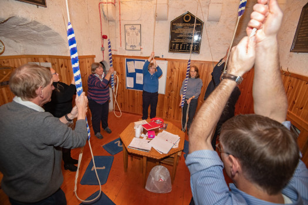
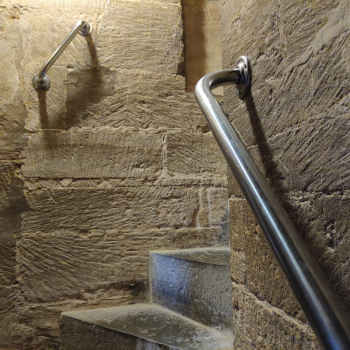
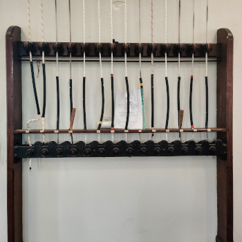
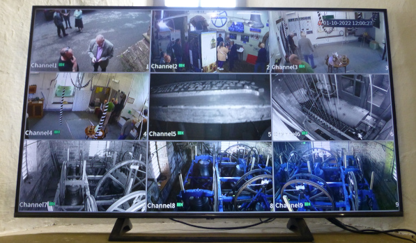
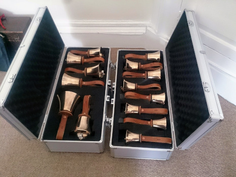
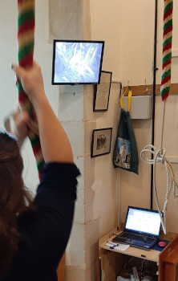

# Ringing Room 


**Site currently under construction**


Try to keep the ringing room a tidy and welcoming place. This will give a good impression to any visitors, especially potential recruits.

The following short videos were prepared by Tom Ridgman, Ely Diocesan Bells Adviser and are hosted on YouTube. We are grateful for permission to reuse this material. The links are:

- [Making ringers welcome and comfortable](https://www.youtube.com/watch?v=a9dBoQGnmOE)

- [Looking after ringing rooms and access](https://www.youtube.com/watch?v=O4R-yfxXvPc)

## Access

If the ringing room is upstairs:

- Are the steps safe, secure, non-slippery? The photograph shows a modern non-slip surface.

- Is there a good handrail (an alternative may be suitably positioned grab handles)? 

- Are the steps well illuminated? 

If the access door opens inwards to the ringing chamber are there measures, such as a window or a notice, to ensure it is not opened into a ringer standing immediately inside? 

If access is by a trap door, is it able to be safely secured when open? 

Is there any other way of accessing the ringing room that is less inconvenient? Maybe seek advice from your local Society.  

## Boxes 

Are these secure and suitable for use?
Are they suitably sized so the ringer doesn’t feel any risk of being too near the edge?
Are they carpeted so they can be stacked safely and without sliding for very young ringers? 
Are there wedges for uneven floors?

Further details are available at [notes on ringing boxes (CCCBR)](https://cccbr.org.uk/wp-content/uploads/2021/06/SM_Ringing_Boxes_2020_Ver_1_1.pdf). This document details how to make a 2ft x 2ft box which is stackable. "Fixed" boxes at towers e.g. Exeter (see picture below) are typically larger. The height generally needs to increase and be roughly in a ratio of 0.5-0.6 to the width. There are Health and Safety implications of high (fixed) boxes, but there are also positive sides to them.

Positive 
- Reduced rope wear, as the rope goes into compression (this induces fibre slip and wearing out).
- Reduces the risk of a trip hazard from the tail end coiling up around or under the ringer's feet.

Negative.

- Need to consider the need for edge protection. Boxes up to 600mm height, in accordance with HSE guidance unguarded edges, do not need to have edge protection.  

Consider whether a box for a heavy bell should be fixed or not? Fixed boxes may become handy storage spaces. If this is the case consider what goes in them. It is not a good place to store the first aid kit.

## Carpets and Rope Mats

These should be fit for purpose. There is a commonly held belief that wool is better, however this anecdotal. Most rope wear is a result of the compression when the rope comes into contact with another surface. The cost of a high wool content carpet maybe a couple of thousand pounds more than a synthetic carpet. A new set of tail ends, every 5-8 years is cheaper over the typical 20 year period of a carpet.

Ideally, mats should not overlap as this introduces a trip hazard.

## Ceiling, Rope Guides,  Spiders 

Are the rope bosses at the optimum height? Too high and the ropes can be flighty. Too low and the sallies can “jump” when coming down at backstroke. The ideal height is typically such that the sally of the lightest bell should just reach the guide whilst that of the heaviest bell sshould not go completely through. It may be neccesary in very heavy rings to have guides at different heights for the lighter and heavier bells.

Ceiling boss material and the contact surface area has a huge effect on how a bell rope wears out.  Cast iron generally corrodes and becomes abrasive to ropes, generally wearing the rope immediately above the sally. A dense timber may be better as it holds a polish and does not abrade the ropes. If unsure, seek expert advice, from your Society, ***[CCCBR](../glossary/#cccbr)***, or a professional bell hanger. 

Is the rope circle poor or very unequally spaced? Again, consider seeking advice as above, especially when there are ropes very close together.  

## Chiming Apparatus 

 

This includes Ellacombe apparatus, chiming hammers, clock hammers and electronic units (e.g., Apollo and similar). 
Ensure that these are disabled before ringing, especially when the apparatus is not in the ringing room. A warning notice should be prominently displayed. This should include advice on how to disable the apparatus. 
The picture on the left shows an ellacombe apparatus and the picture on the right shows the controls for the operation of an electronic unit (alongside controls for an electrically operated spider).

## Coat Hooks 

Are these fit for purpose?  
Are they in suitable locations? 

Ensure that cot hooks do not lead to important items being hidden such as emergency equipment, light switches, clock hammers. Ensure that these do not impinge on a ringer's position. The use of free standing coat stands should be discouraged as these can be dislodged or caught by flying ropes.

## Curtains / blinds 

These are primarily to prevent ringers being blinded by sunlight. Heavy curtains may also be an effective way to shut off an open staircase, door way or open gallery.  They may assist in enabling the ringing room to be heated without heating other unused areas such as the rest of the building, staircase, etc.
Curtains can also serve to deaden excessive echo in a ringing room.

## Electrical Devices 

Power points and powered devices should be checked by a professional, approved by the ***[tower authority](../glossary/#tower-authority)***. Any portable electrical equipment should be subject to regular checks. Devices must be included in the ***[tower authority's](../glossary/#tower-authority)*** register of electrical equipment. If there are too few power points, then additional points should be installed rather than using extension leads and adaptors. Do not daisy chain from one socket.

## Heating   

Consider arrangements to make the environment comfortable. In summer this may include adequate ventilation. In winter this may include heating. If the ringing room is open to the rest of the building it is worth investigating the use of screens or curtains to enclose the area. If there are any windows through which the sun might shine, investigate a blind or curtains to reduce this. 

## Lighting 

Further details can be found at [lighting in and around towers (CCCBR)](https://cccbr.org.uk/wp-content/uploads/2020/02/SM_Lighting_2019_Ver_3.pdf).  

In the ringing room:

- Is the lighting placed centrally to the rope circle, so as to illuminate all ringers above and from the front? Ensure there is enough light within the rope circle and not just around the walls. Uplighters may look good, but the reflectivity of the ringing room may mean they do not work. Uplighters require more energy to achieve an acceptable light level and work best when combined with downlighters, lighting the space at eye level (approximately 6 foot) to waist level (approximately 3 foot) for the ringers.

- Are there at least two light sources? This provides a back-up should one fail or is smashed by a wild rope. If in doubt, fit more lights than originally considered. Ideally engage a professional to help with design. 400-500 lumen at eye level (approximately 6 foot from the floor) is a good starting point when ringing. 

- Lighting needs to be maintained, e.g. bulbs changed, and should be safely accessible.

- There should be a battery back-up to protect against a blown fuse or power failure in at least one light fitting. The lighting should be 'safety lighting' not 'exit lighting'. The former is brighter. There is further information at [Oxford Diocesan Guild website emergency lighting](https://odg.org.uk/wordpress/wp-content/uploads/2020/01/tbc01_emergency_lighting-3.pdf). N.B. This document is to be updated.

If the ringing room has large windows is there some means of reducing direct sunlight temporarily blinding the ringers such as curtains or blinds. 

## Seating 

Seating may consist of chairs, benches, etc. They should be free of obstacles that may be picked up by a rope whilst ringing. Ideally they be double the distance for hooking them with a moving rope. A carefully designed stack of boxes may provide additional seating when the boxes are not in use.

Is there adequate seating to accommodate people not ringing? The size of the tower may restrict the amount of seating.

Is all seating fit for purpose? 

## Notices Boards and Information 

Are notice board(s) displaying up-to-date information, such as tower and Society notices?  

## Teaching aids and a suitable space for teaching. 

This may include model bell(s), simulator(s), books and pictures of the bells above ***[see also CCTV](../ringingroom/#CCTV)***.

# Storage  

Consider whether storage spaces need to be lockable. This is especially important when the ringing room is readily accessible. It may also be necessary to lock any higher value items away.

# The Ringing Experience 

The [Volunteer and Leadership work group](https://cccbr.org.uk/about/workgroups/volunteer-and-leadership/) pages should also be consulted.

# Go of the bells 

Are the bells odd-struck? Are any bells set too fine or too deep?
This may be easily corrected to give a more satisfying experience. Consider seeking advice from your local Society, ***[CCCBR](../glossary/#cccbr)*** or a professional. There is further information at [Oxford Diocesan Guild correcting odd struckness](https://odg.org.uk/wordpress/wp-content/uploads/2020/01/tbc03_correcting_oddstruckness-3.pdf). N.B. This document is to be updated.

# Sound 

Are the sound levels in the ringing room good? Is it echoey? if so, consider a carpet or large rug. Curtains and soft furnishings may also help. 

Do the bells “shout” down through a trap door or through the stair door? Ensuring these are adequately insulated may be easily redressed.

Further advice may be available from your local Society or the ***[CCCBR](../glossary/#cccbr)***. If the problem is larger then consult a professional. There is further information at [Oxford Diocesan Guild sound control](https://view.officeapps.live.com/op/view.aspx?src=https%3A%2F%2Fodg.org.uk%2Fwordpress%2Fwp-content%2Fuploads%2F2020%2F05%2FODG-Sound-Control-Booklet-v2.doc&wdOrigin=BROWSELINK)). N.B. This document is to be updated.

Consider the external acoustics. The bells may cause annoyance to neighbours if especially loud. There may be a professional means of reducing this.

## Other areas to consider 

### CCTV

This may cover multiple areas. Images of the ringing room and bell chamber are useful for visitors who may not be able to access the tower. Images of the bell chamber are useful for learners. Images of other areas in and around the building may provide additional security, etc.

## Communication

Links to the body of the building, especially where the ringing room is separate, also need to be considered. The answer may be as simple as a bell pull or as complex as a telephone/visual communication system. This can assist with timings for services (especially weddings) and other activities within the building.  

### Kitchen

At least a kettle, mugs and a means of taking the latter away for cleaning. These must be compliant with hygiene requirements  

### Toilet(s) 

As these are normally in the main part of the building access may be restricted.

### Parking. 

## Other Tower Resources  

The following is a list of possible assets, though not exhaustive. In all cases consider whether these are kept securely and are adequately insured for loss or damage.  

### Display bell(s) 

If possible, a model bell should be portable allowing its use for demonstrations outside of the tower.  

### Handbells

Are these usable? If not, consider restoration otherwise they are merely a display item.

If handbells are considered a useful resource a cheap option is a set of eight “rainbow” handbells. These are readily available, inexpensive, robust and ideal for teaching place-counting, etc. 

### Records

Tower records of visitors, quarter peals and peals. Within churches in the Church of England, these are formally part of the Parish records. Further information can be found in the [History and Archive work group](https://cccbr.org.uk/about/workgroups/historical-and-archive/) pages.  

Peal and other commemorative boards, certificates and photographs. Are these recorded elsewhere? It is a good idea to maintain a quality photographic record of these in a separate location. There are persons who do produce boards to order, there details are often advertised in the Ringing World and on social media. Putting up a board in a tower requires consultation with the ***[tower authority](../glossary/#tower-authority)*** and an Archdeacons' consultation in a ***[C of E](../glossary/#c-of-e)*** church.

Older peal boards may require restoration. There are specialist firms providing such services, they can be found by a search of the internet or through the Ringing World.

### Simulators

Are the components kept securely? 
Have the electrical components been PAT tested by an approved contractor? 
Any fixed wiring needs to be inspected every couple of years by a qualified electrician. Any fixed wiring should also have been installed by an electrician to BS7671. This generally covers circuits up to sockets, anything plugged into a socket is portable appliance.

### Spare ropes  

See information in the rope section of [Belfry Upkeep](https://belfryupkeep.cccbr.org.uk/docs/120-ropes/).

It is a good idea to have a few usable spares to cover any bell, as needed. Natural fibre ropes degrade whether in use or not. Ropes kept in a box may appear to be in good condition, but the fibres will have decayed whilst not used. Ropes should be stored so as to prevent attack by vermin. Each rope should be labelled to indicate which bell(s) it is for.

Do you have at least one person able, and willing, to check the ropes at suitable intervals? If not a local society 'expert' may be able to assist. If a person is available locally, can they identify and correct any wear points, change or repair a rope if needed. If ropes do need professional maintenance or replacement there are a number of manufacturers. Their details are often advertised in the Ringing World and on social media.

If unsure, consider contacting your local Society or the ***[CCCBR](../glossary/#cccbr)***.

### Tools 

Are these usable and not simply rusted away? 

It may be preferable for the person doing maintenance to provide their own tools. Tower tools may have a habit of “walking” or being misused, even by well-intentioned people!

### Trophies 

These are the usually the property of the awarding body. However, they are in the care of the tower and should be kept securely. Insurance of these items is normally the responsibility of the awarding body.

## Image Credits

| Figure | Details | Source |
| :---: | --- | --- |
| 1 | Ringing room at St Machar, Aberdeen | Photo: CCCBR archive |
| 2 | Non-slip staircase surface | Photo: Tony Crabtree |
| 3 | Hand and grab rails at South Petherton | Photo: James Kirkcaldy
| 4 | Pile of carpeted boxes |  Photo: Tony Crabtree |
| 5 | Carpets, mats and boxes at Exeter Cathedral | Photo: James Kirkcaldy |
| 6 | Rope Guide frame at Melbourne, Derbyshire | Photo: James Kirkcaldy |
| 7 | Ellacombe chiming apparatus | Photo: James Kirkcaldy |
| 8 | Electonic chiming control unit at Exeter Cathedral | Photo: James Kirkcaldy |
| 9 | Well lit ringing room at Great Barton, Suffolk | Photo: CCCBR archive |
| 10 | Notice board | Photo: Tony Crabtree |
| 11 | Teaching aids | Photo: Tony Crabtree |
| 12 | Multiple channel CCTV at Ledbury, Herefordshire| Photo: Alison Hodge |
| 13 | Model demonstration bell | Photo: Tony Crabtree |
| 14 | Set of fourteen handbells in carrying cases | Photo: James Kirkcaldy |
| 15 | Visitor's book | Photo: Tony Crabtree |
| 16 | Peal boards at St Mark, Exeter | Photo: James Kirkcaldy |
| 17 | Using the simulator at Great Gransden, Cambridgeshire | Photo: CCCBR archive |
| 18 | Collection of tools suitable for use on a bell installation | Photo: Tony Crabtree |
| 19 | Competition trophies at Exeter Cathedral | Photo: James Kirkcaldy |

----


**[Previous Chapter](../emergency/)** - **[Next Chapter](../bellchamber/)**


----

## Disclaimer
 
*Whilst every effort has been made to ensure the accuracy of this information, neither contributors nor the Central Council of Church Bell Ringers can accept responsibility for any inaccuracies or for any activities undertaken based on the information provided.*

Version 1.0.0, November 2022

© 2022 Central Council of Church Bell Ringers
