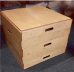
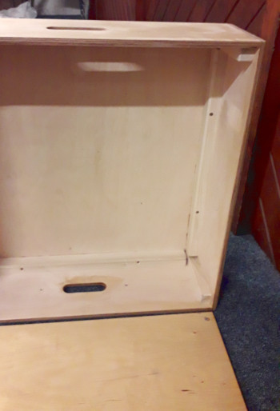
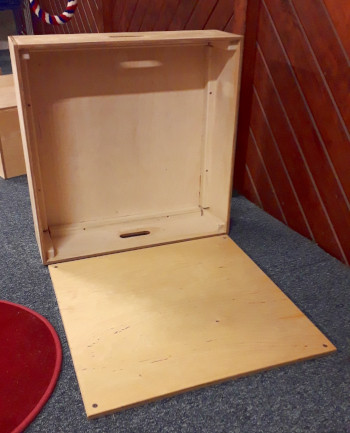
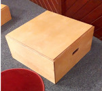

# Ringing Boxes

Their design and construction.

The following, written by David Roskelly, was previously published as a .pdf file on the [CCCBR](https://runningatower.cccbr.org.uk/docs/glossary/#ccccbr) website.

## General Remarks on Box Design

Ringing boxes are one of the ubiquitous but often despised necessities of ringing. They are often heavy, they take up space in a ringing room which, in most cases, has little enough space to begin with and many ringers don't like using them anyway. However they are not going away and a well designed and neatly made box will do much to improve the perception of boxes in general.

A large part of the problem is the provision of boxes which are thrown together without thought, from bits of scrap timber. They are frequently far too small and make the user feel unstable and nervous.

There are a few simple criteria for a good ringing box.

- Stability: Wobbly boxes are very dangerous. If the floor is uneven, have some wedges or small patches of carpet tile to put under a corner. Be sure that what you use won't work its way out and leave you unstable halfway through a quarter peal.

- Strength: Make sure that the box is well built and sturdy. Even a little bit of flexing can be very off-putting if you're not used to ringing on a box.

- Sufficient Size: A box which is too small will make you worry about your feet all the time and put you off your ringing. Boxes should ideally be around 2' (600mm) square, enough space to take a small step backwards or sideways if necessary.

- Rope Safe: Boxes should not have overhanging lips, corners or anything which could get caught on a moving rope.

- Rope Friendly: Smooth rounded edges will not wear ropes unduly. Some people put woollen (NOT synthetic) carpet on the front and top of a box to protect the rope and make it more comfortable but it's a matter of preference, carefully finished woodwork won't hurt the rope or the ringer.

- User friendly. Boxes should be as light as possible, be easily portable (handle holes with rounded edges are worth the work) and, if possible, stackable to simplify storage and prevent the need for risky stacks of boxes when teaching younger ringers.

In the notes that follow, we offer the design for a set of boxes and advice on how to construct them. Other designs are available. It is possible to make a very serviceable box from offcuts and recycled materials. The critical features are making the surface large enough, and the box sufficiently sturdy and stable. A larger rigid box will certainly help the nervous.

Whatever you decide, will depend on your tower: how many boxes may be required, their height, the flooring, the space available when they are in use as well as when they are NOT in use. The boxes themselves and any wedges, etc. must not themselves become a safety hazard!

## Construction Notes

For a set of 8 ringing boxes - or fewer if you wish.

*Figure 1: Set of boxes.*

### Introduction

This set of boxes was designed for a 21 cwt ring of ten bells and the large box is suitable for a tenor of this weight or a
little larger, with a medium box being suitable for the 9th (c. 14 cwt).

These boxes were designed to be strong and sturdy, easy to handle, stackable, safe and aesthetically pleasing. They also
have soft edges to reduce rope wear and make them comfortable to lift and carry.

The box heights are such that, for example, one large box is the same height as three small ones. This allows two stacks
to be placed side by side if required, without creating a step.

The dimensions are such that the complete set can be made from two sheets of 8' x 4' plywood with minimal waste. If you
are making your own set you can alter the heights if you wish. There is about 100mm extra height available from the 8' x 4' sheet after making allowance for cutting wastage. A good use of this might simply be to make three medium height boxes and only four small ones but I chose to have five small boxes as these are the most commonly required.

### Purchase List

- 1 sheet 18 mm birch plywood for box tops
- 1 sheet 12 mm birch plywood for box sides
- 21 m of 24 mm square ash or poplar angle block
- c 450 nails of airgun brads (30 mm)
- PVA glue
- Wood stain (ir required)
- Floor varnish, finishing oil or hard waxoil to cover 6 sq m (outside only) or 12 sq m (inside and out)

### Cutting list

| Quantity | Length | Width | Depth | Material | Part |
| :---: | :---: | :---: | :---: | :---: | :----: |
| 32 | 528 | 24 | 24 | Poplar, Ash or similar | Horizontal angle block |
| 20 | 68 | 24 | 24 | -- " -- | Vertical angle block |
| 8 | 158 | 24 | 24 | -- " -- | -- " -- |
| 4 | 248 | 24 | 24 | -- " -- | -- " -- |
| 8 | 580 | 580 | 18 | Birch plywood | Box tops |
| 10 | 580 | 90 | 12 | -- " -- | Box sides (with handle cutout) |
| 4 | 580 | 180 | 12 | -- " -- | -- " -- |
| 2 | 580 | 270 | 12 | -- " -- | -- " -- |
| 10 | 606 | 90 | 12 | -- " -- | Box front and back |
| 4 | 606 | 180 | 12 | -- " -- | -- " -- |
| 2 | 606 | 270 | 12 | -- " -- | -- " -- | 

I hope the more expert reader will forgive me for explaining some basics which may seem rather obvious. My intention is, of course, to provide enough information for the less experienced wood worker to complete the work without being left completely at sea. That being said, a certain level of experience and common sense is assumed. The reader is of course responsible for the safe conduct of any work and no responsibility can be accepted by the author or distributor of this information for any accident, damage or injury arising from the use of this information.

### Tools

These boxes were designed to be glued and then nailed together with a nail gun . The glue of course provides the structural strength and the nails hold it all together while the glue dries. The ideal list of tools and machines for making these boxes would be as follows:

- Planer/thicknesser for machining angle block.
- Vertical panel saw for cutting plywood parts with high precision.
- Nail gun for 18 gauge 30mm brads.
- Hand-held router with straight cutter, bearing-guided 1/8" and 1/4" roundover cutters, and bearing-guided trimmer.
- Router table with straight cutter.
- Measuring tools and 9" engineer's square.
- Sand paper, etc.

The boxes could of course be constructed with only the following but much more time and patience would be required:

- Panel saw.
- Tenon saw.
- No. 4 smoothing plane.
- No. 7 jointer plane.
- Block plane.
- Rebate or badger plane.
- Hammer.
- Pin punch.
- Measuring tools and 9" engineer's square.
- Sand paper, etc.

### Construction

#### Cutting the Parts

##### Tops

A .pdf format of plans for the tops [can be downloaded here](boxes3.pdf).

If you are fortunate enough to have access to a vertical panel saw then it will save you a huge amount of time. Some DIY shops will provide a sheet material cutting service but be sure that the results will be truly accurate and square before placing your order as correcting any errors will be slower than cutting the sheets yourself and getting it right first time.

The box-tops are the most critical as any errors here may mean that the boxes will not stack properly.

The tops must be exactly square, so check every one carefully by measuring diagonals. 

##### Sides

 A .pdf format of plans for the sides [can be downloaded here](boxes2.pdf).

The (short) sides are almost as crucial as the tops, so check these carefully too. They need to be exactly the same width as the tops and have perfectly square ends.

Notes
4 mm bevel on exposed edges of all angle blocks.
3 mm round over on all external horizontal edges.
6 mm round over on all external vertical edges.
Edge of top is rebated by 2 mm all round.
3 mm round over on all edges of handle openings.

The (long) front and back of each box is the least critical and the cutting list shows 2mm extra length on these so that they can be trimmed after assembly. If the ends are perfectly square it will make assembly easier.

**NOTE!** When cutting the fronts, backs and sides from the 8' strips, you cannot get four fronts out of one strip, you need to cut two sides, a front and a back from each strip.

**Angle block**

The angle block is listed as 24 mm square but some variation is allowable. If you use larger section you may need to shorten the horizontal blocks to make everything fit.

**Timber**

 If you are buying ready planed timber check it is truly square and that it is good quality wood without sap or significant knots. I have specified poplar or ash for a sturdy construction but good pine would do almost as well if you can procure it. Oak is perhaps best avoided as the acid will rot the brads and that may cause rust marks to show after a while which would be a shame.

#### Preparation

I would suggest going through the plywood parts at this stage and choosing the best face of each to go on the outside. I usually pencil 'IN' on the worse side in big letters so I can easily identify the inside when assembling.

##### Tops

The box-tops need to be rebated around the top edge to provide the clearance for stacking without getting stuck together. The rebate is 10 mm deep and 2 mm wide. The simplest way to achieve this is using a router table, if you have access to one. A hand-held router with the fence fitted will do the job just as well with a little care and patience. If you are using your own vertical panel saw the rebate could even be cut at the same time as the boards are cut to size.

Mark on the inside of each top, the position of the ends of the horizontal angle blocks on all four sides. If you are following the drawings exactly, this will be 26mm from each corner. These marks will show you where to glue the angle blocks during assembly. 

The edge of the rebate will need to be rounded over with a 1/8" bearing-guided cutter but this will be done after assembly of the boxes.

##### Sides

Mark on the inside face of each side which edge is to be the top, you will need to be able to see at a glance when gluing up so mark boldly. Handle holes can be made by drilling two 28 mm holes (72 mm apart) and jigsawing between them or by making a jig which screws to the inside of each side piece in turn and guides a router guide collar. If you are drilling for the handle holes, pilot through the board with a 3 mm twist bit, then go halfway through from each side with a 28 mm forstner bit. This will prevent any breakout of the surface and ensure a splinter free handle hole.

The handle holes are finished by running a bearing-guided 1/8" roundover cutter around the edges, inside and out (or by many hours of heavy sanding), and finally smooth the holes with fine sand paper.

##### Angle Block

Use a router with a bearing-guided bevel cutter to put the 4mm chamfer on one edge of all of your angle blocks. Chamfer the two adjacent edges at both ends of all vertical angle blocks. This will show in the bottom of each box but save you having to think about which way up to put the blocks when gluing up.

A .pdf format of the plans for the handles [can be downloaded here](boxes4.pdf).

#### Assembly

##### The first side

*Figure 2: The first side.*

You will need a good flat work bench and several 10 mm scraps of timber to act as spacers.

Have your glue, nail gun, nails, square, parts (organised in groups) and a bucket of warm water and a rag ready to hand
before you begin.

If you are using a nail gun then each entire box can be assembled at once, or you can work in stages if you prefer. If
you are not using a nail gun then you will have to proceed in stages. The order of work is the same in both cases.

Clamp or fix a piece of scrap timber to the bench to push the box-top against as you fit the sides.

Place the box-top upside down on your work bench with a 10 mm spacer at each end of the side you are working on.

Take your first horizontal angle block. The sides which are not adjacent to the bevel are to be glued so apply a generous bead of glue to one of these and then place the block on the box-top between the marks you prepared earlier. The bevel must be towards to middle of the box.

Press hard and rub the block around a little to spread the glue and give a firm joint. Work the block into place between your marks and with the outer face perfectly flush with the edge of the top at both ends.

Nail one end down with one nail then check the other end and nail it down too. If the block is not perfectly straight, bend the middle into place and add nails as necessary to keep it perfectly flush with the edge. Five or six nails should be sufficient. Press down hard when firing the nail gun to keep the glue joint tight. Now pick up your first side piece and apply two beads of glue, one right by the top edge and another (more generous) about 20 mm down from the edge. Place the top edge of the side piece on the spacers (to give the 10 mm rebate for stacking) and press it against the box-top edge and the angle block you just fitted. Rub it about a little as with the angle block to spread the glue and make a good joint and then align the ends of the side with the ends of the box-top. If you were accurate in the cutting both ends will align perfectly. If there is more than about 0.5 mm excess, align one end and we'll come back to the other later.

Drive one nail (from the outside) and check the alignment. If necessary, adjust with a ‘persuader’ while protecting the edge of the work with a bit of scrap timber. Drive the rest of the nails, pushing hard as you do so.

##### The front

Now fit the next horizontal angle block as before and then fit the front as you did with the side, remembering to add a bead of glue down the end where it meets the side piece. Align the end of the front to the face of the side, the excess will all be at the other end and can be trimmed off after assembly is complete.

Take the first vertical angle block and apply glue to both gluing faces (those not adjacent to the chamfer) and to the top end. Insert the vertical angle block into the corner between the two horizontal blocks and rub it in. Drive a couple of nails through the side piece into the vertical block. The side will ensure that the front is truly square to the top (assuming your cutting was accurate) but you need to check that the side is, itself, vertical. If you are confident that the ends of the front and back are all truly square you can align the side to that and fix with nails but it's best to use a tri-square and be certain. 

You should now have one corner assembled with all angles square and a 10 mm x 14 mm rebate around two sides of your box-top.  Now use the rag and warm water to clean away any excess glue from the outside of the box. Wring the rag out fairly well to avoid soaking your work but do rub away all traces of glue as it will show under the varnish if left. You can clean up the inside of the box if you wish but since the glue dries clear it will barely show there if you leave it.

##### The rest

You can now leave the box to dry if you wish but ensure that the unsecured ends of the front and side are square to the
top now, as you won't be able to bend them much once dry.

A picture frame clamp would be perfect to hold them square should they need support but any other method will do.

If you found that the side piece was too long, this is the moment to trim it off with a block plane.

Next attach the second side and then the back as described.

Check each corner as you assemble it to ensure that everything is truly square and correctly aligned.

Once you have completed assembling one box there is a strong temptation to try it for size. Do wait for the glue to be
fully dry and remember that you will have to sand off any footprints afterwards! 

*Figure 3: Nearly complete.*

#### Finishing

Having assembled the boxes you will see that the front and back are a little longer than required and these ends can now be trimmed off using a block plane or a router with a bearing-guided trimmer. Any small variations or misalignments in the top and bottom edges of the fronts, backs and sides can also be corrected with a plane (you may need a rebate or bager plane for the top edges).

The round-over on all external edges can now be cut. Use the 1/4" cutter first to round-over the vertical edges. Then change to the 1/8" cutter and round-over all of the horizontals. For rounding-over the top edge of the box-top run the base of the router on the box side and for the sides run the router base on the box-top. For the bottom inside edges do as much as possible from the inside of the box and do the corners with the router on the edge of the sides. Finish all edges with sandpaper to smooth out any bumps, remove any burn marks and round-over any bits that the router couldn't reach.

You should now have a finished box with every edge smooth, clean and comfortable to touch. Sand all surfaces smooth, apply whatever stain you require and then finish with a floor varnish, hard wax oil or finishing oil. It is a good idea to test the finish first to ensure that is will not be too smooth or slippery to safely ring on.

Notes

In use, I have found that these boxes are easier to keep standing on edge as it allows you to choose a larger box without having to move all of the small ones off the top first, but beware of the risk of the boxes falling over.

On some floorings the boxes can slide about when raising larger bells. Where the boxes are semipermanent you can prevent them sliding by fitting a floor plate. For these boxes the floor plate is 576 mm square and made of 12 mm ply and finished to match the boxes. The upper edges are rounded over using the 1/8" cutter and the plate is screwed to the floor in the desired position. Since the box will normally sit over the plate it does not present a trip hazard but if a very tall ringer wants to ring without the box, it can be removed and the plate is exactly equivalent to the top of the boxes.

I hope that these notes and the drawings that they accompany will be of use to people. If you should find any glaring omission or error, or you simply need more information, do please contact me (sminf@cccbr.org.uk) and I will endeavour to help.

*Figure 4: Finished box.*

| Figure | Details | Source |
| :---: | --- | --- |
| 1 | Set of boxes | Photo: David Roskelly |
| 2 | The first side | Photo: David Roskelly |
| 3 | Nearly complete | Photo: David Roskelly |
| 4 | Finished box | Photo: David Roskelly |


**[Return](https://runningatower.cccbr.org.uk/docs/ringingroom/)**


----

## Disclaimer
 
*Whilst every effort has been made to ensure the accuracy of this information, neither contributors nor the Central Council of Church Bell Ringers can accept responsibility for any inaccuracies or for any activities undertaken based on the information provided.*

Version 1.1, March 2023

© 2023 Central Council of Church Bell Ringers
