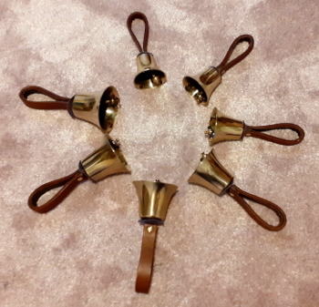
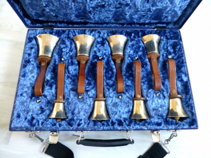

# Handbells

A brief guide

The following, written by Alison Hodge, was previously published as a .pdf file on the [CCCBR](docs/glossary/#cccbr) website.

*Figure 1: Part of a set of hand bells*

## Introduction

In the months whilst ringing was restricted due to the COVID pandemic, the interest in ringing handbells increased,
including outside during warmer weather. This note aims to summarise some points that people may wish to consider.

Musical handbells are usually in tuned sets, unlike small school bells, etc. The metal is bronze about 80% copper and 20% tin
(tower bells are about 77% copper and 23% tin). The handle is usually thick leather, although bells manufactured in America often have plastic handles. The clapper has a rigid shaft so that the bell can be struck in a controlled way.

## Tunes or Changes

Handbells can be used to ring musical tunes or for change ringing. What a group chooses to ring will partly determine how many bells will be needed and what sizes. Change ringing will usually be rung using 6, 8, 10 or 12 handbells (but may be more) with bells in a musical scale. While tunes may be rung on 8 or perhaps 12 bells, the music will be enhanced by the availability of more bells, including some sharps or flats, or a fully chromatic set.

In the USA ‘handbell ringing’ is usually taken to mean tune ringing with large groups of people forming ‘bell choirs’ often in schools, colleges, churches or community groups.

There are similar groups or teams in the UK, but few as large as in the USA.

- **[Handbell Musicians of America](https://handbellmusicians.org)**
- **[Handbell Ringers of Great Britain](https://handbells.org.uk)**
- **[making music](https://www.makingmusic.org.uk/resource/introduction-handbell-ringing))**

In the UK, handbell ringing is more often associated with change ringing, but not by all.

Examples of change ringing -
- **[Pevensey Delight Minor](https://cccbr.org.uk/2020/06/12/result-of-may-youtube-competiton)** Highly commended example.
- **[Plain Bob Triples](https://cccbr.org.uk/2020/09/09/august-youtube-winner)**

## Acquiring Handbells

Many towers and ringing societies own handbells so sets may be available to borrow.

If buying, this will be a personal (or committee) decision depending on funds available, intended use and experience. Are you complete beginners? Or do you have some experience with handbells and now wish to get your own set?

### New Sets

New sets of handbells are available from various suppliers both in the UK and USA. It is also worth considering ‘Bell plates’ and ‘hand chimes’ for schools and groups of younger people. These create similar effects, are more often used for tune ringing, are cheaper and more rugged. 

The number and tone will depend on what you want to ring and as much as anything will be a personal (or committee) choice, and finally, of course, the cost!

New sets will provide you with known quality – manufacturers include:

- **[Taylor’s of Loughborough](https://taylorbells.co.uk/what-we-do/taylor-bells/handbells-small-bells)**
- **[Bells of Whitechapel](https://bellsofwhitechapel.london/handbell-maintenance)**
- **[Malmark (USA)](https://malmark.com)** also suppliers of hand chimes and other accessories
- **[Schulmerich (USA)](https://schulmerichbells.com)** also supplier of hand chimes and extensive range of accessories
- **[Belleplates](https://belleplates.co.uk)**

### Second Hand

Second hand sets may be advertised e.g. in The Ringing World or on websites such as **[Handbell Ringers of Great Britain](https://handbells.org.uk/small-ads-sales)**.

Auction houses sometimes have sets or small numbers of bells for sale. It will be helpful if you have some knowledge of what to look for if buying at auction. Prices can range from a bargain to excessive! 

Sets, part sets and odd bells may be found occasionally in second hand shops, car boot sales, etc. As with auctions, knowledge of what to consider will help.

*Figure 2: Set of small tuned 'rainbow' bells*

Small musical handbells intended for children are also now sold in rainbow colours. Sets including different notes are available (including sharps/flats). Although each bell measures almost the same size as others within a set, they are tuned to different notes. These are comparatively cheap but the clappers are attached by springs so do not have the same action as traditional handbells. They are available from various sources, such as **[Thomann](https://thomann.de/gb/thomann_rainbow_handbells_trhb_20.htm?glp=1&gclid=EAIaIQobChMI-8HwypDk7AIVVvtCh3D4QHCEAQYBCABEgLai_
D_BwE)** on the internet as toys and education aids.

### Ranges

For change ringing a set of 12 bells perhaps size 12 F to 1 C, diatonic (i.e. just the white notes of a piano). Such a set would offer 12 bells for changes, an 8, and light 6 or a heavier 6. If you added a 13th bell this could be a little top D that enables a heavy 6 and a light 6 simultaneously.

This size range is not too heavy, but some people find the little bells too light and quiet. Alternatively, with heavier bells, you could get a set starting at 15 C up to 4 G, with a 13th being 3 A. 12 bells would also enable you to ring basic tunes, if you chose to do so.

For tune ringing, a fully chromatic set will offer more flexibility. Larger groups may include several bells of the same note in the higher pitch range, to reinforce the intensity of the sound.

### Tone

The tone of a handbell will depend on various factors particularly the founder, age and profile of the bells. Small bells will be quieter so achieving a balance within a set with larger bells needs care. The finish of the clapper surface may be altered to adjust this – hard or soft leather, felt or nylon.

Bells from some founders will resonate (i.e. hum) for longer. This may be preferable for tune ringing but for change ringing a more mellow tone with less hum is often preferred so that the rhythmic strike of each bell in the change is audible.

The room acoustic will also affect the audibility of the bells – for change ringing a room with soft furnishing to dampen the sound will be preferable.

*Figure 3: A typical handbell clapper (leather pads removed from the ball and leather felts from the springs)*

Tips when buying second hand bells

- Why they are being sold?
- What is their condition?
- What does the vendor’s description say? e.g. what does ‘excellent condition’ mean?
- What founder? All the same founder? Known founder may enable bells to be replaced/added.
- Are any bells cracked or chipped? NB cracks may not be visible.
- Are the leather handles sound, clean and dry, and not too heavily cracked or kinked, especially at the rivets?
- Are the clappers and springs in place, with the 2 felt pads on each spring?
- Do the clapper balls have the leather or nylon pads that strike the bell in place?
- Are the castings clean, unmarked, without verdigris, apart perhaps from a few light finger prints?
- Is there any sign of heavy, repeated polishing?
- How have they been stored and used? Are rigid boxes or cases included in the sale?
- What are the cost and transport arrangements?

**[Bill Butler’s book 'Musical Handbells' is available from various sources, such as **[abebooks](https://abebooks.co.uk/book-search/title/musical-handbells-a-comprehensive-history-of-the-bells-and-their-founders/author/butler-william)**, and provides excellent background about handbells generally, including a lot of history.

*Figure 4: Handbell during restoration showing the makers mark - the initials of Henry Symondson which may help in dating a bell*

### Maintenance, Repairs & Restoration

Manufacturers provide this service as well as other small companies and individuals. Be cautious if asking a saddler to replace a leather handle. 

Leather handles, clapper pads, felts, etc. are relatively readily replaced. Clappers may be replaceable, but possibly not with the same design as originals in older sets by some founders.

### Storage

*Figure 5: Handbells stored in a custom-made carrying case*

Handbells are expensive musical instruments and as such, should ideally be stored in custom designed rigid instrument cases or wooden boxes. Each bell should be held separately from its neighbours. Strong latches ideally lockable, that will not burst open are important. The practical point to consider is the total weight and size of each case – are they to be carried by hand or would a large, heavy case require a trolley?

Bells should be kept clean and dry, at normal room temperature with some air circulation, away from anything that may corrode the metal of the bells or accelerate degradation of leather handles. It is best that the bells do not touch each other, even avoid the leather of one touching the metal of another. Note that storage boxes may be a requirement in some insurance policies.

Thin cardboard boxes, carrier bags and other lightweight containers are not recommended. Modern rigid plastic storage boxes, especially those with tight-fitting lids, may appear to be suitable but the contents may ‘sweat’ if stored where the temperature fluctuates; condensation may build up, causing tarnishing of the metal and mould and degradation of the leather.

Glass-fronted cases or an open rack in a tower or church were often the traditional storage for a church owned set of
hand bells. While these may appear to be appropriate and rather attractive, perhaps donated or a memorial, they have
drawbacks. Sadly, the risk of theft or misuse, even if the case is locked, is probably too great.

New bells may be supplied in cases and specialist suppliers will make them to order.

Strong flight cases and instrument cases are available from various supplies, relatively cheaply, leaving the design and
fabrication of supporting inserts for the bells as a challenge for ingenuity and skill!

### Ringing Handbells

*Figure 6: Handbell held firmly close to the leather cap*

Ringing handbells is typically a group activity: it is best to join a group to be taught how to ring handbells. They are fragile and expensive musical instruments.

The metal is brittle and will crack if dropped or knocked against a hard surface or even another bell! They should be
held firmly or the leather straps will wear quickly where riveted to the bell; the likelihood of bells together is greater
if they are not held firmly, and could cause damage to the bell casting.

It is also best not to touch the metal with bare hands as grease on hands can tarnish the metal, very noticeable especially on highly polished bells. Some handbell owners require that ringers wear gloves when handling their bells. Polishing is to be avoided, and if required, only the finest grade metal polish should be used very infrequently, otherwise the metal will be worn very gradually. This is especially important for any bells that may be engraved.

*Figure 7: Engraved handbell*

The springs (that enable the clapper to bounce off the bell surface) may need to be ‘set’. This is best done by someone with experience. For change ringing, the clappers need to sound equally at both hand stroke and back stroke. For tune ringing in which only one motion is used to sound the bell, the clappers may be set so that the clapper does not usually strike on one side of the bell, but does on the other side. This is a reason why some sets of bells are designated for either change ringing or tune ringing but not both.

- For tune ringing, there are various styles, with the most frequently encountered summarised **[here](https://makingmusic.org.uk/resource/introduction-handbell-ringing)**

- Change ringing on handbells normally involves each ringer ringing one bell in each hand, but occasionally 2 in each hand.
Demonstrations of handbell ringing may also include **[‘lapping’](https://cambridgeringing.info/Homework/Lapping.htm)**

### Insurance

Ringing societies and churches may well include their sets of handbells as specific items in their insurance policy. Privately owned sets of handbells may or may not be covered in a domestic household policy. It is prudent to check the policy terms in detail, where and how the bells will be stored, are they covered if left in a vehicle, or if taken overseas, are there restrictions on who may use them, e.g. members only, over 18 years?

Specialist musical instrument insurers may insure handbells – commercial providers include -

- **[New Moon](https://newmooninsurance.com)**
- **[Allianz](https://https://www.allianz.co.uk/personal-insurance/musical-insurance.html)**

### More Information

Tune ringing – **[Handbell ringers of Great Britain](https://handbells.org.uk)**

Various books on change ringing:

- Change ringing on handbells by C W Woolley, available from the **[CCCBR shop](https://shop.cccbr.org.uk/?s=handbell&post_type=product))**
- Beginners Guild to Change Ringing on handbells by Bill Butler, available from the **[CCCBR shop](https://shop.cccbr.org.uk/?s=handbell&post_type=product)**
- Musical handbells by Bill Butler, covers mainly the history of handbells and their founders but is
also very useful aid to identifying the founder of handbells. Phillimore 2000 (out of print, but second hand copies are available).
- Handbells by Trevor Jennings, Shire publications 1989 (out of print, but second hand copies are available)
- Change-ringing on handbells by Tina Stoecklin and Simon Gay, 2020 - **[Volume 1 - Basic Techniques](https://www.handbellringing.co.uk/change-ringing-on-handbells-volume-1-basic-techniques)** and **[Volume 2 - Advanced Techniques](https://www.handbellringing.co.uk/change-ringing-on-handbells-volume-2-advanced-techniques)**

There is a lot of information on other websites and YouTube.

| Figure | Details | Source |
| :---: | --- | --- |
| 1 | Part of a set of hand bells | Photo: Gemma McGee |
| 2 | Set of small tuned 'rainbow' bells | Photo: Gemma McGee |
| 3 | A typical handbell clapper | Photo: Gemma McGee |
| 4 | Handbell during restoration | Photo: Gemma McGee |
| 5 | Custom-made carrying case | Photo: Alison Hodge |
| 6 | Handbell held firmly | Photo: Alison Hodge |
| 7 | Engraved handbell | Photo: Alison Hodge |


**[Return](docs/ringingroom/)**


----

## Disclaimer
 
*Whilst every effort has been made to ensure the accuracy of this information, neither contributors nor the Central Council of Church Bell Ringers can accept responsibility for any inaccuracies or for any activities undertaken based on the information provided.* 

Version 1.1, March 2023

© 2023 Central Council of Church Bell Ringers
